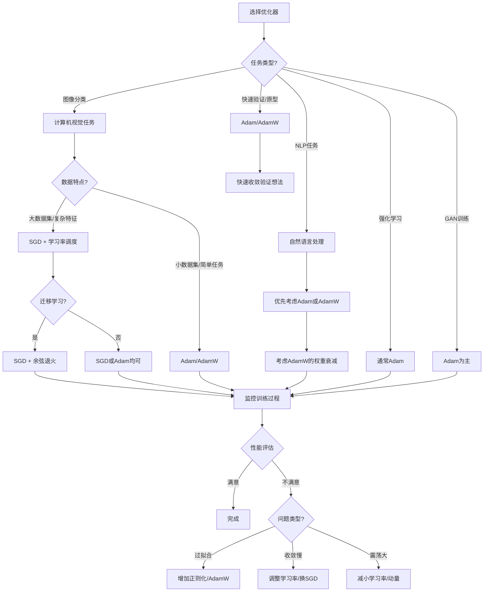

# 机器学习

## KNN

### 基础概念

- K-最近邻算法，基于实例的监督学习方法
- 根据数据点之间的距离来判断数据属于哪一个类别
- 参数k意义：考虑最近的 K 个邻居

### 算法优化

- ==K折交叉验证==：对数据集多次划分，多次评估

  - 将数据集分成k个互补重叠的子集，每个子集称为一个折
  - 对于每个折，作为验证集，其余作为训练集
  - 计算k次迭代中模型的性能平均值。

- ==网格搜索==：多个超参数时自动组合

- ==归一化==：数据预处理，将数据缩放到[0,1]或[-1, 1]

  - Min-Max(线性缩放)归一化：线性缩放到[0, 1]
    $$
    x\_{\text{norm}} = \frac{x - \min(x)}{\max(x) - \min(x)} 
    $$
    
  - Z-Score(标准化)归一化：转化为均值为0，标准差为1的正态分布
    $$
    x\_{\text{norm}} = \frac{x - \bar{x}}{\sigma(x)}
    $$

### 鸢尾花分类 - 基础

> 1. 加载数据集
> 2. train、test数据的分割 `from sklearn.model_selection import train_test_split`
> 3. 设置超参数和模型 `from sklearn.neighbors import KNeighborsClassifier`; `model = KNeighborsClassifier(n_neighbors=K)`
> 4. 训练 `model.fit(X_train, y_train)`
> 5. 预测比较 `model.predict(X_test)`; `model.score(X_test, y_test)`; 或`accuracy_score(y_test, y_)`

```python
from sklearn import datasets
from sklearn.model_selection import train_test_split
from sklearn.neighbors import KNeighborsClassifier

'''1'''
X, y = datasets.load_iris(return_X_y=True)  # return_X_y=True : 直接返回特征矩阵X和标签向量y
'''2'''
X_train, X_test, y_train, y_test = train_test_split(X, y, test_size=0.2, random_state=1024)
'''3'''
model = KNeighborsClassifier(n_neighbors=5)
'''4'''
model.fit(X_train, y_train)
'''5'''
y_ = model.predict(X_test)
print(model.score(X_test, y_test))
"""
from sklearn.metrics import accuracy_score
print(accuracy_score(y_test, y_))
"""
```

### 鸢尾花分类 - k折交叉验证

> between 2-3
>
> 1. 设置k范围
> 2. 交叉验证 `from sklearn.model_selection import cross_val_score`; `score = cross_val_score(model, X_train, y_train, cv=5, scoring='accuracy')`
> 3. 获取`argmax(list[k])`

```python
from sklearn import datasets
from sklearn.model_selection import train_test_split, cross_val_score
from sklearn.neighbors import KNeighborsClassifier
import numpy as np

'''1'''
X, y = datasets.load_iris(return_X_y=True)  # return_X_y=True : 直接返回特征矩阵X和标签向量y
'''2'''
X_train, X_test, y_train, y_test = train_test_split(X, y, test_size=0.2, random_state=1024)

'''优化'''
scores = []
for k in range(1,15):
    model = KNeighborsClassifier(n_neighbors=k)
    score = cross_val_score(model, X_train, y_train, cv=5, scoring='accuracy')
    """
    'precision' ：精确率
	'recall' ：召回率
	'f1' ：F1分数
	'roc_auc' ：ROC曲线下面积
    """
    scores.append(score)
k_best = np.argmax(scores) + 1  # 索引从0开始，+1即k值
print(f'The best k is {k_best}')

'''3'''
model_best = KNeighborsClassifier(n_neighbors=k_best)
'''4'''
model_best.fit(X_train, y_train)
'''5'''
y_ = model_best.predict(X_test)
print(model_best.score(X_test, y_test))
```

### 健康医疗 - 网格搜索

> `from sklearn.model_selection import GridSearchCV`
>
> `params = Dict(str:List[])`
>
> `gcv = GridSearchCV(model, params, cv=6, scoring='accuracy')`
>
> `gcv.fit(X_train, y_train)`; `gcv.best_params_`; `gcv.best_score_`; `gcv.best_estimator_`

```python
from sklearn.model_selection import train_test_split, GridSearchCV
from sklearn.neighbors import KNeighborsClassifier
import numpy as np
import pandas as pd
'''1'''
cancer = pd.read_csv('./cancer.csv',sep = '\t')
cancer.drop('ID',axis = 1,inplace=True)
X = cancer.iloc[:,1:]
y = cancer['Diagnosis']
'''2'''
X_train, X_test, y_train, y_test = train_test_split(X, y, test_size=0.2, random_state=1024)
'''3'''
model = KNeighborsClassifier()
params = {'n_neighbors':[i for i in range(1, 30)], 'weights': ['distance', 'uniform'], 'p':[1, 2]}
"""
weights : 预测时的权重计算方式
	'uniform' : 所有邻居权重相等（简单多数投票）
	'distance' : 距离越近的邻居权重越大（距离反比权重）
p : 距离度量参数
	p=1 : 曼哈顿距离（L1距离）
	p=2 : 欧几里得距离（L2距离）
"""
gcv = GridSearchCV(model, params, cv=6, scoring='accuracy', n_jobs=-1)  # n_jobs：并行数，默认为1，当n_jobs = -1：表示使用所有处理器
gcv.fit(X_train, y_train)
print(gcv.best_params_)
print(gcv.best_score_)
model_best = gcv.best_estimator_
model.fit(X_train, y_train)
print(model.score(X_test, y_test))

```

### 健康医疗 - 归一化

> `from sklearn.preprocessing import StandardScaler, MinMaxScaler`
>
> `mms = MinMaxScaler()`
>
> `X_norm = mms.fit_transform(X)`
>
> 注意：先 split 再归一化

#### 补充：`fit` vs 没有`fit`的核心区别

| 操作              | 作用         | 是否改变scaler状态 | 使用场景                   |
| :---------------- | :----------- | :----------------- | :------------------------- |
| `fit()`           | 学习数据参数 | ✅ 是               | 只在训练集使用             |
| `transform()`     | 应用已有参数 | ❌ 否               | 训练集和测试集都使用       |
| `fit_transform()` | 学习并应用   | ✅ 是               | 只在训练集使用（简便写法） |

```python
from sklearn.model_selection import train_test_split
from sklearn.preprocessing import StandardScaler

# 假设X和y是原始特征和标签
X_train, X_test, y_train, y_test = train_test_split(X, y, test_size=0.2, random_state=42)

# 初始化归一化器
scaler = StandardScaler()

# 在训练集上拟合归一化器并转换训练集
X_train_scaled = scaler.fit_transform(X_train)

# 使用训练集拟合的归一化器来转换测试集
X_test_scaled = scaler.transform(X_test)
"""
有fit：学习数据参数，改变归一化器内部状态。
无fit（只transform）：应用已学习的参数，不改变归一化器内部状态。
对于测试集，我们只使用transform，以确保评估的公正性和模型的泛化能力。
"""
```

底层逻辑

```python
'''训练集处理'''
# 假设 X_train = [[1, 2], [3, 4], [5, 6]]

# 1. fit阶段：计算统计量
mean = np.mean(X_train, axis=0)  # [3, 4]
std = np.std(X_train, axis=0)    # [1.63, 1.63] (近似值)

# 2. transform阶段：应用变换
# 第一个样本: ([1,2] - [3,4]) / [1.63, 1.63] = [-1.225, -1.225]
# 第二个样本: ([3,4] - [3,4]) / [1.63, 1.63] = [0, 0]
# 第三个样本: ([5,6] - [3,4]) / [1.63, 1.63] = [1.225, 1.225]

# 结果: [[-1.225, -1.225], [0, 0], [1.225, 1.225]]

'''测试集处理'''
# 假设 X_test = [[7, 8], [9, 10]]

# 使用训练集学到的参数：mean=[3,4], std=[1.63,1.63]

# 应用同样的变换：
# 第一个样本: ([7,8] - [3,4]) / [1.63, 1.63] = [2.45, 2.45]
# 第二个样本: ([9,10] - [3,4]) / [1.63, 1.63] = [3.675, 3.675]

# 结果: [[2.45, 2.45], [3.675, 3.675]]

'''内存中状态变化'''
# 调用 fit_transform后
scaler.mean_ = [3, 4]      # 存储训练集的均值
scaler.std_ = [1.63, 1.63] # 存储训练集的标准差

# 调用transform时
# 直接使用存储的 mean_ 和 std_
# 不会重新计算统计量！
```

cancer_norm

```python
from sklearn.model_selection import train_test_split, GridSearchCV
from sklearn.neighbors import KNeighborsClassifier
from sklearn.preprocessing import StandardScaler, MinMaxScaler, LabelEncoder
import pandas as pd
'''1'''
cancer = pd.read_csv('./cancer.csv',sep = '\t')
cancer.drop('ID',axis = 1,inplace=True)
X = cancer.iloc[:,1:]
y = cancer['Diagnosis']
'''2'''
# 将字符串标签转换为数值型标签
le = LabelEncoder()
y_encoded = le.fit_transform(y)
X_train, X_test, y_train, y_test = train_test_split(X, y_encoded, test_size=0.2, random_state=512)
'''2.5'''
standard = StandardScaler()
X_train = standard.fit_transform(X_train)
X_test = standard.transform(X_test)
'''3'''
model = KNeighborsClassifier()
params = {'n_neighbors':[i for i in range(1, 30)], 'weights': ['distance', 'uniform'], 'p':[1, 2]}
"""
weights : 预测时的权重计算方式
	'uniform' : 所有邻居权重相等（简单多数投票）
	'distance' : 距离越近的邻居权重越大（距离反比权重）
p : 距离度量参数
	p=1 : 曼哈顿距离（L1距离）
	p=2 : 欧几里得距离（L2距离）
"""
gcv = GridSearchCV(model, params, cv=6, scoring='accuracy', n_jobs=-1)  # n_jobs：并行数，默认为1，当n_jobs = -1：表示使用所有处理器
gcv.fit(X_train, y_train)
print(gcv.best_params_)
print(gcv.best_score_)
model_best = gcv.best_estimator_
model_best.fit(X_train, y_train)
print(model_best.score(X_test, y_test))

# 如果需要将预测结果转换回原始标签
# y_pred_original = le.inverse_transform(model_best.predict(X_test))
```


## 多元线性回归

### 基础概念

- 回归问题关注的是因变量和自变量之间的关系 $\hat{y} = w_1x_1 + w_2x_2 + …… + w_nx_n + w_0$；$\hat{y} = W^TX$
- 最小二乘法：最小化每个数据点与拟合直线之间的垂直平方和，即最小化所有数据点到拟合直线的残差平方和
  - 残差：每个数据点的实际值与拟合直线在该点处的预测值之间的差异
  - 公式：$J(\theta) = \frac{1}{2}\sum\limits_{i = 0}^n(h_{\theta}(x_i) - y_i)^2$     ||      $J(\theta) = \frac{1}{2}(X\theta - y)^T(X\theta - y)$
  - 正规方程：$\theta = (X^TX)^{-1}X^Ty$，即上面的解     `θ = np.linalg.inv(X.T.dot(X)).dot(X.T).dot(y)`
  - 公式推导：拆开后分别矩阵求导
  - 凸函数：黑塞矩阵是否半正定（黑塞矩阵：目标函数在点X处的二阶偏导组成的对称矩阵）。用于说明$J'(\theta) =X^T(X\theta -y)=0$ 时得到极小值
- 最小二乘法的推导：
  1. 数据误差符合高斯分布：$f(\varepsilon|\mu = 0,\sigma^2) = \frac{1}{\sqrt{2\pi}\sigma}e^{-\frac{(\varepsilon - 0)^2}{2\sigma^2}}$
  2. 误差总似然：$P = \prod\limits_{i = 0}^{n}f(\varepsilon_i|0,\sigma^2) = \prod\limits_{i = 0}^{n}\frac{1}{\sqrt{2\pi}\sigma}e^{-\frac{\varepsilon_i ^2}{2\sigma^2}}$
  3. 将$\varepsilon_i = |y_i - W^Tx_i|$  带入： $P_W= \prod\limits_{i = 0}^{n}\frac{1}{\sqrt{2\pi}\sigma}e^{-\frac{(y_i - W^Tx_i)^2}{2\sigma^2}}$，变为求最大似然问题
  4. ln后拆开：$log_e(P_W) = \sum\limits_{i = 0}^{n}log_e(\frac{1}{\sqrt{2\pi}\sigma}e^{-\frac{(y_i - W^Tx_i)^2}{2\sigma^2}})=\sum\limits_{i = 0}^{n}(log_e\frac{1}{\sqrt{2\pi}\sigma} - \frac{1}{\sigma^2}\cdot\frac{1}{2}(y_i - W^Tx_i)^2)$
  5. 要使最大似然最大，即$L(W) = \frac{1}{2}\sum\limits_{i = 0}^n(y^{(i)} - W^Tx^{(i)})^2$

#### 补充：矩阵求导公式

* $$\frac{\partial X^T}{\partial X} = I$$ 求解出来是单位矩阵
* $$\frac{\partial X^TA}{\partial X} = \frac{\partial AX^T}{\partial X} = A$$
* $$\frac{\partial AX}{\partial X} = \frac{\partial XA}{\partial X} = A^T$$
* $\frac{\partial X^TAX}{\partial X} = (A + A^T)X;$ A不是对称矩阵
* $\frac{\partial X^TAX}{\partial X} = 2AX;$ A是对称矩阵

### 梯度下降

- 推导：
  1. 一阶泰勒公式：$f(x) = f(x_0) + f'(x_0)(x - x_0) + R_1(x)$  =>  $f(x_0) \approx f(x) - f'(x_0)(x - x_0)$
  2. $\theta^{n + 1} = \theta^{n} - \alpha * \frac{\partial J(\theta)}{\partial \theta}$
- 学习率
- 三种梯度下降：批量梯度下降BGD（Batch Gradient Descent）、小批量梯度下降MBGD（Mini-Batch Gradient Descent）、随机梯度下降SGD（Stochastic Gradient Descent）
  - BGD是指在每次迭代使用**所有样本**来进行梯度的更新
  - MBGD是指在每次迭代使用**一部分样本**（所有样本500个，使用其中一部分样本）来进行梯度的更新

  - SGD是指每次迭代随机选择**一个样本**来进行梯度更新
- 更新公式：$\frac{\partial J(\theta)}{\partial \theta_j} = (h_{\theta}(x) - y)x_j$  =>  $\theta_j^{n + 1} = \theta_j^{n} - \eta * (h_{\theta}(x) - y )x_j$    
  - BGD：$\theta^{n + 1} = \theta^{n} - \eta * X^T(X\theta -y)$       ——       `g = X_.T.dot(X_.dot(theta) - y)`
  - SGD：$\theta^{n + 1} = \theta^{n} - \eta * X_i^T(X_i\theta -y_i)$
  - MBGD：$\theta_j^{n + 1} = \theta_j^{n} - \eta *\frac{1}{batch\_size}\sum\limits_{i = 1}^{batch\_size} (h_{\theta}(x^{(i)}) - y^{(i)} )x_j^{(i)}$

### 多项式回归

- 对于多项式回归来说主要是为了扩展线性回归算法来适应更广泛的数据集，比如我们数据集有两个维度 $x_1、x_2$，那么用多元线性回归公式就是：$\hat{y} = w_0 + w_1x_1 + w_2x_2$，当我们使用二阶多项式升维的时候，数据集就从原来的 $x_1、x_2$扩展成了$x_1、x_2、x_1^2、x_2^2、x_1x_2$ 。因此多元线性回归就得去多计算三个维度所对应的w值：$\hat{y} = w_0 + w_1x_1 + w_2x_2 + w_3x_1^2 + w_4x_2^2 + w_5x_1x_2$ 。
- `np.concatenate([X, X**2], axis=1)`
- `from sklearn.preprocessing import PolynomialFeatures`; `poly = PolynomialFeatures(degree=2)    poly.fit(X, y)    poly.transform()`

### 算法优化

- ==归一化==：同KNN

- ==正则化==：防止过拟合，增加模型鲁棒性。多元线性回归损失函数加 L2 正则：Ridge 岭回归。多元线性回归损失函数加上 L1 正则：Lasso 回归。

  - $L_1 = ||w||_1 = \sum\limits_{i = 1}^n|w_i|$​   
    - 损失函数：$J = J_0 + L_1 = \frac{1}{2}\sum\limits_{i = 1}^n(h_{\theta}(x^{(i)}) - y^{(i)})^2 + \alpha \sum\limits_{i = 1}^n|w_i|$
    - 权重更新公式：$\theta_j^{n + 1} = \theta_j^{n} -\eta\sum\limits_{i = 1}^{n} (h_{\theta}(x^{(i)}) - y^{(i)} )x_j^{(i)} - \eta*\alpha * sgn(w_i)$
    - `from sklearn.linear_model import Lasso`; `lasso = Lasso(alpha=0.5)   lasso.fit(X, y)`
  - $L_2 = ||w||_2 = \sqrt{\sum\limits_{i = 1}^n(w_i)^2}$   
    - 损失函数：$J = J_0 + \alpha * \sum\limits_{i = 1}^n(w_i)^2$
    - 权重更新公式：$\theta_j^{n + 1} = \theta_j^{n}(1-\eta * \alpha) -\eta *\sum\limits_{i = 1}^{n} (h_{\theta}(x^{(i)}) - y^{(i)} )x_j^{(i)}$
    - `from sklearn.linear_model import Ridge`; `ridge = Ridge(alpha= 1, solver='sag')   ridge.fit(X,y)`
  - 弹性网络（Elastic_Net）    $\alpha \rho ||w||_1 +\frac{\alpha(1-\rho)}{2} ||w||_2 ^ 2$
    - 弹性网络在很多特征互相联系（相关性，比如身高和体重就很有关系）的情况下是非常有用的。Lasso 很可能只随机考虑这些特征中的一个，而弹性网络更倾向于选择两个。在实践中，Lasso 和 Ridge 之间权衡的一个优势是它允许在迭代过程中继承 Ridge 的稳定性。
    - `from sklearn.linear_model import ElasticNet`;  `model = ElasticNet(alpha=1, l1_ratio=0.7)   model.fit(X, y)`

### 双十一销量预测

> 1. 获取数据和预处理
> 2. 特征升维    `from sklearn.preprocessing import PolynomialFeatures`
> 3. 归一化
> 4. 构建模型    `from sklearn.linear_model import SGDRegressor / LinearRegression`
> 5. 训练
> 6. 预测

```python
import numpy as np
from sklearn.linear_model import SGDRegressor  # 线性用LinearRegression
from sklearn.preprocessing import PolynomialFeatures, StandardScaler

'''1'''
X = np.arange(2009, 2020)
y = np.array([0.5,9.36,52,191,350,571,912,1207,1682,2135,2684])
# 预处理
X = X - X.mean()
X = X.reshape(-1, 1)
'''2'''
poly = PolynomialFeatures(degree=3)
X = poly.fit_transform(X)
"""
array([[   1.,   -5.,   25., -125.],
       [   1.,   -4.,   16.,  -64.],
       [   1.,   -3.,    9.,  -27.],
       [   1.,   -2.,    4.,   -8.],
       [   1.,   -1.,    1.,   -1.],
       [   1.,    0.,    0.,    0.],
       [   1.,    1.,    1.,    1.],
       [   1.,    2.,    4.,    8.],
       [   1.,    3.,    9.,   27.],
       [   1.,    4.,   16.,   64.],
       [   1.,    5.,   25.,  125.]])
"""
'''3'''
scaler = StandardScaler()
X_norm = scaler.fit_transform(X)
'''4'''
model = SGDRegressor()
'''5'''
model.fit(X_norm, y)
'''6'''
X_test = np.linspace(-5, 6, 100), reshape(-1, 1)
X_test = poly.transform(X_test)
X_test_norm = scaler.transform(X_test)
y_test = model.predict(X_test_norm)
print(y_test)
```

### 人寿保费

>1. 加载数据预处理
>   - EDA数据探索    `import seaborn as sns`    `sns.kdeplot('xxx', hue='yyy', shade=True)`
>   - 离散化转换
>2. 数据拆分
>3. 特征升维
>4. 归一化
>5. 构建模型（直接使用正则化的模型）    `from sklearn.linear_model import ElasticNet`
>6. 训练
>7. 预测

```python
import pandas as pd
import numpy as np
import seaborn as sns
import matplotlib.pyplot as plt
from sklearn.model_selection import train_test_split
from sklearn.linear_model import ElasticNet
from sklearn.preprocessing import PolynomialFeatures, StandardScaler
from sklearn.metrics import mean_squared_error

'''1'''
data = pd.read_excel('中国人寿.xlsx')
# EDA数据探索
# 性别对保费影响
sns.kdeplot(data=data, x='charges', hue='sex', fill=True)
plt.title('sex')
plt.show()
# 地区对保费影响
sns.kdeplot(data=data, x='charges', hue='region', fill=True)
plt.title('region')
plt.show()
# 吸烟对保费影响
sns.kdeplot(data=data, x='charges', hue='smoker', fill=True)
plt.title('smoker')
plt.show()
# 孩子数量对保费影响
sns.kdeplot(data=data, x='charges', hue='children', palette='Set1', fill=True)
plt.title('children')
plt.show()
# 移除不重要特征
data = data.drop(['region', 'sex'], axis=1)
# 离散转换
def convert(df,bmi):
    df['bmi'] = 'fat' if df['bmi'] >= bmi else 'standard'
    return df
data = data.apply(convert, axis = 1, args=(30,))
data = pd.get_dummies(data)

# 特征和目标值抽取
X = data.drop('charges', axis=1) # 训练数据
y = data['charges'] # 目标值

'''2'''
X_train, X_test, y_train, y_test = train_test_split(X, y, test_size=0.2, random_state=1024)
'''3'''
poly = PolynomialFeatures(degree=2, include_bias=False)
X_train = poly.fit_transform(X_train)
X_test = poly.transform(X_test)
'''4'''
scaler = StandardScaler()
X_train_norm = scaler.fit_transform(X_train)
X_test_norm = scaler.transform(X_test)
'''5'''
model = ElasticNet(alpha=0.1, l1_ratio=0.3, max_iter=1000)
model.fit(X_train_norm, y_train)
print(model.score(X_test_norm, y_test))
print('训练数据MSE：', mean_squared_error(y_train, model.predict(X_train_norm)))
print('测试数据MSE：', mean_squared_error(y_test, model.predict(X_test_norm)))

```


## 逻辑斯蒂回归

### 基础概念

- 基于多元线性回归的分类算法。逻辑回归中对应一条非常重要的S型曲线，对应的函数是Sigmoid函数：$f(x) = \frac{1}{1 + e^{-x}}$
- 逻辑回归就是在多元线性回归基础上把结果缩放到 0 ~ 1 之间。$h_{\theta}(x)$ 【概率函数，用于分类，分类的目标函数】越接近 1 越是正例，$h_{\theta}(x)$ 越接近 0 越是负例，根据中间 0.5 将数据分为二类。其中$h_{\theta}(x)$ 就是概率函数  $h_{\theta}(x) = g(\theta^Tx) = \frac{1}{1 + e^{-\theta^Tx}}$

- 伯努利分布(0-1分布)(Bernoulli)：随机变量 x 只取 0 和 1 两个值，并且相应的概率为：$Pr(x = 1) = p;\quad Pr(x = 0) = 1-p;\quad 0 < p < 1$，x 的概率函数可写为 $f(x | p) = \begin{cases}p^x(1 - p)^{1-x}, &x =  1、0\\0,& x \neq 1、0\end{cases}$

- 损失函数推导：

  1. 最大似然估计思想，根据若干已知的 X,y(训练集) 找到一组 $\theta$ 使得 X 作为已知条件下 y 发生的概率最大：$P(y|x;\theta) = \begin{cases}h_{\theta}(x), &y =  1\\1-h_{\theta}(x),& y =  0\end{cases}$，整合到一起得到逻辑回归表达式：$P(y|x;\theta) = (h_{\theta}(x))^{y}(1 - h_{\theta}(x))^{1-y}$

  2. 假设训练样本相互独立，似然函数表达式为：$L(\theta) = \prod\limits_{i = 1}^nP(y^{(i)}|x^{(i)};\theta)= \prod\limits_{i=1}^n(h_{\theta}(x^{(i)}))^{y^{(i)}}(1 - h_{\theta}(x^{(i)}))^{1-y^{(i)}}$，两边ln

     $l(\theta) = \ln{L(\theta)} = \sum\limits_{i = 1}^n[y^{(i)}\ln h_{\theta}(x^{(i)}) + (1-y^{(i)})\ln(1-h_{\theta}(x^{(i)}))]$

  3. 极大似然越大越好，就是说，$ -l(\theta)$越小越好。最终损失函数：$J(\theta) = -l(\theta)$

- 回归迭代公式
  $$
  \begin{aligned} \frac{\partial}{\partial{\theta_j}}J(\theta) &=-\sum\limits_{i = 1}^n(y^{(i)}\frac{1}{h_{\theta}(x^{(i)})}\frac{\partial}{\partial_{\theta_j}}h_{\theta}(x^{(i)}) - (1-y^{(i)})\frac{1}{1-h_{\theta}(x^{(i)})}\frac{\partial}{\partial_{\theta_j}}h_{\theta}(x^{(i)}))\\\\&=-\sum\limits_{i = 1}^n(y^{(i)}\frac{1}{h_{\theta}(x^{(i)})} - (1-y^{(i)})\frac{1}{1-h_{\theta}(x^{(i)})})h_{\theta}(x^{(i)})(1-h_{\theta}(x^{(i)}))\frac{\partial}{\partial_{\theta_j}}\theta^Tx\\\\&=-\sum\limits_{i = 1}^n(y^{(i)} - h_{\theta}(x^{(i)}))\frac{\partial}{\partial_{\theta_j}}\theta^Tx\\\\&=\sum\limits_{i = 1}^n(h_{\theta}(x^{(i)}) -y^{(i)})x_j^{(i)}\end{aligned}
  $$
  最终参数迭代更新公式为：$\theta_j^{t+1} = \theta_j^t - \alpha \cdot \sum\limits_{i=1}^{n}(h_{\theta}(x^{(i)}) -y^{(i)})x_j^{(i)}$

### 多分类扩展

- One-Vs-Rest(ovr)：把一个多分类的问题变成多个二分类的问题。选择其中一个类别为正类，使其他所有类别为负类。
  - 优点：普适性还比较广，可以应用于能输出值或者概率的分类器，有多少个类别就训练多少个分类器。
  - 缺点：很容易造成训练集样本数量的不平衡，尤其在类别较多的情况下，经常容易出现正类样本的数量远远**不及**负类样本的数量，这样就会造成分类器的偏向性。
- Softmax ：一种做多分类的算法。多分类就是多项分布，可以理解为二项分布的扩展。投硬币是二项分布，掷骰子是多项分布。

### Logistics iris

```python
from sklearn import datasets
from sklearn.model_selection import train_test_split
from sklearn.linear_model import LogisticRegression
from sklearn.metrics import accuracy_score

X, y = datasets.load_iris(return_X_y=True)
X_train, X_test, y_train, y_test = train_test_split(X, y, test_size=0.2, random_state=1024)

lr = LogisticRegression(max_iter=5000)
lr.fit(X_train, y_train)
y_pred = lr.predict(X_test)

print(accuracy_score(y_test, y_pred))
```


## 聚类算法

| 特性           | K-means            | DBSCAN                   | 层次聚类                   |
| :------------- | :----------------- | :----------------------- | :------------------------- |
| **形状假设**   | 球形簇             | 任意形状                 | 任意形状（取决于连接度量） |
| **簇数需求**   | **必须指定K**      | 无需指定                 | 无需指定，可事后选择       |
| **抗噪性**     | **差**             | **优**（有专门噪声类别） | 一般（取决于连接方法）     |
| **处理大数据** | **优**（效率高）   | 中（依赖索引结构）       | **差**（复杂度高）         |
| **输出结果**   | 扁平分区           | 扁平分区 + 噪声          | **树状层次结构**           |
| **关键优势**   | 简单、高效、规模化 | 任意形状、抗噪、无需K    | 可解释性强、多层次结构     |

### 基础概念

- 无监督学习

- 余弦距离：取值范围[-1,+1] 越趋近于1代表越相似，越趋近于-1代表方向相反，0代表正交
  $$
  cos\theta = \frac{a \cdot b}{||a||_2||b||_2}= \frac{x_1x_2 + y_1y_2}{\sqrt{x_1^2 + y_1^2} \times \sqrt{x_2^2 + y_2^2}}
  $$

### K-means

> 将N个样本映射到K和簇中，每个簇至少有一个样本

- 算法步骤
  - 选择K个初始的簇中心 
  - 逐个计算每个样本到簇中心的距离，将样本归属到距离最小的那个簇中心的簇中

  - 每个簇内部计算平均值，更新簇中心

  - 开始迭代

- 损失函数
  $$
  \sum\limits_{i=0}^{n}\underset{\mu_j \in C}\min(||x_i - \mu_j||^2)
  $$

  * 其中$\mu_j = \frac{1}{|C_j|}\sum\limits_{x \in C_j}x$ 是簇的均值向量，或者说是质心。

  * 其中$||x_i - \mu_j||^2$代表每个样本点到均值点的距离。

- K值选择

  针对某个样本的轮廓系数s为：$ s= \frac{b - a}{max(a, b)}$

  - a：某个样本与其所在簇内其他样本的平均距离
  - b：某个样本与其他簇样本的平均距离

  聚类总的轮廓系数SC为：$SC = \frac{1}{N}\sum\limits_{i = 1}^Ns_i$，所有样本的$s_i$的均值称为聚类结果的**轮廓系数**，是该聚类是否合理、有效的度量。

**轮廓系数**

```python
# 聚类：轮廓系数，对聚类的评价指标，对应数学公式
from sklearn.metrics import silhouette_score
from sklearn.cluster import KMeans

score = []
k_values = range(2, 7)

for i in k_values:
    kmeans = KMeans(n_clusters=i, random_state=42, n_init=10)
    kmeans.fit(X)
    y_ = kmeans.predict(X)  # 预测类别 == 标签
    score.append(silhouette_score(X, y_))
    print(f'K={i}时的轮廓系数: {silhouette_score(X, y_):.4f}')
    
# 找到最佳K值
best_k = k_values[score.index(max(score))]
print(f'最佳聚类数量 K={best_k}，轮廓系数={max(score):.4f}')
```

**图像特征提取**

```python
from matplotlib import pyplot as plt
from sklearn.cluster import KMeans

plt.figure(figsize=(8, 4))

# 加载图片显示原图
pixel = plt.imread('bird.png')
plt.subplot(1, 2, 1)
plt.imshow(pixel)

# 聚类运算，压缩图片
pixel = pixel.reshape((128 * 128, 3))  # 每行代表一个像素的RGB值
kmeans = KMeans(n_clusters=8)
kmeans.fit(pixel)

# 获取每个像素的簇标签
pixel_labels = kmeans.labels_
# 获取8个簇中心颜色
cluster_centers = kmeans.cluster_centers_
# 用簇中心颜色替换每个像素
compressed_pixels = cluster_centers[pixel_labels]  # 此处使用了numpy的花式索引，通过传入索引列表来取值
# 重塑为图像格式
newPixel = compressed_pixels.reshape(128, 128, 3)
plt.subplot(1, 2, 2)
plt.imshow(newPixel)
plt.show()
```

### DBSCAN

- Density-Based Spatial Clustering of Applications with Noise，具有噪声的基于密度的聚类方法。该算法将具有足够密度的区域划分为簇，并在具有噪声的空间数据库中发现任意形状的簇，它将簇定义为密度相连的点的最大集合。
- 算法步骤：

  1）给定领域半径：Eps和成为核心对象的在领域半径内的最少点数：MinPts。
  2）从任意点p开始，将其标记为”visited“，检查其是否为核心点（即p的Eps邻域至少有MinPts个对象），如果不是核心点，则将其标记为噪声点。否则为p创建一个新的簇C，并且把把p的Eps邻域中的所有对象都放到候选集合N中。
  3）迭代地把N中不属于其它簇的对象添加至C中，在此过程中，对于N中标记为”unvisited"的对象p‘，把它标记为“visited”，并且检查它的Eps邻域，如果p’也为核心对象，则p’的Eps邻域中的对象都被添加至N中。继续添加对象至C中，直到C不能扩展，即直到N为空。此时，簇C完全生成。
  4）从剩余的对象中随机选择下一个未访问对象，重复3）的过程，直到所有对象都被访问。
- 参数解析

  - eps：邻域的距离阈值，默认值是0.5。eps过大，则更多的点会落在核心对象的eps邻域，此时我们的类别数可能会减少， 本来不应该是一类的样本也会被划为一类。反之则类别数可能会增大，本来是一类的样本却被划分开。使用k-距离图辅助选择。
  - min_samples：样本点要成为核心对象所需要的eps邻域的样本数阈值。默认值是5。


```python
import numpy as np
from sklearn import datasets
from sklearn.cluster import KMeans, DBSCAN
import matplotlib.pyplot as plt

# y中是两类：0,1
X, y = datasets.make_circles(n_samples=1000, noise=0.05, factor=0.5)
# centers = [(1.5,1.5)] 元组，代表着，中心点的坐标值
# y1一类：0 + 2
X1, y1 = datasets.make_blobs(n_samples=500, n_features=2, centers=[(1.5, 1.5)], cluster_std=0.2)

# 将circle和散点进行了数据合并
X = np.concatenate([X, X1])
y = np.concatenate([y, y1 + 2])
plt.scatter(X[:, 0], X[:, 1], c=y)

kmeans = KMeans(3)
kmeans.fit(X)
y_ = kmeans.labels_
plt.scatter(X[:, 0], X[:, 1], c=y_)
plt.show()

dbscan = DBSCAN(eps = 0.2,min_samples=3)
dbscan.fit(X)
y_ = dbscan.labels_
plt.scatter(X[:,0],X[:,1],c = y_)
plt.show()

```

### 分层聚类

- 分层聚类法（hierarchical cluster method），其做法是开始时把每个样品作为一类，然后把最靠近的样品（即距离最小的群品）首先聚为小类，再将已聚合的小类按其类间距离再合并，不断继续下去，最后把一切子类都聚合到一个大类。

- 算法步骤：

  - 计算簇间距离
    - 最小距离（单链接）：两个簇中最近数据点的距离。
    - 最大距离（全链接）：两个簇中最远数据点的距离。
    - 平均距离（均链接）：两个簇中所有数据点对距离的平均值。
    - 中心距离（质心法）：两个簇中心点的距离。
  - 合并最相似的簇（距离最小）
  - 更新距离矩阵
  - 重复合并过程

- 参数解析：

  - n_clusters 

    划分类别数目

  - linkage

    度量两个子类的相似度时所依据的距离

    * Single Linkage：将两个数据点集中距离最近的两个数据点间的距离作为这两个点集的距离。
    * Complete Linkage：将两个点集中距离最远的两个数据点间的距离作为这两个点集的距离。
      上述两种方法容易受到极端值的影响，计算大样本集效率较高。
    * Average Linkage：计算两个点集中的每个数据点与其他所有数据点的距离。将所有距离的均值作为两个点集间的距离。这种方法计算量比较大，不过这种度量方法更合理
    * Ward：最小化簇内方差。

  - connectivity

    连接性约束，作用：只有相邻的簇才能合并在一起，进行聚类

```python
import numpy as np
import matplotlib.pyplot as plt
import mpl_toolkits.mplot3d.axes3d as p3
from sklearn.cluster import AgglomerativeClustering
from sklearn.datasets import make_swiss_roll

X, y = make_swiss_roll(n_samples=1500, noise=0.05)
fig = plt.figure(figsize=(12, 9))
a3 = fig.add_subplot(projection='3d')
a3.scatter(X[:, 0], X[:, 1], X[:, 2], c=y)
a3.view_init(10, -80)

from sklearn.neighbors import kneighbors_graph  # graph图形的意思

# 邻居数量变少，认为，条件宽松
conn = kneighbors_graph(X, n_neighbors=10)  # 采用邻居，进行约束
agg = AgglomerativeClustering(n_clusters=6, connectivity=conn, linkage='ward')  # 最近的距离，作为标准，
agg.fit(X)
y_ = agg.labels_
fig = plt.figure(figsize=(12, 9))
a3 = fig.add_subplot(projection='3d')
a3.scatter(X[:, 0], X[:, 1], X[:, 2], c=y_)
a3.view_init(10, -80)
plt.show()

```


## 决策树-分类算法

- 有监督

- 决策树是标准的二叉树

- 常用分裂指标
  - 信息增益
  - Gini系数

  - 信息增益率
  - MSE（回归问题）
  
- 信息熵：在信息论里熵叫作信息量，即熵是对不确定性的度量。
  $$
  H(x) = -\sum\limits_{i = 1}^n p_i(x)log_2p_i(x)
  $$
  

### 信息增益（ID3）


- 写作 g(X,Y)。它的计算方式为熵减去条件熵: $g(X,Y) \rm = H(Y) - H(Y|X)$。表示知道了某个条件后，原来事件**不确定性降低的幅度**。

- 步骤：  （输入：训练集D，特征集A，阈值$\epsilon$；输出：决策树T）
  1. 若D中全部实例同属于一类c，则用c作为节点的标注，返回T
  2. 若A为空，则将D中实例数最多的类c作为该节点的标注，并返回T
  3. 计算A中每个特征对D的信息增益，并选择信息增益最大的特征a
  4. 如果a带来的信息增益小于阈值$\epsilon$，则将D中实例数最多的类c作为该节点的标注，并返回T
  5. 对特征a的每个可能取值$a_i$，将数据集D分割为几个子集$D_i$构建子节点，由结点、子节点、a、每个$a_i$构建决策树T
  6. 对每个子集，以$D_i$为数据集，以A-{a}为特征集，递归调用1-5步

### Gini系数（CRAT）

> 回归树

国际上通用的、用以衡量一个国家或地区居民收入差距的常用指标。 基尼系数的实际数值只能介于 0～1 之间，基尼系数越小收入分配越平均，基尼系数越大收入分配越不平均。Gini 系数越小，代表集合中的数据越纯，所有我们可以计算分裂前的值在按照某个维度对数据集进行划分，然后可以去计算多个节点的 Gini 系数。
$$
\rm gini = \sum\limits_{i = 1}^np_i(1 - p_i)
$$
在对数据进行分类是gini系数的变化越大，说明划分越纯，效果越好

- 步骤
  1. 在D构建的特征空间中，计算每个可能的切分特征和可能的切分值，并分别计算损失函数的值
  2. 对于使得损失函数值最小的特征和切分值，将数据集划分为两个子集
  3. 对这两个子集，分布递归调用1-2，直到满足停止条件，得到决策树

### 信息增益率（C4.5）

信息增益率在信息增益的基础上增加了惩罚项，惩罚项是特征的固有值。 写作 gr(X,Y)。定义为信息增益除以特征的固有值，如下：
$$
gr(X,Y) = \frac{g(X,Y)}{Info(X)}\\
Info(X) = -\sum\limits_{v \in values(X)}\frac{num(v)}{num(X)}log_2{\frac{num(v)}{num(X)}}
$$
一个属性的信息增益越大，表明属性对样本的熵减少的能力更强，这个属性使得数据由不确定性变成确定性的能力越强。所以如果是取值更多的属性，更容易使得数据更“纯”（尤其是连续型数值），其信息增益更大，决策树会首先挑选这个属性作为树的顶点。结果训练出来的形状是一棵庞大且深度很浅的树，这样的划分是极为不合理的。信息增益率在信息增益的基础上除了一项split information,来惩罚值更多的属性。从而使划分更加合理。

### 剪枝策略

决策树在构建过程中，如果让树无限生长，会导致树的分支过多、深度过深，此时树会“记住”训练集中的每一个样本，包括样本中的噪声和异常值，从而出现“过拟合”现象。解决过拟合的核心方法是“剪枝”，即通过删除部分分支来简化决策树，提高其泛化能力。剪枝策略主要分为两大类：预剪枝和后剪枝。

- 预剪枝：通过设置一些停止条件，提前终止树的生长
  - 样本数量阈值
  - 熵/基尼系数阈值
  - 树的深度阈值
- 后剪枝：先让决策树完全生长，然后从树的最底层开始，逐一判断每个分支是否有保留的必要。如果删除某个分支后，模型在验证集上的性能没有下降（甚至有所提升），则删除该分支。

### 决策树 iris

```python
import numpy as np
from sklearn.tree import DecisionTreeClassifier
from sklearn import datasets
from sklearn.model_selection import train_test_split
from sklearn import tree
import matplotlib.pyplot as plt

iris = datasets.load_iris()
X, y = datasets.load_iris(return_X_y=True)

# 随机拆分
X_train, X_test, y_train, y_test = train_test_split(X, y, random_state=256)

# max_depth调整树深度：剪枝操作
# max_depth默认，深度最大，延伸到将数据完全划分开为止。
model = DecisionTreeClassifier(max_depth=None, criterion='entropy')
model.fit(X_train, y_train)
y_ = model.predict(X_test)
print('真实类别是：', y_test)
print('算法预测是：', y_)
print('准确率是：', model.score(X_test, y_test))
# 决策树提供了predict_proba这个方法，发现这个方法，返回值要么是0，要么是1
model.predict_proba(X_test)
plt.figure(figsize=(20, 10))
tree.plot_tree(model,
               feature_names=iris.feature_names,
               class_names=iris['target_names'],
               filled=True,
               rounded=True,
               fontsize=10)
plt.show()

# 剪枝操作
model = DecisionTreeClassifier(criterion='entropy', min_impurity_decrease=0.2)
# min_impurity_decrease（节点划分最小不纯度）如果某节点的不纯度(基尼系数，信息增益，均方差)小于这个阈值，则该节点不再生成子节点
model.fit(X_train, y_train)
y_ = model.predict(X_test)
print('真实类别是：', y_test)
print('算法预测是：', y_)
print('准确率是：', model.score(X_test, y_test))
model.predict_proba(X_test)
plt.figure(figsize=(20, 10))
tree.plot_tree(model,
               feature_names=iris.feature_names,
               class_names=iris['target_names'],
               filled=True,
               rounded=True,
               fontsize=10)
plt.show()

# 筛选合适决策树深度
depth = np.arange(1, 16)
err = []
for d in depth:
    model = DecisionTreeClassifier(criterion='entropy', max_depth=d)
    model.fit(X_train, y_train)
    score = model.score(X_test, y_test)
    err.append(1 - score)
    print('错误率为%0.3f%%' % (100 * (1 - score)))
plt.rcParams['font.family'] = 'STKaiti'
plt.plot(depth, err, 'ro-')
plt.xlabel('决策树深度', fontsize=18)
plt.ylabel('错误率', fontsize=18)
plt.title('筛选合适决策树深度')
plt.grid()
plt.show()
```

### GBDT梯度提升分类树

- **交叉熵**：用来衡量在给定真实分布下，使用非真实分布所指定的策略消除系统的不确定性所需要付出的努力大小。

  - $\rm\sum\limits_{k = 1}^Np_klog_2\frac{1}{q_k}$  ，其中 $p_k$ 表示真实分布， $q_k$ 表示非真实分布。
  - 交叉熵越低，策略越好；最低的交叉熵也就是使用真实分布所计算出来的信息熵，此时$p_k=q_k$

- GBDT分类树

  - 损失函数是交叉熵
  - 概率计算使用sigmoid ---> $f(x) = \frac{1}{1 + e^{-x}}$
  - 使用mse作为分裂标准（同梯度提升回归树）
  - 梯度提升(Boosting)：通过多个弱模型（比如多个小决策树）的叠加，不断改进预测的准确性。

- 过程：

  1. 先建立一个简单的决策树模型，初步预测
  2. 计算这个模型预测的误差
  3. 基于这些误差，建第二棵决策树，专门修正这些错误
  4. 不断重复，每次都用新的决策树来修正上一个模型的错误
  5. 所有这些决策树预测结构加起来就是最终的预测结果

- 算法公式

  - 概率计算（sigmoid函数）

  $$
  p = \frac{1}{1 + exp(-F(x))}
  $$

  - 函数初始值（这个函数即是sigmoid分母中的 F(x)，用于计算概率）

    逻辑回归中的函数是线性函数，GBDT 中的函数不是线性函数，但是作用类似！

  $$
  F_0(x) = log\frac{\sum\limits_{i=1}^Ny_i}{\sum\limits_{i=1}^N(1 -y_i)}
  $$

  - 计算残差公式

  $$
  \rm residual = \widetilde{y}= y - \frac{1}{1+exp(-F(x))}
  $$

  - 均方误差（根据均方误差，筛选最佳裂分条件）

  $$
  \rm mse = ((residual - residual.mean())^2).mean()
  $$

  - 决策树叶节点预测值（相当于负梯度）

  $$
  \gamma_{mj} = \frac{\sum\limits_{x_i \in R_{mj}}\widetilde{y}_i}{\sum\limits_{x_i \in R_{mj}}(y_i - \widetilde{y}_i)(1 - y_i + \widetilde{y}_i)}
  $$

  - 梯度提升

  $$
  F_1 = F_0 + \gamma * learning\_rate
  $$


```python
import numpy as np
import matplotlib.pyplot as plt
from sklearn.tree import DecisionTreeRegressor

# 生成虚拟数据集
np.random.seed(42)
n_samples = 1000
X = np.random.uniform(0, 1, (n_samples, 2))
y = 4 * X[:, 0] + 2 * np.sin(5 * X[:, 1]) + np.random.normal(0, 0.1, n_samples)

# 将数据可视化
plt.figure(figsize=(8, 6))
plt.scatter(X[:, 0], y, color='red', label='Feature 1 vs Target', alpha=0.7)
plt.scatter(X[:, 1], y, color='blue', label='Feature 2 vs Target', alpha=0.7)
plt.title("Feature vs Target Plot")
plt.xlabel("Feature Value")
plt.ylabel("Target Value")
plt.legend()
plt.show()

# 手动实现GBDT
class GradientBoostingRegressor:
    def __init__(self, n_estimators=500, learning_rate=0.11, max_depth=5):
        self.n_estimators = n_estimators
        self.learning_rate = learning_rate
        self.max_depth = max_depth
        self.models = []
        self.gammas = []

    def fit(self, X, y):
        # 初始化模型 F_0(x)
        F_0 = np.mean(y)
        self.models.append(F_0)
        F_t = np.full_like(y, F_0)

        for i in range(self.n_estimators):
            # 计算残差 r_t = y - F_t(x)
            residual = y - F_t

            # 拟合残差的回归树 h_t(x)
            tree = DecisionTreeRegressor(max_depth=self.max_depth)
            tree.fit(X, residual)

            # 预测新树的输出
            h_t = tree.predict(X)

            # 更新模型 F_{t+1}(x) = F_t(x) + γ * h_t(x)
            gamma = self.learning_rate
            F_t += gamma * h_t

            # 保存模型
            self.models.append(tree)
            self.gammas.append(gamma)

    def predict(self, X):
        # 使用所有的树进行预测
        F_t = np.full(X.shape[0], self.models[0])
        for tree, gamma in zip(self.models[1:], self.gammas):
            F_t += gamma * tree.predict(X)
        return F_t


# 训练 GBDT 模型
gbdt = GradientBoostingRegressor(n_estimators=10, learning_rate=0.1, max_depth=3)
gbdt.fit(X, y)

# 预测结果
y_pred = gbdt.predict(X)

# 可视化拟合效果
plt.figure(figsize=(8, 6))
plt.scatter(X[:, 0], y, color='red', label='Actual', alpha=0.7)
plt.scatter(X[:, 0], y_pred, color='green', label='Predicted', alpha=0.7)
plt.title("Actual vs Predicted Values (Feature 1)")
plt.xlabel("Feature 1")
plt.ylabel("Target Value")
plt.legend()
plt.show()

plt.figure(figsize=(8, 6))
plt.scatter(X[:, 1], y, color='blue', label='Actual', alpha=0.7)
plt.scatter(X[:, 1], y_pred, color='orange', label='Predicted', alpha=0.7)
plt.title("Actual vs Predicted Values (Feature 2)")
plt.xlabel("Feature 2")
plt.ylabel("Target Value")
plt.legend()
plt.show()

# 可视化残差
residuals = y - y_pred
plt.figure(figsize=(8, 6))
plt.scatter(y_pred, residuals, color='purple', alpha=0.7)
plt.axhline(y=0, color='black', linestyle='--')
plt.title("Residuals vs Predicted")
plt.xlabel("Predicted Values")
plt.ylabel("Residuals")
plt.show()

# 可视化损失变化
train_loss = []
F_0 = np.mean(y)
F_t = np.full_like(y, F_0)
for i, (tree, gamma) in enumerate(zip(gbdt.models[1:], gbdt.gammas)):
    F_t += gamma * tree.predict(X)
    loss = np.mean((y - F_t) ** 2)
    train_loss.append(loss)

plt.figure(figsize=(8, 6))
plt.plot(range(len(train_loss)), train_loss, marker='o', color='blue')
plt.title("Training Loss Over Iterations")
plt.xlabel("Iteration")
plt.ylabel("MSE Loss")
plt.show()

```

### Xgboost树

> GBDT是机器学习算法，XGBoost是该算法的工程实现。

如果不考虑工程实现、解决问题上的一些差异，XGBoost与GBDT比较大的不同仅仅在于目标函数的定义。

Xgboost包含多棵树，定义每棵树的复杂度：

​	$\Omega(f) = \gamma T + \frac{1}{2}\lambda \sum\limits_{j=1}^T w_j^2$

​	其中 T 为叶子节点的个数，为叶子节点向量的模 。$\gamma$ 表示节点切分的难度，$\lambda$ 表示L2正则化系数。

$Obj^{(t)} = \sum\limits_{i = 1}^nL(y_i,\hat{y}_i^{(t-1)} + f_t(x_i)) + \sum\limits_{i =1}^t\Omega(f_i)$​​​

$Obj^{(t)} = \sum\limits_{i=1}^nL(y_i,\hat{y}_i^{(t-1)} + f_t{(x_i})) + \Omega(f_t) + \sum\limits_{i=1}^{t-1}\Omega(f_i)$​​

$Obj^{(t)} = \sum\limits_{i=1}^nL(y_i,\hat{y}_i^{(t-1)} + f_t{(x_i})) + \Omega(f_t) + constant$​​

$\sum\limits_{i=1}^{t-1}\Omega(f_i)$​ 为前 t-1 棵树的复杂度，是常数项，求导时可忽略。目标函数简化为：
$$
Obj^{(t)} = \sum\limits_{i=1}^nL\left(y_i,\hat{y}_i^{t-1} + f_t{(x_i})\right) + \Omega(f_t)
$$


## 算法选择

| 算法         | 问题类型  | 特点                   | 关键参数           | 计算复杂度 | 可解释性 |
| :----------- | :-------- | :--------------------- | :----------------- | :--------- | :------- |
| KNN          | 分类/回归 | 惰性学习，基于相似度   | K值、距离度量      | O(n²)测试  | 中等     |
| 多元线性回归 | 回归      | 线性关系建模           | 正则化参数         | O(n³)训练  | 高       |
| 逻辑斯蒂回归 | 分类      | 概率输出，线性决策边界 | 正则化参数         | O(n³)训练  | 高       |
| 聚类算法     | 无监督    | 发现数据内在结构       | 簇数、距离函数     | 依算法而定 | 中等     |
| 决策树       | 分类/回归 | 树形结构，非线性决策   | 最大深度、分裂标准 | O(n log n) | 高       |

```text
开始
│
├── 问题有标签吗？
│   │
│   ├── 是 → 预测目标是连续值吗？
│   │   │
│   │   ├── 是 → 回归问题
│   │   │   ├── 线性关系？ → 多元线性回归
│   │   │   └── 非线性关系？ → 决策树回归
│   │   │
│   │   └── 否 → 分类问题
│   │       ├── 需要概率？ → 逻辑斯蒂回归
│   │       ├── 需要可解释性？ → 决策树
│   │       └── 小数据集，简单基线？ → KNN
│   │
│   └── 否 → 无监督问题
│       ├── 发现分组？ → 聚类算法
│       └── 降维/异常检测？ → 其他算法
│
└── 考虑数据规模和特征维度
```


## Question

1. 机器学习中，先归一化再划分训练集和测试集，还是先划分训练集和测试集再分别归一化？

> 先划分训练集和测试集再分别归一化
>
> - 避免数据泄露：如果现在整个数据集上归一化，测试集的信息就会泄露到训练过程中，无法真实泛化
> - 模拟真是场景：测试集应该代表未知的数据，在训练时完全不可见。均值、标准差等应该只从训练集学习

2. 分类和回归的区别

> 本质相同，都是对输入做出预测，都是监督学习
>
> - 输出
>   - 分类问题输出的是物体所属的类别（定性），值是离散的
>   - 回归问题输出的是物体的值（定量），是连续的
> - 目的
>   - 分类目的是寻找*决策边界*
>   - 回归目的是寻找*最优拟合*


# 神经网络

## 神经网络基础

### pytorch

- | 特性         | torch.Tensor                 | torch.tensor                          |
  | ------------ | ---------------------------- | ------------------------------------- |
  | 输入数据     | 需显式指定形状（如 (2, 3)）  | **接受任意数据源（如列表、数组）**    |
  | 数据类型推断 | **默认为 torch.float32**     | 自动推断输入数据类型                  |
  | 灵活性       | **仅支持直接定义形状**       | 支持复杂输入（如嵌套列表、NumPy数组） |
  | 设备指定     | 需后续操作（如 .to(device)） | 可直接通过 device 参数指定            |

- Tensor和numpy的转换

  - `data_numpy = data_tensor.numpy()  # Tensor 转 numpy`
  - `data_tensor = torch.from_numpy(data_numpy)  # 浅拷贝`
  - `data_tensor = torch.tensor(data_numpy)  # 深拷贝`

- view 修改张量形状时要求内存连续，优先使用reshape


- 梯度控制
  - 模型训练的时候设置成True，需要反向传播进行梯度计算+参数更新
  - 模型推理的时候设置成False，不需要梯度计算和反向传播

| **方法**                      | **功能定位**                                         | **适用场景**               |
| ----------------------------- | ---------------------------------------------------- | -------------------------- |
| torch.no_grad()               | 上下文管理器，临时禁用所有张量的梯度计算             | 模型推理                   |
| torch.set_grad_enabled(False) | 全局开关，永久性设置是否计算梯度（需手动恢复）       | 训练/测试模式切换          |
| detach()                      | 张量方法，创建与原张量共享数据但断开梯度连接的新张量 | 获取中间结果、固定部分参数 |


- 数据加载  `from torch.utils.data import DataLoader, TensorDataset`
  - Dataset：只负责数据的抽象
  - TensorDataset
    - 数据封装：将数据的**特征和标签封装到一个张量数据集中**，每个元素都是一个样本。
    - 简化索引：允许通过索引直接访问数据集中的任何点，简化了数据的访问和处理。
  - DataLoader  `dataloader = DataLoader(dataset=dataset, batch_size=16, shuffle=True, drop_last=False, num_workers=2)`
    - dataset (Dataset)：必需参数，要加载的数据集对象，必须继承自 torch.utils.data.Dataset 类
    - batch_size (int, 可选)：每个批次加载的样本数量，默认值: 1
    - shuffle (bool, 可选)：是否在每个 epoch 开始时打乱数据顺序，对于训练集通常设为 True，验证/测试集设为 False，默认为False
    - drop_last (bool, 可选)：如果数据集大小不能被 batch_size 整除，是否丢弃最后一个不完整的批次，默认为False
    - num_workers：指定数据加载的子进程数据量，默认0。增加值可以加快数据的加载速度，但也会增加内存消耗。


### 神经网络结构

```python
class DNN(nn.Module):
    def __init__(self, input_dim, output_dim):
        super(DNN, self).__init__()
        self.linear1 = nn.Linear(input_dim, 256)
        self.linear2 = nn.Linear(256,256)
        self.linear3 = nn.Linear(256, output_dim)
        
    def _active(self, x):
        return torch.sigmoid(x)
    
    def forward(self, x):
        x = self._active(self.linear1(x))
        x = self._active(self.linear2(x))
        x = self.linear3(x)
        return x
```

推荐使用`nn.Sequential`

```python
class DNN(nn.Module):
    def __init__(self, input_dim, output_dim):
        super(DNN, self).__init__()
        self.model = nn.Sequential(
        	nn.Linear(input_dim, 256),
            nn.ReLU(),
            nn.Linear(256, 256),
            nn.ReLU(),
            nn.Linear(256, output_dim)
        )
        
    def forward(self, x):
        return self.model(x)
```

### 激活函数

- sigmoid

  - $$
    f(x) = \frac{1}{1+e^{-x}}
    $$

  -  ⼀般来说， sigmoid ⽹络在5层之内就会产⽣梯度消失现象。⽽且，该激活函数并不是以0中⼼的，所以在实践中这种激活函数使⽤的很少。sigmoid函数⼀般只⽤于⼆分类的输出层。

- tanh

  - $$
    f(x)=\frac{1-e^{-2x}}{1+e^{-2x}}
    $$

  - 以 0 为中⼼的，使得其收敛速度要⽐ Sigmoid 快，减少迭代次数。然⽽，Tanh 两侧的导数也为 0，同样会造成梯度消失。 若使⽤时可在隐藏层使⽤tanh函数，在输出层使⽤sigmoid函数。

- relu

  - $$
    f(x)=max(0, x)
    $$

  - ReLU是⽬前最常⽤的激活函数。 ReLU 能够在x>0时保持梯度不衰减，从⽽缓解梯度消失问题。然⽽，随着训练的推进，部分输⼊会落⼊⼩于0区域，导致对应权重⽆法更新。Relu会使⼀部分神经元的输出为0，这样就造成了⽹络的稀疏性，并且减少了参数的相互依存关系，缓解过拟合问题的发⽣。

- softmax

  - $$
    softmax(z_i)=\frac{e^{z_i}}{\Sigma_je^{z_j}}
    $$

  - ⽤于多分类过程中，它是⼆分类函数sigmoid在多分类上的推⼴，⽬的是将多分类的结果以概率的形式展现出来。映射成为(0,1)的值，⽽这些值的累和为1 （满⾜概率的性质），选取概率最⼤节点，作为预测⽬标类别。

- leaky relu

  - $$
    f(x) =
    \begin{cases} 
    \alpha x, & \text{if } x \leq 0 \\ 
    x, & \text{if } x > 0
    \end{cases}
    $$

  -  解决了Relu的神经元死亡问题

- ELU

  - $$
    f(x) =
    \begin{cases} 
    \alpha(e^x-1), & \text{if } x \leq 0 \\ 
    x, & \text{if } x > 0
    \end{cases}
    $$

  - ELU激活函数上所有点都是连续且可微的( $\alpha= 1$)，所以不存在梯度消失和梯度爆炸的问题。ELU在$x>0$部分与ReLU相似，而在$x<0$部分与sigmoid/tanh相似，这样就能很好的结合两者的优点。
  
- SiLU

  - $$
    silu(x)=x*sigmoid(x)=\frac{x}{1+e^{-x}}
    $$

  - 平滑、缓解神经元死亡


### 损失函数

- 回归问题

  - MSE 均方误差

  - MAE 平均绝对误差

  - Huber 综合MSE和MAE
    $$
    L_{\delta}(a) =
    \begin{cases} 
    \frac{1}{2}a^2, & \text{if } |a| \leq \delta \\ 
    \delta(|a|-\frac{1}{2}\delta), & \text{if } |a| > \delta
    \end{cases} \\
    where \quad a=y_i-\hat{y}_i
    $$

    - Huber损失函数适用于需要平衡精确拟合和对离群值具有鲁棒性的场景。在实际应用中，数据经常不完全干净，包含噪声或者异常值，而传统的均方误差可能受到这些异常值的影响，导致估计结果出现偏差。相比之下，Huber损失函数可以有效地降低这种影响。除此之外，Huber损失函数也适用于对模型结果稳健性要求较高的情况。当模型对数据中的噪声或异常值非常敏感时，采用Huber损失函数可以使得模型更加鲁棒，进而提高模型的泛化能力和预测性能。

- 分类问题

  - Cross Entropy Loss 交叉熵损失   `criterion = nn.CrossEntropyLoss()`

### 反向传播

$$
w^{new}_{ij}=w^{old}_{ij}-\eta \frac{\partial L}{\partial w_{ij}}
$$

1. Epoch: 使⽤全部数据对模型进⾏以此完整训练 
2. Batch: 使⽤训练集中的⼩部分样本对模型权重进⾏以此反向传播的参数更新 
3. Iteration: 使⽤⼀个 Batch 数据对模型进⾏⼀次参数更新的过程.

- 误差反向传播原理

  每一层计算梯度都会用到下一层计算过的梯度，为避免重复计算，将所有的**中间值都存储起来**。只要向前传播了误差，每一层想要计算自己对于最终损失函数梯度时，无需链式法则计算一长串，**只需计算上一层的误差以及自己与上一层的局部的梯度即可**。

$$
\delta^l=\partial L / \partial z^l\\
a^{l+1} = \sigma(z^{l+1}),\quad \quad z^{l+1}=W^{l+1} \cdot a^l\\
\\
\text{中间值}:\quad\delta^l=\frac{\partial l}{\partial z^l}=\frac{\partial l}{\partial z^{l+1}}\cdot \frac{\partial z^{l+1}}{\partial a^l}\cdot \frac{\partial a^l}{\partial z^l}=\delta^{l+1}\cdot W^{l+1}\cdot \sigma'(z^l)\\
\\
\frac{\partial L}{\partial W^L}=\frac{\partial L}{\partial z^l}\cdot \frac{\partial z^l}{\partial W^l}=\delta^l \cdot a^{l-1}
\\
=> W^{l+1}=W^l-\eta \times \frac{\partial L}{\partial W^l}=W^l - \eta\cdot\delta^l\cdot a^{l-1}
$$

### 初始化

- 均匀分布初始化,权重参数初始化从区间均匀随机取值。

- 正态分布初始化, 随机初始化从均值为0，标准差是1的⾼斯分布中取样，使⽤⼀些很⼩的值对参数W进⾏初始化

- HE初始化(Kaiming初始化)：适用于ReLU，两种形式

  - $$
    w \sim \mathcal{N}(0, \frac{2}{n_{in}})
    $$

  - $$
    w \sim \mathcal{U}(-\sqrt{\frac{6}{n_{in}}}, \sqrt{\frac{6}{n_{in}}})
    $$

- Xavier初始化(Glorot初始化)：适用于sigmoid/tanh，对于ReLU失效

  - $$
    w \sim \mathcal{N}(0, \frac{2}{n_{in}+n_{out}})
    $$

  - $$
    w \sim \mathcal{U}(-\sqrt{\frac{6}{n_{in}+n_{out}}}, \sqrt{\frac{6}{n_{in}+n_{out}}})
    $$

```python
import torch
import torch.nn.functional as F
import torch.nn as nn

linear = nn.Linear(5, 3)

# 1. 均匀分布随机初始化
nn.init.uniform_(linear.weight)
# 2. 固定初始化
nn.init.constant_(linear.weight, 5)
# 3. 全0初始化
nn.init.zeros_(linear.weight)
# 4. 全1初始化
nn.init.ones_(linear.weight)
# 5. 正态分布随机初始化
nn.init.normal_(linear.weight, mean=0, std=1)

# 6. kaiming 初始化
# kaiming 正态分布初始化
nn.init.kaiming_normal_(linear.weight)
# kaiming 均匀分布初始化
nn.init.kaiming_uniform_(linear.weight)

# 7. xavier 初始化
# xavier 正态分布初始化
nn.init.xavier_normal_(linear.weight)
# xavier 均匀分布初始化
nn.init.xavier_uniform_(linear.weight)
```

### 优化器

指数加权平均：各数值的权重都不同，距离越远的数字对平均数计算的贡献就越⼩ （权重较⼩），距离越近则对平均数的计算贡献就越⼤（权重越⼤）
$$
S_t=\left\{
\begin{aligned}

Y_1, \quad t=0 \\
\beta *S_{t-1}+(1-\beta)*Y_t,\quad t>0
\end{aligned}
\right.
$$

1. $S_t$ 表示指数加权平均值; 
2. $Y_t $表示 t 时刻的值; 
3. $\beta$ 调节权重系数，该值越⼤平均数越平缓。

- SGD

- Momentum

- AdaGrad

- RMSprop

- Adam

- AdamW：在原始 Adam 中，使用 `L2 正则化` 的方式是将 `λ * θ` 加入到 `∇L` 中，这个正则项会 被自适应缩放，导致不能有效控制参数大小。AdamW将权重衰减从梯度更新中分离，改为显示更新

  ```python
  # Adam 默认含 L2 正则化方式
  optimizer = torch.optim.Adam(model.parameters(), lr=1e-3, weight_decay=1e-2)
  # AdamW 正确方式（推荐）
  optimizer = torch.optim.AdamW(model.parameters(), lr=1e-3, weight_decay=1e-2)
  ```

  

==动态学习率==：

`optimizer = optim.SGD(net.parameters(), lr=0.1)`

- 指数衰减	`scheduler = optim.lr_scheduler.ExponentialLR(optimizer, gamma=0.98)`
- 固定步长衰减 `scheduler = optim.lr_scheduler.StepLR(optimizer, step_size=3, gamma=0.5)`
- 多步长衰减     `scheduler = optim.lr_scheduler.MultiStepLR(optimizer, milestones=[200,340,400], gamma=0.8)`
- 余弦退火衰减 `scheduler = optim.lr_scheduler.CosineAnnealing(optimizer, T_max=150, eta_min=0)`

```python
from torch.optim.lr_scheduler import StepLR, ExponentialLR, CosineAnnealingLR
# 分段衰减
scheduler = StepLR(optimizer,
                   step_size = 4, # Period of learning rate decay
                   gamma = 0.5) # Multiplicative factor of learning rate decay

# 指数衰减
scheduler = ExponentialLR(optimizer,
                          gamma = 0.5) # Multiplicative factor of learning rate decay

# 余弦退火
scheduler = CosineAnnealingLR(optimizer,
                              T_max = 32, # Maximum number of iterations.
                              eta_min = 1e-4) # Minimum learning rate.

"""
在每次epoch结束时执行  sheduler.step()
"""
```


## DNN

`深度神经网络`

### 手机价格分类

> 0. 设置随机种子、添加GPU支持  `torch.manual_seed()`/`torch.cuda.manual_seed()`; `device = torch.device("cuda")`
>1. 构建数据          `raw_data → train_test_split → 标准化 → Tensor转换 → Dataset创建 → DataLoader`
>    1. 读取数据，若从pandas中读取列，使用`.values`属性转换为numpy数组
>    2. 转换类型(若没有特殊要求，直接在构建dataset时进行)，`.astype(np.float32)`; `.astype(np.int64)`（PyTorch的CrossEntropyLoss要求目标标签为long类型 int64）
>    3. 数据集划分，`train_test_split(x, y, test_size=0.2, random_state=1024, stratify=y)`，设置 stratify=y 时，保持训练集和测试集中类别的分布比例与原始数据集一致。
>    4. 标准化，`StandardScaler()`
>    5. 构建数据集(同步转为Tensor)，`train_dataset = TensorDataset(torch.tensor(x_train, dtype=torch.float32), torch.tensor(y_train))`
> 2. 构建模型
> 3. 实例化模型并`.to(device)`;   定义优化器、学习率调度器、损失函数
> 4. 训练   `model.train()`
>    1. 定义列表储存loss `train_loss = []`; `test_loss = []`
>    2. 训练次数`num_epochs`
>    3. 循环训练
>       1. dataloader取出训练数据  `train_loader = DateLoader(train_dataset, batch_size=32, shuffle=True)`
>       2. 定义训练初始变量 `running_loss=0`; 
>       3. 循环batch  `for batch_idx, (data, target) in enumerate(train_loader)`
>          1. 将数据放入device  `.to(device)`
>          2. 清空梯度  `optimizer.zero_grad()`
>          3. 前向传播  `output = model(data)`
>          4. 计算loss和梯度  `loss = criterion(output, target)`；  `loss.backward()`
>          6. 更新参数  `optimizer.step()`
>          7. 叠加损失和样本总量  `running_loss += loss.item()*data.size(0)`; 
>          8. 打印记录  `if (batch_idx+1) % 100 == 0:   `  `Train Epoch: 0 [32000/60000 (53%)]	Loss: 0.190816`
>       4. 存储平均损失  `train_loss.append(running_loss/len(train_dataset))`; `test_loss.append(test())`
>       5. 更新学习率，可打印记录  `scheduler.step()`; `print(Learning rate: {optimizer.param_groups[0]['lr']:.6f}\n")`
>       6. 返回两个列表可用于可视化
> 5. 定义test()函数  `model.eval()`
>    1. dataloader取出数据  `test_loader = DataLoader(test_dataset, batch_size=400, shuffle=False)`
>    2. 定义初始值 `test_loss = 0`; `total_samples = 0`; `correct = 0`
>    3. 取消梯度并循环  `with torch.no_grad():  for data, target in test_loader:...`
>       1. 将数据放入device  `.to(device)`
>       2. 前向传播  `output = model(data)`
>       3. 计算loss `loss = criterion(output, target)`
>       4. 叠加损失和样本量  `test_loss += loss.item()*data.size(0)`; `total_samples += data.size(0)`
>       5. 计算准确率  `pred = output.argmax(dim=1)`; `correct += pred.eq(target).sum().item()`; 
>    4. 计算平均损失和accuracy  `avg_test_loss`
>    5. 打印记录  `Test set: Average loss: 0.5699, Accuracy: 9471/10000 (94.71%)`
>    6. 返回数据给train用  `return avg_test_loss`
> 6. 可选可视化

```python
import torch
import torch.nn as nn
import numpy as np
import pandas as pd
from sklearn.preprocessing import StandardScaler
from sklearn.model_selection import train_test_split
from torch.utils.data import DataLoader, TensorDataset
import torch.optim as optim

'''0'''
torch.manual_seed(1024)
torch.cuda.manual_seed(1024)
device = torch.device("cuda")

'''1'''
data = pd.read_csv('mobile_price.csv')
x, y = data.iloc[:, :-1].values, data.iloc[:, -1].values
print(x.shape, y.shape)
x, y = x.astype(np.float32), y.astype(np.int64)
x_train, x_test, y_train, y_test = train_test_split(x, y, test_size=0.2, random_state=1024, stratify=y)
scaler = StandardScaler()
x_train_norm, x_test_norm = scaler.fit_transform(x_train), scaler.transform(x_test)
train_dataset = TensorDataset(torch.tensor(x_train_norm), torch.tensor(y_train))
test_dataset = TensorDataset(torch.tensor(x_test_norm), torch.tensor(y_test))

'''2'''
class DNN(nn.Module):
    def __init__(self):
        super(DNN, self).__init__()
        self.net = nn.Sequential(
            nn.Linear(20, 512),
            nn.Tanh(),
            nn.Linear(512, 512),
            nn.Tanh(),
            nn.Linear(512, 512),
            nn.Tanh(),
            nn.Linear(512, 4)
        )

    def forward(self, x):
        return self.net(x)


'''3'''
model = DNN().to(device)
optimizer = optim.Adam(model.parameters(), lr=0.001)
scheduler = optim.lr_scheduler.StepLR(optimizer, step_size=8, gamma=0.5)
criterion = nn.CrossEntropyLoss()


'''4'''
def train():
    model.train()
    train_losses = []
    test_losses = []
    accuracies = []
    num_epochs = 20
    for epoch in range(num_epochs):
        train_loader = DataLoader(train_dataset, batch_size=16, shuffle=True)
        running_loss = 0
        for batch_idx, (data, target) in enumerate(train_loader):
            data, target = data.to(device), target.to(device)
            optimizer.zero_grad()
            output = model(data)
            loss = criterion(output, target)
            loss.backward()
            optimizer.step()
            running_loss += loss.item() * data.size(0)
            if (batch_idx + 1) % 20 == 0:
                print(
                    f'Train Epoch: {epoch+1} [{(batch_idx + 1) * data.size(0)} / {len(train_dataset)}] \t{100 * (batch_idx + 1) * data.size(0) / len(train_dataset):.0f}% \t Loss: {loss.item():.4f}')
        avg_loss = running_loss / len(train_dataset)
        train_losses.append(avg_loss)
        print(f'Epoch {epoch+1}: Train Loss: {avg_loss:.4f}')
        test_loss, accuracy = test()
        test_losses.append(test_loss)
        accuracies.append(accuracy)
        scheduler.step()
        print(f'Learning rate: {optimizer.param_groups[0]['lr']:.6f}\n')
    return train_losses, test_losses, accuracies


'''5'''
def test():
    model.eval()
    test_loader = DataLoader(test_dataset, batch_size=100, shuffle=False)
    test_loss = 0
    correct = 0
    with torch.no_grad():
        for data, target in test_loader:
            data, target = data.to(device), target.to(device)
            output = model(data)
            loss = criterion(output, target)
            test_loss += loss.item() * data.size(0)
            pred = output.argmax(dim=1)
            correct += pred.eq(target).sum().item()
        avg_test_loss = test_loss / len(test_dataset)
        accuracy = 100 * correct / len(test_dataset)
        print(f'Test set: Average loss: {avg_test_loss:.6f}, Accuraccy: [{correct}/{len(test_dataset)}] {100 * correct / len(test_dataset):.2f}%')
        return avg_test_loss, accuracy


if __name__ == '__main__':
    train_loss, test_loss, accuracies = train()
    # 可视化
    import matplotlib.pyplot as plt
    plt.figure(figsize=(10, 5))
    plt.subplot(1, 2, 1)
    plt.plot(train_loss, label='Train Loss')
    plt.plot(test_loss, label='Test Loss')
    plt.xlabel('Epoch')
    plt.ylabel('Loss')
    plt.grid(True)
    plt.title('Loss curve')
    plt.legend()
    plt.subplot(1, 2, 2)
    plt.plot(accuracies, label='Accuracy')
    plt.xlabel('Epoch')
    plt.ylabel('Accuracy(%)')
    plt.title('Accuracy curve')
    plt.grid(True)
    plt.legend()
    plt.tight_layout()
    plt.show()

```


### 手写数字预测

> 读取数据
>
> `from torchvision import datasets, transforms`
>
> `transform_norm = transforms.Compose([transforms.ToTensor(), transforms.Normalize((0.1307,),(0.3081,))])  # MNIST均值和标准差`
>
> `train_dataset = datasets.MNIST(root='./data', train=True, download=True, transform=transform_norm)`
>
> `test_dataset = datasets.MNIST(root='./data', train=False, download=True, transform=transform_norm)`

```python
import torch
import torch.nn as nn
import torch.optim as optim
from torch.utils.data import DataLoader
from torchvision import datasets, transforms
import os
os.environ['KMP_DUPLICATE_LIB_OK'] = 'True'

torch.manual_seed(1024)
torch.cuda.manual_seed(1024)
device = torch.device('cuda')

train_dataset = datasets.MNIST(root='./data', train=True, download=True)
test_dataset = datasets.MNIST(root='./data', train=False, download=True)

transform_norm = transforms.Compose([
    transforms.ToTensor(),
    transforms.Normalize((0.1307,), (0.3081,))  # MNIST均值和标准差
])
train_dataset.transform = transform_norm
test_dataset.transform = transform_norm
image, label = train_dataset[0]
print("Mean:", image.mean().item())
print("Std:", image.std().item())


class DNN(nn.Module):
    def __init__(self):
        super(DNN, self).__init__()
        self.net = nn.Sequential(
            nn.Linear(28 * 28, 256),
            nn.ReLU(),
            nn.Linear(256, 512),
            nn.ReLU(),
            nn.Dropout(0.2),
            nn.Linear(512, 256),
            nn.ReLU(),
            nn.Dropout(0.1),
            nn.Linear(256, 256),
            nn.Linear(256, 10)
        )

    def forward(self, x):
        x = x.reshape(-1, 28 * 28)  # nn.Flatten()
        return self.net(x)


model = DNN().to(device)
optimizer = optim.Adam(model.parameters(), lr=0.001)
scheduler = optim.lr_scheduler.StepLR(optimizer, step_size=2, gamma=0.5)
criterion = nn.CrossEntropyLoss()


def train(num_epochs):
    model.train()
    train_loss = []
    test_loss = []
    for epoch in range(num_epochs):
        train_loader = DataLoader(train_dataset, batch_size=64, shuffle=True)
        running_loss = 0
        total_samples = 0
        for batch_idx, (x, y) in enumerate(train_loader):
            x, y = x.to(device), y.to(device)
            optimizer.zero_grad()
            output = model(x)
            loss = criterion(output, y)
            loss.backward()
            optimizer.step()
            running_loss += loss.item() * x.size(0)
            total_samples += x.size(0)
            if (batch_idx + 1) % 100 == 0:
                print(
                    f'Train Epoch: {epoch}, [{(batch_idx + 1) * x.size(0)}/{len(train_loader.dataset)}({100 * (batch_idx + 1) * x.size(0) / len(train_loader.dataset):.0f}%)] \tLoss: {running_loss / total_samples}')
        train_loss.append(running_loss / total_samples)
        test_loss.append(test())
        scheduler.step()
        print(f'Learning Rate: {optimizer.param_groups[0]['lr']:.6f}\n')
    return train_loss, test_loss


def test():
    model.eval()
    test_loss = 0
    test_loader = DataLoader(test_dataset, batch_size=1000, shuffle=False)
    total_samples = 0
    correct = 0
    for x, y in test_loader:
        x, y = x.to(device), y.to(device)
        output = model(x)
        loss = criterion(output, y)
        test_loss += loss.item() * x.size(0)
        total_samples += x.size(0)
        pred = torch.argmax(output, dim=1)
        correct += torch.sum(pred == y)
    test_avg_loss = test_loss / total_samples
    print(f'Test set Loss: {test_avg_loss}\tAccuracy: {100 * correct / total_samples:.2f}%')
    return test_avg_loss


if __name__ == '__main__':
    train_loss, test_loss = train(10)
    import matplotlib.pyplot as plt

    plt.plot(range(len(train_loss)), train_loss, label='Train Loss')
    plt.plot(range(len(test_loss)), test_loss, label='Test Loss')
    plt.xlabel('Epoch')
    plt.ylabel('Loss')
    plt.legend()
    plt.show()
```


## CNN

`卷积神经网络`

### 基础概念

- DNN与CNN区别

  - DNN

    参数量巨大

    缺乏空间结构感知能力 —> DNN会把二维展成一维，空间结构被破坏（缩放、形变、亮暗）

  - CNN

    空间结构：局部特征 -> 逐步组合 -> 全局特征

    局部连接：神经元只连接一小块区域的相邻像素，专注于提取局部特征，参数量减少

    参数共享：平移不变性，相对位置不影响识别结果，参数量 ↓

- 卷积：卷积操作就是用一个包含特定权重的小窗来提取图像中的特征，通过与图像的不同位置进行卷积操作(与图像进行逐元素相乘然后相加)，网络能够学习并捕捉到不同特征的信息。

- 感受野：卷积神经网络每一层输出的特征图上每个像素点映射回输入图像上的区域大小。感受野范围越大表示接触到的原始图像范围就越大，意味着能学习更为全面，语义层次更高的信息。网络越深，神经元的感受野越大。


### CNN架构

CNN主要由以下5层组成：

- 数据输入层

- 卷积计算层

  ```python
  torch.nn.Conv2d(
      in_channels,  # 输入的通道数，对于RGB图像，该值通常为3（第一层）
      out_channels,  # 输出通道数，即卷积核的数量，卷积操作后生产特征图的数量
      kernel_size,  # 卷积核大小，int or tuple
      stride=1,
      padding=0,
      dilation=1,  # 卷积核元素之间的间距
      groups=1,
      bias=True,  # 默认True，在卷积输出中添加一个可学习的偏置项bias
      padding_mode="zeros",
      device=None,
      dtype=None,
  )
  ```

- ReLU激活层

- 池化层

  ```python
  nn.MaxPool2d(
      self.kernel_size,  # 池化窗口大小，int or tuple
      self.stride,
      self.padding,
      self.dilation,  # 池化窗口元素间的间距
      ceil_mode,
      return_indices,  # bool: 返回最大值位置索引
  )
  ```
  
- 全连接层

1. 数据输入层：对原始图像进行预处理
   - 取均值
   - 归一化
   - PCA/白化
2. 卷积计算层：最重要的一个层次
   - 局部关联，每个神经元看做一个滤波器
   - 窗口滑动：filter对局部数据计算
3. 激活层：一般采用ReLU，收敛快，梯度简单，但较脆弱
   - 不要使用Sigmoid，首先试ReLU，其次Leaky ReLU或Maxout，偶尔Tanh
4. 池化层：夹在连续的卷积层中间，用于压缩数据和参数量，减小过拟合，没有参数，不可学习。
   - 特征不变形，图像压缩时去掉无关紧要的信息，留下的信息则具有尺度不变性的特征，最能表达图像的特征
   - 特征降维
   - 防止过拟合
   - Max pooling，最常用，最常见的形式是使用尺寸2x2的滤波器，以步长为2来对每个深度切片进行降采样，将其中75%的激活信息都丢掉。
   - Average pooling
5. 全连接层：CNN尾部，同传统神经网络

#### 补充：卷积计算

- 步幅 / 填充

  - 改变每一层的行为，有两个主要参数可供我们调整。选择了滤波器的尺寸后，还需要选择步幅和填充。
  - 计算任意给定卷积层的输出大小公式为

  $$
  N_{out} = \frac{N_{in}-K+2P}{S}+1
  $$

  ​	其中$N_{out}$是输出尺寸，K是滤波器尺寸，P是填充，S是步幅。

- 通道

  - 原始输入有多少通道，对应的一个卷积核就必须有多少个通道。即$[n,n,c] \leftarrow [x,x,c]$；
  - 用k个卷积核对输入进行卷积处理，则最后得到的特征图一定包含k个通道，如输入$[n,n,c]$，$k$ 个卷积核进行卷积，则卷积核形状：$[w_1,w_2,c,k]$，最终得到的特征图必定为$[h_1,h_2,k]$

#### 补充：BN层

- 由来：在反向传播中，每层权重的更新是在假定其他权重不变的情况下，向损失函数降低的方向调整自己。在深层模型中，每层输入的分布和权重在同时变化，导致层间配合缺乏默契，层数越多，配合越困难。
- BN层通<u>常添加在每个神经网络层和激活层之间</u>，对神经网络输出的数据分布进行统一和调整，变成均值为0和方程为1的标准正态分布

$$
y^{(b)}_i=BN(x_i^{(b)}) = \gamma \cdot(\frac{x_i^{(b)}-\mu(x_i)}{\sqrt{\sigma(x_i)^2+\epsilon}})+\beta
$$

​	其中，$x_i^{(b)}$ 表示当前Batch的b-th样本输入节点的值，$x_i$为$[x_i^{(1)}, x_i^{(2)},...,x_i^{(m)}]$构成的行向量 $\mu,\sigma$ 为该行的均值和标准差，$\epsilon$ 为防止除零引入的极小量，$\gamma,\beta$ 为待学习的scale和shift参数。无论$x_i$原本的均值和方程是多少，通过batchnorm后其均值和方差分别变为待学习的$\beta,\gamma$。

​	推理时，使用累积的均值、方差
$$
\mu _{running} \leftarrow (1-\alpha)\mu_{running}+\alpha \mu_B \\
\sigma_{running}^2 \leftarrow (1-\alpha)\sigma^2_{running}+\alpha \sigma^2_B
$$

```python
nn.BatchNorm2d(
	num_features,  # 一般只需要这个参数，即channel数
    eps=1e-5,  # 分母中添加的防止除0的epsilon
    momentum=0.1,
    affine=True,  # 设为True时，加入可以学习的系数矩阵 \gamma, \beta
)
```

### 数据增强

```python
# 数据增强
transform_train = transforms.Compose([
    transforms.Resize(224, interpolation=InterpolationMode.BICUBIC),
    # 将图像短边缩放到224像素，长边按比例缩放;使用BICUBIC插值算法（高质量但较慢）保持图像质量
    transforms.RandomResizedCrop(224),
    # 随机裁剪图像区域并缩放到224×224,引入尺度变化和位置变化的多样性，增强模型泛化能力
    transforms.RandomHorizontalFlip(),  # 以50%概率水平翻转图像
    transforms.ColorJitter(0.2, 0.2, 0.2, 0.2),  # 随机调整亮度、对比度、饱和度和色相
    transforms.RandomRotation(15),  # 随机旋转图像（-15°到+15°之间）
    transforms.ToTensor(),
    transforms.Normalize(mean=[0.485, 0.456, 0.406],
                         std=[0.229, 0.224, 0.225]),  # 用ImageNet数据集的均值和标准差进行标准化用ImageNet数据集的均值和标准差进行标准化
])

transform_test = transforms.Compose([
    transforms.Resize(224, interpolation=InterpolationMode.BICUBIC),
    transforms.CenterCrop(224),  # 从图像中心裁剪出224×224的正方形区域，确保输入尺寸一致。从图像中心裁剪出224×224的正方形区域，确保输入尺寸一致。
    transforms.ToTensor(),
    transforms.Normalize(mean=[0.485, 0.456, 0.406],
                         std=[0.229, 0.224, 0.225]),
])
```

### DNN  CIFAR10 (for comparison)

```python
import torch
import torch.nn as nn
import torch.optim as optim
from torch.utils.data import DataLoader
from torchvision import datasets, transforms
import matplotlib.pyplot as plt
import os
os.environ['KMP_DUPLICATE_LIB_OK'] = 'TRUE'

torch.manual_seed(1024)
torch.cuda.manual_seed(1024)
device = torch.device('cuda')

transform_norm = transforms.Compose([
    transforms.ToTensor(),
    transforms.Normalize(
        mean=(0.4914, 0.4822, 0.4465),
        std=(0.247, 0.243, 0.261)
    )
])
train_dataset = datasets.CIFAR10(root='./data', train=True, download=True, transform=transform_norm)
test_dataset = datasets.CIFAR10(root='./data', train=False, download=True, transform=transform_norm)


class DNN(nn.Module):
    def __init__(self):
        super(DNN, self).__init__()
        self.net = nn.Sequential(
            nn.Flatten(),
            nn.Linear(32 * 32 * 3, 512),
            nn.ReLU(),
            nn.Dropout(0.5),
            nn.Linear(512, 256),
            nn.ReLU(),
            nn.Dropout(0.4),
            nn.Linear(256, 128),
            nn.ReLU(),
            nn.Dropout(0.2),
            nn.Linear(128, 10),
        )

    def forward(self, x):
        return self.net(x)


model = DNN().to(device)
optimizer = optim.Adam(params=model.parameters(), lr=0.001, weight_decay=1e-4)
scheduler = optim.lr_scheduler.StepLR(optimizer, step_size=3, gamma=0.5)
criterion = nn.CrossEntropyLoss()


def train(num_epochs):
    model.train()
    train_loss = []
    test_loss = []
    for epoch in range(num_epochs):
        train_loader = DataLoader(train_dataset, batch_size=128, shuffle=True)
        running_loss = 0
        total_samples = 0
        for batch_idx, (x, y) in enumerate(train_loader):
            x, y = x.to(device), y.to(device)
            optimizer.zero_grad()
            output = model(x)
            loss = criterion(output, y)
            loss.backward()
            optimizer.step()
            running_loss += loss.item() * x.size(0)
            total_samples += x.size(0)
            if (batch_idx + 1) % 50 == 0:
                print(
                    f'Train Epoch: {epoch} [{(batch_idx + 1) * x.size(0)}/{len(train_loader.dataset)} ({100 * (batch_idx + 1) * x.size(0) / len(train_loader.dataset):.0f}%)], Loss: {running_loss / total_samples:.6f}')
        train_loss.append(running_loss / total_samples)
        test_loss.append(test())
        scheduler.step()
        print(f'Learning rate: {optimizer.param_groups[0]['lr']:.6f}\n')
    return train_loss, test_loss


def test():
    model.eval()
    test_loss = 0
    total_samples = 0
    correct = 0
    test_loader = DataLoader(test_dataset, batch_size=512, shuffle=False)
    with torch.no_grad():
        for x, y in test_loader:
            x, y = x.to(device), y.to(device)
            output = model(x)
            loss = criterion(output, y)
            test_loss += loss.item() * x.size(0)
            total_samples += x.size(0)
            pred = output.argmax(dim=1)
            correct += pred.eq(y).sum().item()
        avg_loss = test_loss / total_samples
        print(f'Test loss: {avg_loss}, Accuracy: {100 * correct / len(test_loader.dataset):.4f}%')
        return avg_loss


if __name__ == '__main__':
    train_loss, test_loss = train(10)
    plt.plot(range(len(train_loss)), train_loss, label='Train Loss')
    plt.plot(range(len(test_loss)), test_loss, label='Test Loss')
    plt.xlabel('Epoch')
    plt.ylabel('Loss')
    plt.legend()
    plt.show()
```

### LeNet-5  CIFAR10

LetNet-5是一个较简单的卷积神经网络。整个 LeNet-5 网络总共包括7层（不含输入层），分别是：C1、S2、C3、S4、C5、F6、OUTPUT。

- C1层：6 个 5×5 大小的卷积核，padding=0，stride=1进行卷积，得到 6 个 28×28 大小的特征图
- S2层：6 个 2×2 大小的卷积核进行*池化*，padding=0，stride=2，得到 6 个 14×14 大小的特征图  （包含了激活层）
- C3层：16 个 5×5xn 大小的卷积核，padding=0，stride=1 进行卷积，得到 16 个 10×10 大小的特征图
- S4层：16 个 2×2 大小的卷积核进行池化，padding=0，stride=2，得到 16 个 5×5 大小的特征图
- F5层：S4层的输出展平为一维向量，通过一个带有120个神经元的全连接层进行连接  （此处可以考虑用第三个卷积层直接得到1×1大小的特征图）
- F6层：全连接层，共有 84 个神经元，与 C5 层进行全连接，即每个神经元都与 C5 层的 120 个特征图相连
- Output层

```python
import torch
import torch.nn as nn
import torch.optim as optim
from torchvision import datasets, transforms
from torch.utils.data import DataLoader

import matplotlib.pyplot as plt
import os

os.environ['KMP_DUPLICATE_LIB_OK'] = 'TRUE'

torch.manual_seed(1024)
torch.cuda.manual_seed(1024)
device = torch.device('cuda')

transform_norm = transforms.Compose([
    transforms.ToTensor(),
    transforms.Normalize(
        mean=(0.4914, 0.4822, 0.4465),
        std=(0.247, 0.243, 0.261)
    )
])
train_dataset = datasets.CIFAR10(root='./data', train=True, download=True, transform=transform_norm)
test_dataset = datasets.CIFAR10(root='./data', train=False, download=True, transform=transform_norm)
print(train_dataset.data.shape)


class LeNet5(nn.Module):
    def __init__(self):
        super(LeNet5, self).__init__()
        self.conv_block = nn.Sequential(
            # 输入[3, 32, 32]
            nn.Conv2d(3, 6, kernel_size=5),  # -> 特征图 [28, 28]
            nn.BatchNorm2d(6),
            nn.ReLU(),
            nn.MaxPool2d(2, 2),  # -> 特征图 [14, 14]

            nn.Conv2d(6, 16, kernel_size=5),  # -> 特征图 [10, 10]
            nn.BatchNorm2d(16),
            nn.ReLU(),
            nn.MaxPool2d(2, 2),  # -> 特征图 [5, 5] * 16
        )

        self.classifier = nn.Sequential(
            nn.Flatten(),
            nn.Linear(5 * 5 * 16, 120),
            nn.ReLU(),
            nn.Linear(120, 84),
            nn.ReLU(),
            nn.Linear(84, 10),
        )

    def forward(self, x):
        x = self.conv_block(x)
        x = self.classifier(x)
        return x

model = LeNet5().to(device)
optimizer = optim.Adam(model.parameters(), lr=0.001)
scheduler = optim.lr_scheduler.StepLR(optimizer, step_size=4, gamma=0.7)
criterion = nn.CrossEntropyLoss()


def train(num_epochs):
    model.train()
    train_loss = []
    test_loss = []
    for epoch in range(num_epochs):
        train_loader = DataLoader(train_dataset, batch_size=256, shuffle=True)
        running_loss = 0
        total_samples = 0
        for batch_idx, (x, y) in enumerate(train_loader):
            x, y = x.to(device), y.to(device)
            optimizer.zero_grad()
            output = model(x)
            loss = criterion(output, y)
            loss.backward()
            optimizer.step()
            running_loss += loss.item() * x.size(0)
            total_samples += x.size(0)
            if (batch_idx + 1) % 40 == 0:
                print(
                    f'Train Epoch: {epoch} [{(batch_idx + 1) * x.size(0)}/{len(train_loader.dataset)}] ({100 * (batch_idx + 1) * x.size(0) / len(train_loader.dataset):.0f}%)\t Loss: {running_loss / total_samples:.6f}')
        avg_loss = running_loss / total_samples
        train_loss.append(avg_loss)
        test_loss.append(test())
        scheduler.step()
        print(f'Learning rate: {optimizer.param_groups[0]['lr']:.6f}')
    return train_loss, test_loss


def test():
    model.eval()
    test_loss = 0
    correct = 0
    total_samples = 0
    test_loader = DataLoader(test_dataset, batch_size=1000, shuffle=False)
    with torch.no_grad():
        for x, y in test_loader:
            x, y = x.to(device), y.to(device)
            output = model(x)
            loss = criterion(output, y)
            test_loss += loss.item() * x.size(0)
            total_samples += x.size(0)
            pred = output.argmax(dim=1)
            correct += pred.eq(y).sum().item()
        avg_loss = test_loss / total_samples
        print(f"Test Loss: {avg_loss}, Accuracy: {100*correct / total_samples:.4f}%")
        return avg_loss


if __name__ == '__main__':
    train_loss, test_loss = train(20)
    plt.plot(range(len(train_loss)), train_loss, label='Train Loss')
    plt.plot(range(len(test_loss)), test_loss, label='Test Loss')
    plt.xlabel('Epoch')
    plt.ylabel('Loss')
    plt.legend()
    plt.show()
```

### AlexNet

AlexNet原始架构包含8个学习层 - 5个卷积层和3个全连接层。下面是详细的架构描述：

1. 输入层：接受224×224×3的RGB图像(在FashionMNIST中调整为227×227×1的灰度图像)
2. 卷积层1：96个11×11的卷积核，步长4，使用ReLU激活
3. 最大池化层1：3×3池化窗口，步长2
4. 卷积层2：256个5×5的卷积核，padding=2，使用ReLU激活
5. 最大池化层2：3×3池化窗口，步长2
6. 卷积层3：384个3×3的卷积核，padding=1，使用ReLU激活
7. 卷积层4：384个3×3的卷积核，padding=1，使用ReLU激活
8. 卷积层5：256个3×3的卷积核，padding=1，使用ReLU激活
9. 最大池化层3：3×3池化窗口，步长2
10. 全连接层1：4096个神经元，使用ReLU激活，Dropout=0.5
11. 全连接层2：4096个神经元，使用ReLU激活，Dropout=0.5
12. 全连接层3(输出层)：1000个神经元(在FashionMNIST中调整为10个)

创新点

- 更深的神经网络、ReLU激活函数的使用
- 局部响应归一化(LRN)的使用
- 数据增强、Dropout
- 大规模分布式训练


### VGG16

通过堆叠多个3*3的卷积核来代替大尺度卷积核；增加conv深度原因？

- 小卷积核需要增加深度来扩大感受野，但参数更少，计算更高效，性能更高
- 深度增加可以提取更复杂的特征，提高网络的表达能力，使其能够学习从边缘到物体语义的不同层次信息
- 多次非线性变换增强表达能力。

VGG-16 的 “16” 来源于网络中含有的 16 个有可学习权重的层，其中包括 13 个卷积层和 3 个全连接层。所有的卷积层都使用 3x3 大小的卷积核，所有的池化层都使用 2x2 的窗口和步幅为 2，这样可以将特征图的尺寸减半。

**网络结构**

1. Block 1
   - 两个 3x3 的卷积层，每个层有 64 个滤波器，步幅为 1， padding 为 1。
   - 一个 2x2 的最大池化层，步幅为 2。
2. Block 2
   - 两个 3x3 的卷积层，每个层有 128 个滤波器，步幅为 1， padding 为 1。
   - 一个 2x2 的最大池化层，步幅为 2。
3. Block 3
   - 三个 3x3 的卷积层，每个层有 256 个滤波器，步幅为 1， padding 为 1。
   - 一个 2x2 的最大池化层，步幅为 2。
4. Block 4
   - 三个 3x3 的卷积层，每个层有 512 个滤波器，步幅为 1， padding 为 1。
   - 一个 2x2 的最大池化层，步幅为 2。
5. Block 5
   - 三个 3x3 的卷积层，每个层有 512 个滤波器，步幅为 1， padding 为 1。
   - 一个 2x2 的最大池化层，步幅为 2。
6. 在最后一个池化层之后，网络进入全连接层阶段
   - 第一个全连接层有 4096 个神经元。
   - 第二个全连接层也有 4096 个神经元。
   - 最后一个全连接层是输出层，具有与分类任务类别数量相同的神经元（例如，在 ImageNet 任务中，这是 1000 个类别）。

> 在每个卷积层和全连接层之后，通常会跟随 ReLU 激活函数，以引入非线性特性。

```python
class VGG16(nn.Module):
    def __init__(self, features, class_num):
        super(VGG16, self).__init__()
        self.features = features
        self.classifier = nn.Sequential(
            nn.Dropout(0.5),
            nn.Linear(512 * 1 * 1, 4096),
            nn.ReLU(True),
            nn.Dropout(0.5),

            nn.Linear(4096, 4096),
            nn.ReLU(True),
            nn.Dropout(0.5),

            nn.Linear(4096, class_num),
        )

    def forward(self, x):
        x = self.features(x)
        x = torch.flatten(x, start_dim=1)
        x = self.classifier(x)
        return x


def make_features(cfg: List):
    layers = []
    in_channels = 3
    for i in cfg:
        if i == "M":
            layers.append(nn.MaxPool2d(2, 2))
        else:
            conv2d = nn.Conv2d(in_channels, i, kernel_size=3, padding=1)
            layers += [conv2d, nn.BatchNorm2d(i), nn.ReLU(True)]
            in_channels = i
    return nn.Sequential(*layers)


cfgs = {'vgg16': [64, 64, 'M', 128, 128, 'M', 256, 256, 256, 'M', 512, 512, 512, 'M', 512, 512, 512, 'M']}
features = make_features(cfgs['vgg16'])
model = VGG16(features, 10).to(device)
```

### ResNet

- 退化问题

  在增加网络层数的过程中，training accuracy组件趋于饱和，继续增加层数，training accuracy就会出现下降现象，而这种下降不是过拟合造成的。

  理论上讲，较深的模型不应该比较浅的模型更差，因为较深的模型是较浅模型的超空间。较深模型可以先构建较浅模型，然后添加很多恒等映射得到。实际上较深模型后面添加的不是恒等映射，而是一些非线性层。因此退化问题也表明了通过多个非线性层来近似恒等映射是困难的。

- 残差学习

  对于一个堆积层结构（几层堆积而成）当输入为$x$时其学习到的特征记为$H(x)$ ，现在我们希望其可以学习到残差$F(x)=H(x)-x$ ，这样其实原始的学习特征是 $F(x)+x$。之所以这样是因为残差学习相比原始特征直接学习更容易。当残差为0时，此时堆积层仅仅做了恒等映射，至少网络性能不会下降，实际上残差不会为0，这也会使得堆积层在输入特征基础上学习到新的特征，从而拥有更好的性能。这有点类似与电路中的“短路”，所以是一种短路连接（shortcut connection）。

  - 无残差学习：学到输入到输出的恒等映射
  - 有残差学习：学到输入和输出的差别


ResNet优于普通网络的原理

- 前向传播阶段：每一层的输出不仅是通过当前层的变换$F(x)$，还加入了原始输入$x$，使得网络能更容易地学到恒等映射，避免信息在层数过多时丢失

- 在反向传播中

  - 普通网络：梯度传播过程中可能因为网络层数过深，导致梯度消失或爆炸，使得网络很难训练

  - ResNet：通过跳跃连接，梯度可以直接从后面的层传递到前面的层，保证了梯度稳定，并且能够有效更新所有层的权重

    考虑传统网络第$l$层到第L层的映射：
    $$
    x_L = x_l + \sum_{i=l}^{L-1}F(x_i,W_i)
    $$
    反向传播时梯度：
    $$
    \frac{\partial Loss}{\partial x_l}=\frac{\partial Loss}{\partial x_L}\cdot (1+\frac{\partial}{\partial x_l}\sum_{i=l}^{L-1}F(x_i, W_i))
    $$

    > 梯度包含直接传播项“1”和残差项，即使残差项很小，梯度也不会消失。

**ResNet34**


```python
from torch import nn
from torch.nn import functional as F


class ResidualBlock(nn.Module):
    def __init__(self, inchannel, outchannel, stride=1, shortcut=None):
        super(ResidualBlock, self).__init__()
        self.main_path = nn.Sequential(
            nn.Conv2d(inchannel, outchannel, 3, stride, 1, bias=False),
            nn.BatchNorm2d(outchannel),
            nn.ReLU(inplace=True),
            nn.Conv2d(outchannel, outchannel, 3, 1, 1, bias=False),
            nn.BatchNorm2d(outchannel)
        )
        self.shortcut = shortcut

    def forward(self, x):
        out = self.main_path(x)
        residual = x if self.shortcut is None else self.shortcut(x)
        out += residual
        return F.relu(out)


class ResNet34(nn.Module):
    """
    实现主module:ResNet34
    ResNet34包含多个layer，每个layer又包含多个residual block
    用子model实现residual block，用__make_layer__函数实现layer
    """

    def __init__(self, num_classes=1000):
        """
        构建ResNet34网络的各层结构
        :param num_classes:
        """
        super(ResNet34, self).__init__()
        self.pre = nn.Sequential(
            nn.Conv2d(3, 64, 7, 2, 3, bias=False),
            nn.BatchNorm2d(64),
            nn.ReLU(inplace=True),
            nn.MaxPool2d(3, 2, 1)
        )
        self.layer1 = self.__make_layer__(64, 64, 3)
        self.layer2 = self.__make_layer__(64, 128, 4, stride=2)
        self.layer3 = self.__make_layer__(128, 256, 6, stride=2)
        self.layer4 = self.__make_layer__(256, 512, 3, stride=2)
        self.fc = nn.Linear(512, num_classes)

    def __make_layer__(self, inchannel, outchannel, block_num, stride=1):
        """
        构建layer，包含多个residual block
        """
        # 只有当stride不为1或输入输出通道数不同时才需要shortcut
        shortcut = None
        if stride != 1 or inchannel != outchannel:
            shortcut = nn.Sequential(
                nn.Conv2d(inchannel, outchannel, 1, stride, bias=False),
                nn.BatchNorm2d(outchannel)
            )

        layers = []
        layers.append(ResidualBlock(inchannel, outchannel, stride, shortcut))
        for i in range(1, block_num):
            layers.append(ResidualBlock(outchannel, outchannel))
        return nn.Sequential(*layers)

    def forward(self, x):
        x = self.pre(x)

        x = self.layer1(x)
        x = self.layer2(x)
        x = self.layer3(x)
        x = self.layer4(x)

        x = F.adaptive_avg_pool2d(x, (1, 1))
        x = x.view(x.size(0), -1)
        return self.fc(x)

```


### 迁移学习  ResNet50 CIFAR10

迁移学习把任务A开发的模型作为初始点，重新使用在为任务B开发模型的过程中。迁移学习是通过从已学习的相关任务中转移知识来改进学习的新任务。

1. 载入模型

   ```python
   # https://pytorch.org/vision/stable/models.html
   # 初始化模型，要指定权重，不给weights这个参数代表代表随机生成权重，而不是使用预训练模型
   from torchvision import models
   transfer_model = models.resnet50(weights=models.ResNet50_Weights.DEFAULT)
   ```

2. 查看模型参数

   ```python
   # Keep the original resnet layers unchanged
   for name, param in transfer_model.named_parameters():
       print(name)
       param.requires_grad = False  # 在训练过程中不更新权重
   ```

3. 冻结参数

   ```python
   for name, param in model.named_parameters():
       if 'layer4' in name or 'fc' in name:  # 'layer4'（ResNet的最后一个卷积块）;'fc'（全连接分类层）
           param.requires_grad = True  # 允许这些层的参数在训练时更新（参与反向传播）。
       else:
           param.requires_grad = False
   ```

4. 修改输出层，根据任务B场景；

   ```python
   # 修改输出层
   num_ftrs = model.fc.in_features  # 获取当前模型最后一层全连接层（fc层）的输入特征维度
   model.fc = nn.Linear(num_ftrs, 10)
   ```

5. 载入优化器

   ```python
   model = model.to(device)
   optimizer = optim.SGD(filter(lambda p: p.requires_grad, model.parameters()),  # 确保只优化那些 requires_grad=True 的参数
                         lr=0.01, momentum=0.9, weight_decay=5e-4)
   scheduler = CosineAnnealingLR(optimizer, T_max=20)  # 余弦退火学习率调度器
   ```

6. 考虑使用不同的学习率（微调需要更小的学习率）

   ```python
   # 为不同层设置不同学习率：layer4用小学习率（0.0001），分类头用正常学习率（0.001）
   params_group = [
       # 第一组：layer4的参数，学习率0.0001
       {"params": resnet_model.layer4.parameters(), "lr": 0.0001},
       # 第二组：分类头的参数，学习率0.001
       {"params": resnet_model.fc.parameters(), "lr": 0.001}
   ]
    
   # 优化器传入参数组
   optimizer = torch.optim.Adam(params_group, weight_decay=1e-4)  # 增加权重衰减，进一步防过拟合
   ```

7. 后续训练同之前的CNN

**ResNet50 CIFAR10**

```python
import torch
import torch.nn as nn
import torch.optim as optim
from torchvision import datasets, transforms, models
from torchvision.models import ResNet50_Weights
from torch.utils.data import DataLoader
import matplotlib.pyplot as plt
from torch.optim.lr_scheduler import CosineAnnealingLR
from torchvision.transforms import InterpolationMode
import os

os.environ['KMP_DUPLICATE_LIB_OK'] = 'TRUE'
device = torch.device("cuda" if torch.cuda.is_available() else "cpu")

# 数据增强
transform_train = transforms.Compose([
    transforms.Resize(224, interpolation=InterpolationMode.BICUBIC),
    # 将图像短边缩放到224像素，长边按比例缩放;使用BICUBIC插值算法（高质量但较慢）保持图像质量
    transforms.RandomResizedCrop(224),
    # 随机裁剪图像区域并缩放到224×224,引入尺度变化和位置变化的多样性，增强模型泛化能力
    transforms.RandomHorizontalFlip(),  # 以50%概率水平翻转图像
    transforms.ColorJitter(0.2, 0.2, 0.2, 0.2),  # 随机调整亮度、对比度、饱和度和色相
    transforms.RandomRotation(15),  # 随机旋转图像（-15°到+15°之间）
    transforms.ToTensor(),
    transforms.Normalize(mean=[0.485, 0.456, 0.406],
                         std=[0.229, 0.224, 0.225]),  # 用ImageNet数据集的均值和标准差进行标准化用ImageNet数据集的均值和标准差进行标准化
])

transform_test = transforms.Compose([
    transforms.Resize(224, interpolation=InterpolationMode.BICUBIC),
    transforms.CenterCrop(224),  # 从图像中心裁剪出224×224的正方形区域，确保输入尺寸一致。从图像中心裁剪出224×224的正方形区域，确保输入尺寸一致。
    transforms.ToTensor(),
    transforms.Normalize(mean=[0.485, 0.456, 0.406],
                         std=[0.229, 0.224, 0.225]),
])

train_dataset = datasets.CIFAR10(root='./data', train=True, download=True, transform=transform_train)
test_dataset = datasets.CIFAR10(root='./data', train=False, download=True, transform=transform_test)

train_loader = DataLoader(train_dataset, batch_size=64, shuffle=True, num_workers=4)
test_loader = DataLoader(test_dataset, batch_size=64, shuffle=False, num_workers=4)
# `num_workers=2`: 使用 2 个子进程并行加载数据，加速数据准备过程。

# 加载预训练模型
model = models.resnet50(weights=ResNet50_Weights.DEFAULT)

# 解冻 layer4 和 fc 层
for name, param in model.named_parameters():
    if 'layer4' in name or 'fc' in name:  # 'layer4'（ResNet的最后一个卷积块）;'fc'（全连接分类层）
        param.requires_grad = True  # 允许这些层的参数在训练时更新（参与反向传播）。
    else:
        param.requires_grad = False

'''* * * * * * * * * * ↓ 关键 ↓ * * * * * * * * '''
# 修改输出层
num_ftrs = model.fc.in_features  # 获取当前模型最后一层全连接层（fc层）的输入特征维度
model.fc = nn.Linear(num_ftrs, 10)
# 创建一个新的全连接层替换原来的fc层, 输入维度保持与原来相同（num_ftrs）,输出维度改为10（适用于10分类任务）
model = model.to(device)
optimizer = optim.SGD(filter(lambda p: p.requires_grad, model.parameters()),  # 确保只优化那些 requires_grad=True 的参数
                      lr=0.01, momentum=0.9, weight_decay=5e-4)
scheduler = CosineAnnealingLR(optimizer, T_max=20)  # 余弦退火学习率调度器
criterion = nn.CrossEntropyLoss()
'''* * * * * * * * * * ↑ 关键 ↑ * * * * * * * * '''

best_acc = 0.0  # 用于在训练过程中记录最高的验证集准确率
os.makedirs('checkpoints', exist_ok=True)
# exist_ok=True 关键参数。若目录已存在，默认会抛出 FileExistsError；但设置 exist_ok=True 后，会忽略该错误，继续执行而不中断程序。
train_losses = []
test_losses = []
accuracies = []


# 训练函数
def train(epoch_num):
    global best_acc
    for epoch_idx in range(epoch_num):
        model.train()
        running_loss = 0.0
        total_samples = 0
        for batch_idx, (data, target) in enumerate(train_loader):
            data, target = data.to(device), target.to(device)
            optimizer.zero_grad()
            output = model(data)
            loss = criterion(output, target)
            loss.backward()
            optimizer.step()
            running_loss += loss.item()*data.size(0)
            total_samples += data.size(0)
            if batch_idx % 100 == 0:
                print(f'Train Epoch: {epoch_idx} [{batch_idx * data.size(0)}/{len(train_loader.dataset)}'
                      f' ({100. * batch_idx / len(train_loader):.0f}%)]\tLoss: {loss.item():.6f}')

        avg_loss = running_loss / total_samples
        train_losses.append(avg_loss)
        print(f'\nEpoch {epoch_idx + 1}: Train Loss: {avg_loss:.4f}')

        test_loss, acc = test()
        test_losses.append(test_loss)
        accuracies.append(acc)

        if acc > best_acc:
            best_acc = acc
            torch.save(model.state_dict(), 'checkpoints/best_model.pth')
            print("Best model saved.")

        scheduler.step()


# 测试函数
def test():
    model.eval()
    test_loss = 0.0
    total_samples = 0
    correct = 0
    with torch.no_grad():
        for data, target in test_loader:
            data, target = data.to(device), target.to(device)
            output = model(data)
            test_loss += criterion(output, target).item()*data.size(0)
            total_samples += data.size(0)
            pred = output.argmax(dim=1)
            correct += pred.eq(target).sum().item()

    avg_test_loss = test_loss / total_samples
    accuracy = 100. * correct / total_samples
    print(f'Test set: Average loss: {avg_test_loss:.4f}, Accuracy: {correct}/{total_samples}'
          f'({accuracy:.2f}%)')
    return avg_test_loss, accuracy


if __name__ == '__main__':
    from multiprocessing import freeze_support

    freeze_support()
    '''
    专门为Windows平台设计的函数
    在Windows下，多进程的实现方式会"模拟"Unix的fork()，需要这个函数来正确处理
    确保子进程能够正确启动
    '''

    # 开始训练
    train(20)

    # 绘制 loss 和 acc 曲线
    plt.figure(figsize=(10, 4))
    plt.subplot(1, 2, 1)
    plt.plot(train_losses, label='Train Loss')
    plt.plot(test_losses, label='Test Loss')
    plt.xlabel('Epoch')
    plt.ylabel('Loss')
    plt.title('Loss Curve')
    plt.legend()
    plt.grid(True)

    plt.subplot(1, 2, 2)
    plt.plot(accuracies, label='Test Accuracy')
    plt.xlabel('Epoch')
    plt.ylabel('Accuracy (%)')
    plt.title('Accuracy Curve')
    plt.legend()
    plt.grid(True)

    plt.tight_layout()
    plt.show()

```

#### 补充：此处optimizer使用SGD而非Adam




## Question

1. Tensor 相对于 Numpy 的显著优势？

>- 支持GPU加速计算
>- 支持自动微分
>- 支持分布式训练

2. 为什么先激活再池化？

> - 卷积层的输出经过ReLU会将所有负值置零。然后池化层在这些非负的激活值中选择最大值。这确保了池化操作选择的是被激活的特征中最显著的那个。
> - 如果先池化，可能选择一个负值作为该区域的最大值。然后这个负的最大值再经过ReLU激活时会被置零，这导致了信息的完全丢失：该池化区域最终输出为零，即使原始卷积输出在该区域包含信息，并且池化操作本身也认为那个负值是最显著的。

3. BN层的位置？

> 在现代CNN架构（如ResNet, DenseNet等）中，最常用且被广泛认为最有效的做法是将BN层放在卷积层之后，激活层之前。
>
> - `Conv -> BN -> ReLU`
>   - BN的初衷：BN的提出是为了解决“Internal Covariate Shift”问题。BN通过标准化每一层的输入，将其强制拉回均值为0、方差为1的标准分布，从而稳定并加速训练。
>   - 对谁做标准化？ BN应该作用于进入激活函数之前的“净输入”。因为激活函数的输入分布变化，才是导致梯度消失或爆炸等训练问题的直接原因。
> - `Conv -> ReLU -> BN`
>   - ReLU首先会产生大量的0（稀疏性）。
>   - 然后BN层需要对这些包含大量0的数据进行标准化。BN的缩放和偏移操作可能会将一些原本是0的值变成非零值改变ReLU带来的稀疏性。这在一定程度上破坏了ReLU诱导的稀疏性，而稀疏性通常被认为是有利于网络泛化和特征选择的。

# NLP

> 自然语言处理

## RNN

> 带有记忆的时间序列预测模型

### 基础概念

- 循环神经网络（Recurrent Neural Network, RNN）是一类具有内部环状连接的人工神经网络，用于处理序列数据。其最大特点是网络中存在着环，使得信息能在网络中进行循环，实现对序列信息的存储和处理。

- 网络结构

  ```python
  class SimpleRNN(nn.Module):
      def __init__(self, input_size, hidden_size):
          super(SimpleRNN, self).__init__()
          self.rnn = nn.RNN(input_size, hidden_size, batch_first=True)
          
      def forward(self, x):
          out, _ = self.rnn(x)
          return out
  ```

  > nn.RNN(input_size, hidden_size, num_layers=1, nonlinearity='tanh', bias=True, batch_first=False, dropout=0, bidirectional=False)
  >
  > - input_size：输入特征的维度。即每个时间步的输入向量大小。
  > - hidden_size：隐藏层的维度。表示 RNN 网络中隐藏状态向量的大小。
  > - num_layers：RNN 层数，默认值为 1。如果设置为大于 1，则为多层 RNN 网络。
  > - nonlinearity：激活函数。默认值是 'tanh'，也可以设置为 'relu'。
  > - bias：是否使用偏置项，默认值是 True。
  > - batch_first：如果设置为 True，则输入和输出的形状为 (batch, seq_len, input_size)，否则为 (seq_len, batch, input_size)。默认值为 False。
  > - dropout：在多层 RNN 中，除了最后一层外，其他层的输出将使用 dropout。默认值是 0，表示不使用 dropout。
  > - bidirectional：是否使用双向 RNN。如果设置为 True，则使用双向 RNN。默认值是 False。
  >
  > 
  >
  > - output：输出张量，形状为 (seq_len, batch, hidden_size) 或 (batch, seq_len, hidden_size)，具体取决于 batch_first 的设置。
  >
  > - h_n：隐藏状态张量，形状为 (num_layers * num_directions, batch, hidden_size)。这是 RNN 在最后时刻的隐藏状态。如果是多层或者双向的 RNN，num_directions 将是 2。

  

  1. 输入层：RNN能够接受一个输入序列（如文字、语言信号等）并将其传递到隐藏层

     ↓ 输入到隐藏：每个时间步，RNN从输入层接收一个新的输入，并将其与之前的隐藏状态结合起来，以生成新的隐藏状态

  2. 隐藏层：隐藏层之间存在循环连接，使得网络能够维护一个记忆状态，这一状态包含了过去的信息，使得RNN恩能够顾理解序列中的上下文信息

     ↓ 隐藏到隐藏：隐藏层之间的循环连接使得信息可以在时间步之间传播，从而捕捉序列中的依赖关系

     ↓ 隐藏到输出：每个时间步的隐藏状态都会传递到输出层，已生成对应的输出

  3. 输出层：RNN可以有一个或多个输出，例如在序列生成任务中，每个时间步都会有一个输出

- 原理：
  $$
  h_t=tanh(x_tW_{ih}^T+b_{ih}+h_{t-1}W_{hh}^T+b_{hh})
  $$

  > 从公式中看出，输入特征$x_t$经过神经网络后的输出是$x_tW_{ih}^T+b_{ih}$，上一个时刻$x_{t-1}$的输出$h_{t-1}$也要经过神经网络，输出为$h_{t-1}W_{hh}^T+b_{hh}$，把这2项进行求和并用tanh()进行激活，就得到了此刻的$h_t$，这个循环周而复始下去，就是循环神经网络。

- 双向RNN

  上面的RNN结构模型能够观察到的都是以前的信息，但是未来的数据没有参与进来。双向RNN实际上就是将输入的特征序列倒序排列然后在模型中加入反向传播层(隐藏层)，将运算的结果与前向的输出组合作为最终的输出。

- 优缺点
  - 优点：能够处理不同长度的序列数据；能够捕捉序列中的时间依赖关系。
  - 梯度消失和梯度爆炸问题；长距离依赖。

### LSTM

> 长短时记忆网络，与传统的RNN相比，LSTM引入了3个门(输入门、遗忘门、输出门)和一个细胞状态，这些机制使得LSTM能够更好地处理序列中的长期依赖关系

- 细胞状态

  - 类似于传送带，贯穿整个LSTM单元
  - 可以选择性的保留后丢弃信息，是信息的主要存储器

- 遗忘门：决定那些信息需要从细胞状态中遗忘
  $$
  f_t=\sigma(W_f \cdot [h_{t-1},x_t]+b_f)
  $$

  > $W_f$：遗忘门的权重矩阵；$b_f$：遗忘门的偏置项；$x_t$：当前时间步的输入；$h_{t-1}$：前一时刻的隐藏状态；$\sigma$：sigmoid激活函数

- 输入门：决定记住哪些新信息

  从当前输入中提取有效信息；对提取的有效信息做出筛选，为每个分量做出评级。

  - 生成候选信息：$\tilde{C_t} = tanh(W_C \cdot [h_{t-1}, x_t]+b_C)$
  - 更新细胞状态：$i_t=\sigma(W_i \cdot [h_{t-1}, x_t]+b_i)$
  - 更新公式：$C_t=f_t \cdot C_{t-1}+i_t \cdot \tilde{C_t}$

- 输出门：决定展示什么信息

  $o_t=\sigma(W_o\cdot[h_{t-1}, x_t]+b_o)$

- 优点
  1. 解决梯度消失问题：通过门机制和细胞状态，有效传播长期信息。
  2. 灵活的记忆能力：适用于各种时间序列建模任务。
  3. 强大的表达能力：捕捉复杂的序列模式。
- 缺点
  1. 计算复杂高：相比传统 RNN，LSTM 的计算代价更大。
  2. 训练时间长：更多的参数和复杂的计算使得训练过程较慢。
  3. 难以调参：需要精细调整超参数，如学习率、隐藏单元数等。

**股票预测**

- 模型建立

```python
import os
import swanlab
import torch
import torch.nn as nn
import torch.optim as optim
from torch.utils.data import DataLoader
import matplotlib.pyplot as plt
from copy import deepcopy as dc
import numpy as np
import pandas as pd
from torch.utils.data import Dataset
from sklearn.preprocessing import MinMaxScaler


class LSTMModel(nn.Module):
    """
    定义模型类
    """

    def __init__(self, input_size=1, hidden_size1=50, hidden_size2=64, fc1_size=32, fc2_size=16, output_size=1):
        super(LSTMModel, self).__init__()
        self.lstm1 = nn.LSTM(input_size, hidden_size1, batch_first=True)
        self.lstm2 = nn.LSTM(hidden_size1, hidden_size2, batch_first=True)
        self.fc1 = nn.Linear(hidden_size2, fc1_size)
        self.fc2 = nn.Linear(fc1_size, fc2_size)
        self.fc3 = nn.Linear(fc2_size, output_size)

    def forward(self, x):
        x, _ = self.lstm1(x)
        x, _ = self.lstm2(x)
        x = self.fc1(x[:, -1, :])
        x = self.fc2(x)
        x = self.fc3(x)
        return x
```

- ==数据预处理==——滑动窗口

```python
class TimeSeriesDataset(Dataset):
    """
    定义数据集类
    """

    def __init__(self, X, y):
        self.X = X
        self.y = y

    def __len__(self):
        return len(self.X)

    def __getitem__(self, i):
        return self.X[i], self.y[i]


def prepare_dataframe_for_lstm(df, n_steps):
    """
    处理数据集，使其适用于LSTM模型
    """
    df = dc(df)
    df['date'] = pd.to_datetime(df['date'])
    df.set_index('date', inplace=True)

    for i in range(1, n_steps + 1):
        df[f'close(t-{i})'] = df['close'].shift(i)

    df.dropna(inplace=True)
    """
    eg
    date        close  close(t-1)  close(t-2)  close(t-3)
    2023-01-04  103.1  102.3       101.5       100.0
    2023-01-05  104.7  103.1       102.3       101.5
    2023-01-06  105.2  104.7       103.1       102.3
    2023-01-07  106.8  105.2       104.7       103.1
    """
    return df


def get_dataset(file_path, lookback, split_ratio=0.9):
    """
    归一化数据、划分训练集和测试集
    """
    data = pd.read_csv(file_path)
    data = data[['date', 'close']]

    shifted_df_as_np = prepare_dataframe_for_lstm(data, lookback)

    # 先划分训练集和测试集
    split_index = int(len(shifted_df_as_np) * split_ratio)

    train_data = shifted_df_as_np[:split_index]
    test_data = shifted_df_as_np[split_index:]

    # 分别对训练集和测试集进行归一化
    scaler = MinMaxScaler(feature_range=(-1, 1))
    train_data_scaled = scaler.fit_transform(train_data)
    test_data_scaled = scaler.transform(test_data)

    # 处理训练数据
    X_train = train_data_scaled[:, 1:]
    y_train = train_data_scaled[:, 0]
    X_train = dc(np.flip(X_train, axis=1))

    # 处理测试数据
    X_test = test_data_scaled[:, 1:]
    y_test = test_data_scaled[:, 0]
    X_test = dc(np.flip(X_test, axis=1))
    """
    flip: 翻转
    close(t-1)  close(t-2)  close(t-3)  ...  close(t-7)
    102.3       101.5       100.0       ...  96.8
    103.1       102.3       101.5       ...  97.5
    ...
    ↓   ↓   ↓   ↓   ↓   ↓   ↓   ↓   ↓   ↓   ↓   ↓   ↓
    close(t-7)  close(t-6)  close(t-5)  ...  close(t-1)
    96.8        97.5        98.7        ...  102.3
    97.5        98.7        99.2        ...  103.1
    ...
    翻转后，每个样本的序列从早到晚排列，这是LSTM期望的输入格式。
    """

    # 重塑和转换为Tensor
    X_train = X_train.reshape((-1, lookback, 1))
    X_test = X_test.reshape((-1, lookback, 1))
    """
    将训练特征重塑为3维张量
    -1 : 自动计算样本数量（batch size）
    lookback : 时间步长（每个样本的历史数据长度）
    1 : 特征数量（这里只有收盘价1个特征）
    最终形状： (样本数, 时间步长, 特征数)
    """
    y_train = y_train.reshape((-1, 1))
    y_test = y_test.reshape((-1, 1))
    """
    将训练标签重塑为2维张量
    形状： (样本数, 1)
    每个标签是下一个时间点的收盘价
    """

    X_train = torch.tensor(X_train).float()
    y_train = torch.tensor(y_train).float()
    X_test = torch.tensor(X_test).float()
    y_test = torch.tensor(y_test).float()

    return scaler, X_train, X_test, y_train, y_test
```

> `df.shift(periods=1, freq=None, axis=0, fill_value=None)`
>
> - `periods` : 要移动的步数（正数表示向下移动，负数表示向上移动）
> - `freq` : 可选，用于时间序列索引的移动频率
> - `axis` : 默认为0，表示按行移动
> - `fill_value` : 用于填充移动后产生的NaN位置的值

```markdown
假设原始数据
date        close 
2023-01-01  100.0 
2023-01-02  101.5 
2023-01-03  102.3 
2023-01-04  103.1 
2023-01-05  104.7 
2023-01-06  105.2 
2023-01-07  106.8

当执行 `df['close'].shift(2)` 时，结果会是：
date        close  close(t-2) 
2023-01-01  100.0  NaN 
2023-01-02  101.5  NaN 
2023-01-03  102.3  100.0 
2023-01-04  103.1  101.5 
2023-01-05  104.7  102.3 
2023-01-06  105.2  103.1 
2023-01-07  106.8  104.7

循环会创建多个滞后列
for i in range(1, n_steps + 1):
    df[f'close(t-{i})'] = df['close'].shift(i)
如果n_steps=3，最终生成的DataFrame会是：
date        close  close(t-1)  close(t-2)  close(t-3)
2023-01-04  103.1  102.3       101.5       100.0
2023-01-05  104.7  103.1       102.3       101.5
2023-01-06  105.2  104.7       103.1       102.3
2023-01-07  106.8  105.2       104.7       103.1
注意前3行被删除了，因为它们包含NaN值（通过 df.dropna(inplace=True) ）。
```

- 训练、预测、画图

```python
def train(model, train_loader, optimizer, criterion):
    model.train()
    running_loss = 0
    # 训练
    for i, batch in enumerate(train_loader):
        x_batch, y_batch = batch[0].to(device), batch[1].to(device)
        y_pred = model(x_batch)
        loss = criterion(y_pred, y_batch)
        running_loss += loss.item()
        optimizer.zero_grad()
        loss.backward()
        optimizer.step()

    avg_loss_epoch = running_loss / len(train_loader)
    print(f'Epoch: {epoch}, Batch: {i}, Avg. Loss: {avg_loss_epoch}')
    swanlab.log({"train/loss": running_loss}, step=epoch)
    running_loss = 0


def validate(model, test_loader, criterion, epoch):
    model.eval()
    val_loss = 0
    with torch.no_grad():
        for _, batch in enumerate(test_loader):
            x_batch, y_batch = batch[0].to(device), batch[1].to(device)
            y_pred = model(x_batch)
            loss = criterion(y_pred, y_batch)
            val_loss += loss.item()
        avg_val_loss = val_loss / len(test_loader)
        print(f'Epoch: {epoch}, Validation Loss: {avg_val_loss}')
        swanlab.log({"val/loss": avg_val_loss}, step=epoch)


def inverse_transform_and_extract(scaler, data, lookback):
    dummies = np.zeros((data.shape[0], lookback + 1))
    dummies[:, 0] = data.flatten()
    return dc(scaler.inverse_transform(dummies)[:, 0])


def plot_predictions(actual, predicted, title, xlabel='Date', ylabel='Close Price'):
    """
    绘制最后的股价预测与真实值的对比图
    """
    plt.figure(figsize=(10, 6))
    plt.plot(actual, color='red', label='Actual Close Price')
    plt.plot(predicted, color='blue', label='Predicted Close Price', alpha=0.5)
    plt.xlabel(xlabel)
    plt.ylabel(ylabel)
    plt.title(title)
    plt.legend()
    return swanlab.Image(plt, caption=title)


def visualize_predictions(train_predictions, val_predictions, scaler, y_train, y_test, lookback):
    train_predictions = inverse_transform_and_extract(scaler, train_predictions, lookback)
    val_predictions = inverse_transform_and_extract(scaler, val_predictions, lookback)
    new_y_train = inverse_transform_and_extract(scaler, y_train, lookback)
    new_y_test = inverse_transform_and_extract(scaler, y_test, lookback)

    plt_image = []
    plt_image.append(
        plot_predictions(new_y_train, train_predictions, '(TrainSet) Google Stock Price Prediction with LSTM'))
    plt_image.append(plot_predictions(new_y_test, val_predictions, '(TestSet) Google Stock Price Prediction with LSTM'))

    swanlab.log({"Prediction": plt_image})


if __name__ == '__main__':
    # ------------------- 初始化一个SwanLab实验 -------------------
    swanlab.init(
        project='Google-Stock-Prediction',
        experiment_name="LSTM",
        description="根据前7天的数据预测下一日股价",
        config={
            "learning_rate": 1e-3,
            "epochs": 200,
            "batch_size": 32,
            "lookback": 7,
            "spilt_ratio": 0.9,
            "save_path": "./checkpoint",
            "optimizer": "AdamW",
            "device": 'cuda' if torch.cuda.is_available() else 'cpu',
        },
    )

    config = swanlab.config
    device = torch.device(config.device)

    # ------------------- 定义数据集 -------------------
    scaler, X_train, X_test, y_train, y_test = get_dataset(file_path='./GOOG.csv',
                                                           lookback=config.lookback,
                                                           split_ratio=config.spilt_ratio, )

    train_dataset = TimeSeriesDataset(X_train, y_train)
    test_dataset = TimeSeriesDataset(X_test, y_test)

    train_loader = DataLoader(train_dataset, batch_size=config.batch_size, shuffle=True)
    test_loader = DataLoader(test_dataset, batch_size=config.batch_size, shuffle=False)

    # ------------------- 定义模型、超参数 -------------------
    model = LSTMModel(input_size=1, output_size=1)

    model = model.to(device)
    optimizer = optim.Adam(model.parameters(), lr=config.learning_rate)
    criterion = nn.MSELoss()

    # ------------------- 训练与验证 -------------------
    for epoch in range(1, config.epochs + 1):
        train(model, train_loader, optimizer, criterion)
        validate(model, test_loader, criterion, epoch)

    # ------------------- 使用最佳模型推理，与生成可视化结果 -------------------
    with torch.no_grad():
        model.eval()
        train_predictions = model(X_train.to(device)).to('cpu').numpy()
        val_predictions = model(X_test.to(device)).to('cpu').numpy()
        visualize_predictions(train_predictions, val_predictions, scaler, y_train, y_test, config.lookback)

    # ------------------- 保存模型 -------------------
    model_save_path = os.path.join(config.save_path, 'lstm.pth')
    if not os.path.exists(config.save_path):
        os.makedirs(config.save_path)
    torch.save(model.state_dict(), model_save_path)
```


### GRU

> GRU模型包含两个主要的门控机制：更新门和重置门

- 重置门：时间步 t 的输入 $x_t$，与 t−1 步的隐藏层输出 $h_{t−1}$，分别与各自的权重矩阵相乘后再相加，最后输入到 Sigmoid 激活函数中，就得到了重置门。 注意，虽然计算重置门的过程与计算更新门的过程很相似，但两者使用的权重矩阵并不相同。
  $$
  r_t = \sigma (W_{r}\cdot[h_{t-1}, x_t]+b_r)
  $$
  重置门的作用是帮助模型判断：应该保留多少历史信息。$r_t$中的元素越接近于 1，则模型会倾向于保留更多的历史信息。

- 更新门：时间步 t 的输入 $x_t$，与 t−1 步的隐藏层输出 $h_{t−1}$，分别与各自的权重矩阵相乘后再相加，最后输入到 Sigmoid 激活函数中，就得到了更新门
  $$
  z_t  = \sigma (W_{z}\cdot[h_{t-1}, x_t]+b_z)
  $$
  更新门的作用是帮助模型判断：应该将多少历史信息带到未来。我们将在最终输出部分深入理解更新门的作用（$z_t$ 中的元素越接近于 1，则模型会倾向于保留更多的历史信息，而更少用最新的输入 $x_t$）。

- 候选隐藏状态：候选状态结合了当前输入和重置门$r_t$的影响
  $$
  \tilde{h}_t = tanh(W_h\cdot[r_t \odot h_{t-1}, x_t]+b_h)
  $$

  > $\odot$表示按元素相乘

- 最终隐藏状态：根据更新门的值和上一时刻的隐藏状态与当前时刻的候选隐藏状态，最终计算出当前的隐藏状态。
  $$
  h_t=(1-z_t)\odot h_{t-1}+z_t \odot \tilde{h}_t
  $$

- 优点
  1. 较少的参数：GRU 比 LSTM 更简单，参数较少，计算效率更高。
  2. 较快的训练速度：GRU 的门结构较简单，因此训练时间比 LSTM 更短。
  3. 长距离依赖建模：GRU 能够有效地捕捉时间序列数据中的长距离依赖，解决传统 RNN 的梯度消失问题。
- 缺点
  1. 性能不如 LSTM：在一些复杂任务中，LSTM 可能比 GRU 更强大，尤其是在处理更复杂的时间序列任务时。
  2. 较少的控制：GRU 只有两个门（与 LSTM 的三个门相比），可能在某些情况下缺乏足够的灵活性。

```python
class GRU(nn.Module):
    def __init__(self, input_size, hidden_size, num_layers, forecast_horizon):
        super(GRU, self).__init__()
        self.num_layers = num_layers
        self.input_size = input_size
        self.hidden_size = hidden_size        
        self.forecast_horizon = forecast_horizon
        # GRU层
        self.gru = nn.GRU(input_size=self.input_size, hidden_size=self.hidden_size,
                          num_layers=self.num_layers, batch_first=True)
        # 全连接层1
        self.fc1 = nn.Linear(self.hidden_size, 20)
        # 全连接层2
        self.fc2 = nn.Linear(20, self.forecast_horizon)
        # Dropout层，用于防止过拟合
        self.dropout = nn.Dropout(0.2)

    def forward(self, x):
        h_0 = torch.randn(self.num_layers, x.size(0), self.hidden_size)
        # 通过GRU层进行前向传播
        out, _ = self.gru(x, h_0)
        # 通过全连接层和激活函数
        out = F.relu(self.fc1(out[:, -1, :]))  # 只取最后一个时间步的输出
        out = self.fc2(out)  # 输出层
        return out
```


## Transformer

> 序列模型；
>
> 成功的序列架构都在使用加权求和的方式来建立样本与样本之间的关联 --> 如何求解对样本加权求和的权重

### 注意力机制

> 通过计算样本之间的相关性来判断每个样本在序列中的重要程度，并给这些样本赋予能代表其重要性的权重

- 假设数据中存在A和B两个样本，则必须计算AB、AA、BA、BB四组相关性。在每次计算相关性时，作为核心词的那个词被认为在询问，作为非核心的词被认为在应答。

- 在实际计算相关性时，一般不会直接使用原始特征矩阵与转置相乘，因为渴望得到的是语义的相关性，所以往往会先在原始特征矩阵的基础上乘以一个解读语义的 W 参数矩阵(神经网络的参数，由迭代获得)，以生成用于询问的矩阵Q、用于应答的矩阵K，以及其他可能有用的矩阵

- $$
  Attention(Q,K,V) = softmax(\frac{QK^T}{\sqrt{d_k}})V
  $$

  -  $d_k$：词向量特征维度。标准化，防止softmax的输入过大。

  - softmax：归一化，令一个样本的相关性总和为1，即得到权重，即注意力分数：
    $$
    score = \left(\begin{array}{l}
    a_{11} & a_{12}\\
    a_{21} &a_{22}
    \end{array}
    \right)
    $$
    
  - V：代表原始特征的语义化，与权重相乘得：
    $$
    Attention = \left(\begin{array}{l}
    a_{11}v_{11}+a_{12}v_{21} & a_{11}v_{12}+a_{12}v_{22}&a_{11}v_{13}+a_{12}v_{23}\\
    a_{21}v_{11}+a_{22}v_{21} & a_{21}v_{12}+a_{22}v_{22}&a_{21}v_{13}+a_{22}v_{23}
    \end{array}
    \right)
    $$
    $a_{11}v_{11}+a_{12}v_{21}$ 正是$v_{11}$和$v_{21}$的加权求和结果，而$v_{11}$和$v_{21}$正对应着第一个样本的第一个特征与第二个样本的第一个特征，他们之间加权求和所建立的联系正是两个样本之间、两个时间步之间所建立的关联。
  
- 多头注意力机制：多个W形成多个Q、K子空间，可以让模型去关注不同方面的信息。每个头都会独立地计算注意力得分，并生成一个注意力加权后的输出。这些输出随后被合并（通常是通过拼接或平均）以形成一个最终的、更复杂的表示。

### Embedding

文字向量化：使用nn.Embedding层，通过神经网络参数W编码成向量，编码结果由损失函数来引导编码成最有利于损失函数减小的状态

### Positional Ecoding

$$
PE_{(pos,2i)}=sin(\frac{pos}{10000^{2i/d_{model}}})\\
PE_{(pos,2i+1)}=cos(\frac{pos}{10000^{2i/d_{model}}})\\
$$

- pos：词语原始的位置编号
- i：具体的特征索引
- d_model：Embedding的维度，也就是编码后的特征数量
- 偶数维度sin，奇数维度cos

使用正余弦编码原因

- 泛化性：三角函数的周期性
- 不额外增加训练参数
- 相对位置的平滑变化

### Add & Norm

- Add：残差连接在构建深层神经网络时，被视为一种有效的兜底策略。 当网络已经达到或接近其性能的最优解时，如果继续增加网络深度（即添加更多的层），这些新增的层（被视为冗余层）不应该对网络的性能产生负面影响。具体见上面ResNet

- Norm

  使用的是层归一化(LN)，层归一化会对残差连接后的输出进行归一化处理，然后使用可学习的参数（如beta和gamma）对归一化后的输出进行缩放和平移。这样既可以保持数据的分布稳定性，又可以保留一定的灵活性。

  >- 批归一化（Batch Normalization）： 它通过在每个批次中对输入数据进行规范化，使其均值为0、方差为1，从而加速网络的收敛过程，降低网络对初始化和学习率的敏感性，同时也有一定的正则化效果。**是在不同样本之间进行归一化。**
  >- 层归一化（Layer Normalization）： 与批归一化不同，它在每层中对所有样本的输出进行规范化，而不是对每个批次进行规范化。层归一化在处理序列数据等不适合批处理的情况下，可以作为替代方案使用。**是在同一样本内部进行归一化。**

  

### Transformer实现

- nn.Transformer参数：

  | 参数名             | 解释                                                         |
  | ------------------ | ------------------------------------------------------------ |
  | d_model            | Encoder和Decoder输入参数的特征维度，即词向量维度。默认512    |
  | nhead              | 多头数量。默认8                                              |
  | num_encoder_layers | TransrformerEncoderLayer数量，值越大网络越深，参数越多。默认6 |
  | num_decoder_layers | 同上。默认6                                                  |
  | dim_feedforward    | Feed Forward层的隐藏层的神经元数量。默认2048                 |
  | dropout            | 默认0.1                                                      |
  | activation         | Feed Forward层的激活函数。默认relu                           |
  | custom_encoder     | 自定义Encoder                                                |
  | custom_decoder     | 自定义Decoder                                                |
  | layer_norm_eps     | BatchNorm的eps参数，默认1e-5                                 |
  | batch_first        | batch维度是否第一个。默认false                               |
  | norm_first         | 是否先执行Norm                                               |


### 手撕Attention

```python
import torch
from torch import nn
import math

X = torch.randn(16,64,512)
n_head = 8
d_model = 512

class Multi_head_attention(nn.Module):
    def __init__(self, n_head, d_model):
        self.n_head = n_head
        self.d_model = d_model
        
        # 定义q、k、v、线性变换层
        self.w_q = nn.Linear(d_model, d_model)
        self.w_k = nn.Linear(d_model, d_model)
        self.w_v = nn.Linear(d_model, d_model)
        self.w_o = nn.Linear(d_model, d_model)
        
        # softmax函数
        self.softmax = nn.Softmax(dim=-1)
        
    def forward(self, q, k, v):
        B, T, D = q.shape
        n_d = d_model // n_head
        q, k, v = self.w_q(q), self.w_k(k), self.w_v(v)
        # q, k, v拆分转置
        q = q.view(B, T, n_head, n_d).transpose(1, 2)  # -> (B, n_head, T, n_d)
        k = k.view(B, T, n_head, n_d).transpose(1, 2)
        v = v.view(B, T, n_head, n_d).transpose(1, 2)
        
        # 计算
        score = q @ k.transpose(2, 3) / math.sqrt(n_d) # -> (B, n_head, T, T)
        # 先mask再softmax
        mask = torch.tril(torch.ones(T, T, dtype=bool))
        score = score.masked_fill(mask==0, -10000)
        score = self.softmax(score)
        # 点积v
        score = score @ v
        
        # 合并
        x_concate = score.transpose(1, 2).contiguous().view(B, T, self.d_model)
        return self.w_o(x_concate)
    
    
Attn = Multi_head_attention(n_head, d_model)
Y = Atten(X, X, X)
print(Y.shape)
    
```


### 手撕Embedding层

```python
class Embedding(nn.Module):
    def __init(self, vocab_size, d_model):
        super().__init__()
        self.embedding = nn.Embedding(vocab_size, d_model)
        self.d_model = d_model
        
    def forward(self, x):  # x: token id list
        output = self.embedding(x) * math.sqrt(self.d_model)
        return output
"""
输入: [1, 2, 3, 4]  (token id 列表)
        ↓  nn.Embedding 查表
输出: [[0.12, -0.34, ...],   (每个id对应一个d_model维向量)
       [0.56, 0.78, ...],
       [0.99, -0.11, ...],
       ...]
"""    
```

### 手撕PositionalEncoding

```python
class PositionalEncoding(nn.Module):
    def __init__(self, d_model, max_len=5000):
        super().__init__()
        pe = torch.zeros(max_len, d_model)
        position = torch.arange(0, max_len, dtype=torch.float).unsqueeze(1)
        div_term = torch.exp(torch.arange(0, d_model, 2).float()*(-math.log(10000.0)/d_model))
        
        pe[:, 0::2] = torch.sin(position * div_term)
        pe[:, 1::2] = torch.cos(position * div_term)
        pe = pe.unsqueeze(0)
        self.register_buffer('pe', pe)
        
    def forward(self, x):
        output = x + self.pe[:, :x.size(1)]
        return output
        
```

### 手撕FFN

```python
class FFN(nn.Module):
    def __init__(self, d_model, d_ff):
        super().__init__()
        self.linear1 = nn.Linear(d_model, d_ff)  # 通常 d_ff = 4 * d_model
        self.linear2 = nn.Linear(d_ff, d_model)
        sefl.activation = nn.ReLU()
        
    def forward(self, x):
        output = self.linear2(self.activation(self.linear1(x)))
        return output
```

### 手撕Encoder部分

```python
class EncoderLayer(nn.Module):
    def __init__(self, d_model, d_ff, n_heads, dropout=0.1):
        super().__init__()
        self.self_attn = MultiHeadAttention(n_heads, d_model)
        self.ffn = FFN(d_model, d_ff)
        self.norm1 = nn.LayerNorm(d_model)
        self.norm2 = nn.LayerNorm(d_model)
        self.dropout = nn.Dropout(dropout)
        
    def forward(self, x):
        attn_output = self.self_attn(x, x, x)
        x = self.norm1(x + self.dropout(attn_output))
        
        ffn_output = self.ffn(x)
        x = self.norm2(x + self.dropout(ffn_output))
        return x+

    
```

### 手撕Transformer

```python
class Transformer(nn.Module):
    def __init__(self, vocab_size, d_model, n_heads, n_layers, d_ff):
        super().__init__()
        self.embedding = Embedding(vocab_size, d_model)
        self.pos_encoding = PositionalEncoding(d_model)
        self.layers = nn.ModuleList([EncoderLayer(d_model, d_ff, n_heads) for _ in range(n_layers)])
        self.linear = nn.Linear(d_model, vocab_size)
        
    def forward(self, x):
        x = self.embedding(x)
        x = self.pos_encoding(x)
        
        for i, layer in enumerate(self.layers):
            x = layer(x)
        
        logits = self.linear(x)
        return logits
```

### 手撕KVcache

- Attention

```python
class MultiHeadAttention(nn.Module):
    def __init__(self, d_model, n_head, mask=None, kv_cache=None):
        self.d_model = d_model
        self.n_head = n_head
        self.n_d = d_model // n_head
        self.w_q = nn.Linear(d_model, d_model)
        self.w_k = nn.Linear(d_model, d_model)
        self.w_v = nn.Linear(d_model, d_model)
        self.w_0 = nn.Linear(d_model, d_model)
        
    def forward(self, q, k, v):
        B, T, _ = q.shape
        q = self.w_q(q).view(B, T, self.n_head, self.n_d).transpose(1, 2)
        k = self.w_k(k).view(B, -1, self.n_head, self.n_d).transpose(1, 2)
        v = self.w_v(v).view(B, -1, self.n_head, self.n_d).transpose(1, 2)
        if kv_cache is None:
            if 'k' in kv_cache and 'v' in kv_cache:
                k = torch.cat([kv_cache['k'], k], dim=2)
                v = torch.cat([kv_cache['v'], v], dim=2)
            kv_cache['k'] = k
            kv_cache['v'] = v
        score = q @ k.transpose(2, 3) / math.sqrt(self.n_d)
        if mask is not None:
            score = score.masked_fill(mask == 0, -1e9)
        score = F.softmax(score, dim=-1) @ v
        x_concate = score.transpose(1, 2).contiguous().view(B, T, self.model)
        return self.w_o(x_concate)
        
```

```python

```

- DecoderLayer

```python
class DecoderLayer(nn.Module):
    def __init__(self, d_model, n_head, d_ff, dropout=0.1):
        super().__init__()
        self.self_attn = MutiHeadAttention(d_model, n_head)
        self.norm1 = nn.LayerNorm(d_model)
        self.norm2 = nn.LayerNorm(d_model)
        self.ffn = nn.Sequential(
            nn.Linear(d_model, d_ff),
            nn.RuLU(),
            nn.Linear(d_ff, d_model)
        )
        self.dropout = nn.Dropout(dropout)
    
    def forward(self, x, mask=None, kv_cache=None):
        attn_output = self.self_attn(x, x, x, kv_cache)
        x = self.norm1(x + self.dropout(attn_output))
        ffn_output = self.ffn(x)
        x = self.norm2(x + self.dropout(ffn))
        return x
```

- Transformer_kv_cache

```python
class TransformerDecoderWithKVCache(nn.Module):
    def __init__(self, vocab_size, d_model, n_head, d_ff, n_layer, max_len=1000):
        super().__init__()
        self.d_model = d_model
        self.n_layer = n_layer
        self.embedding = Embedding(vocab_size, d_model)
        self.pos_encoding = PositionalEncoding(d_model)
        self.layers = nn.ModuleList([
            DecoderLayer(d_model, n_head, d_ff) for _ in range(n_layer)
        ])
        self.layer_norm = nn.LayerNorm(d_model)
        self.linear = nn.Linear(d_model, vocab_size)
        
    def create_mask(self, seq_len, device):
        mask = torch.tril(torch.ones(seq_len, seq_len, device=device))
        return mask.unsqueeze(0).unsqueeze(0)  # [1, 1, seq_len, seq_len]
        
    def forward(self, input_ids, kv_cache=None):
        batch_size, seq_len = input_inds.shape
        device = input_ids.device
        
        if kv_cache is not None and len(kv_cache) > 0:
            input_ids_new = input_ids[:, -1:]  # -> [batch_size, 1] 若[:, -1]，则丢失一个维度
            pos_ids = torch.arange(seq_len - 1, seq_len, device=device).unsqeeze(0)
        else:
            input_ids_new = input_ids
            pos_ids = torch.arange(seq_len, device=device).unsqeeze(0)
            kv_caches = [{} for _ in range(self.n_layer)]  # 每一个layer层都有自己的 KV Cache
        # Embedding + PositionalEncoding
        x = self.embedding(input_ids_new) + self.pos_encoding(pos_ids)
        if kv_cache is not None and len(kv_cache[0]) > 0:
            full_seq_len = seq_len
            mask = torch.ones(1, 1, 1, full_seq_len, device=device)
        else:
            mask = self.create_causal_mask(seq_len, device)
        
        for i, layer in enumerate(self.layers):
            x = layer(x, mask, kv_caches[i])
        x = self.layer_norm(x)
        logits = self.linear(x)
        return logits, kv_caches
        
```


### 手撕RoPE

```python
class RoPE(nn.Module):
    def __init__(self, dim:int, max_seq_len:int, theta:float = 10000.0):
        # dim: 输入embeddings最后一个维度的大小(head_dim), 必须是偶数，因为RoPE成对操作
        # max_seq_len: 最大序列长度
        # theta: RoPE中的base value
        super().__init__()
        if dim % 2 != 0:
            raise ValueError('dim必须是偶数')
        self.dim = dim
        self.max_seq_len = max_seq_len
        self.theta = theta
        
        freqs = 1.0 / (theta ** (torch.arange(0, dim, 2).float() / dim))
        t = torch.arange(max_seq_len, device=freqs.device)
        freqs_outer = torch.outer(t, freqs)  # (max_seq_len, dim/2)
        # 转为复数形式, 每个元素是一个复数 e^(j*m*freqs_i)
        freqs_cis = torch.polar(torch.ones_like(freqs_outer), freqs_outer)
        self.register_buffer('freqs_cis', freqs_cis)
        
    def forward(self, x, current_pos:int = 0):
        seq_len = x.shape[-2]  # 假设倒数第2个维度是序列长度
        freqs_cis_to_apply = self.freqs_cis[current_pos: current_pos + seq_len, :]
        x_comples = torch.view_as_complex(x.float().reshape(*x.shape[:,-1], -1, -2))
        freqs_cis_reshaped = freqs_cis_to_apply.unsqueeze(0).unsqueeze(0)  # 假设x是(B, H, S, D)
        if x_complex.ndim == 3:
            freqs_cis_reshaped = freqs_cis_to_apply.unsqueeze(0)
            
        x_rotated = x_complex * freqs_cis_reshaped
        x_out = torch.view_as_real(x_rotated)
        x_out = x_out.reshape(*x.shape)
        return x_out.type_as(x)
```

```python

```


### 手撕GQA

```python
class GroupedQueryAttention(nn.Module):
    def __init__(self, dim, n_q_head, n_kv_head, head_dim):
        super().__init__()
        if n_q_head % n_kv_head != 0:
            raise ValueError('必须倍数')
        
        self.n_q_head = n_q_head
        self.n_kv_head = n_kv_head
        self.head_dim = head_dim
        self.n_group = n_q_head // n_kv_head
        
        self.w_q = nn.Linear(dim, n_q_head * head_dim, bias=False)
        self.w_k = nn.Linear(dim, n_kv_head * head_dim, bias=False)
        self.w_v = nn.Linear(dim, n_kv_head * head_dim, bias=False)
        self.w_o = nn.Linear(n_q_head * head_dim, dim, bias=False)
        
    def _repeat_kv(self, x):
        # x: (batch_size, num_kv_heads, seq_len, head_dim)
        B, T, _, _ = x.shape
        if self.n_group == 1:  # MHA
            return x
        x = x.unsqeeze(2).repeat(1, 1, self.n_group, 1, 1)
        return x.reshape(B, self.n_q_head, T, self.head_dim)
    
    def forward(self, q, k, v, mask, apply_rope_fuc=None, current_pos_q=0, current_pos_k=0):
        B, q_seq_len, _ = q.shape
        _, kv_seq_len, _ = k.shape
        q_head = self.w_q(q).view(B, q_seq_len, self.n_q_head, self.head_dim).transpose(1, 2)
        k_head = self.w_k(k).view(B, kv_seq_len, self.n_kv_head, self.head_dim).transpose(1, 2)
        v_head = self.w_v(v).view(B, kv_seq_len, self.n_kv_head, self.head_dim).transpose(1, 2)
        if apply_rope_func:  # 应用旋转位置编码
            q_head = apply_rope_func(q_head, current_pos_q)
            k_head = apply_rope_func(k_head, current_pos_k)
        # 扩展kv头
        k_head_grouped = self._repeat_kv(k_head)
        v_head_grouped = self._repeat_kv(v_head)
        scores = q_head @ k_head_grouped.transpose(2, 3) / math.sqrt(self.head_dim)
        if mask is not None:
            if mask.ndim ==3 and mask.shape[0] == B and mask.shape[1] == q_seq_len and mask.shape[2] == kv_seq_len:
                mask = mask.unsqueeze(1)  # (B, 1, q_s, kv_s)
            scores = scores.masked_fill(mask == 0, float('-inf'))
        output = F.softmax(scores, dim=-1) @ v_head_grouped
        return self.w_o(output)    
        
```


# FastApi

```python
from fastapi import FastAPI

app = FastAPI()

@app.get("/")
async def root():
    return {"message": "OK"}

# 路径参数
@app.get("/items/{item_id}")
async def get_item(item_id: int):
    return {"item_id": item_id}


# 查询参数
@app.get("/items/{itme_id}")
async def read_item(item_id: int, q: str | None = None):
    if q:
        return {"item_id": item_id, "q": q}
    return {"item_id": item_id}


# 请求体
from pydantic import BaseModel

class Item(BaseModel):
    name: str
    description: str | None = None
    price: float
    
@app.post("/items")
async def create_item(item: Item):
    return {"item_name": item.name, "price": item.price}
```

```python
参数来了 ↓
    │
    ├─ 1. 路径里有 {同名}？ ─────────→ 路径参数
    │
    ├─ 2. 类型是 Pydantic BaseModel？ → 请求体
    │
    ├─ 3. 类型是 简单单值类型？ ──────→ 查询参数
    │       (str, int, float, bool, Optional[简单类型])
    │
    └─ 4. 类型是 复合类型？ ──────────→ 请求体
            (Dict, List, Set, 等)
        
```


## 数据模型与验证  

```python
from fastapi import FastAPI, HTTPException
from pydantic import BaseModel, Field, validator
from typing import List, Optional

app = FastAPI(title='数据模型与验证')


class Book(BaseModel):
    title: str = Field(max_length=50)
    author: str
    page: int = Field(gt=0)


@app.post('/books/')
async def add_book(book: Book):
    return book

if __name__ == '__main__':
    import uvicorn
    uvicorn.run('test:app', host='127.0.0.1', port=8000, reload=True)
```

## 中间件

```python
from fastapi import Request

@app.middleware("http")
async def add_process_time_header(request: Request, call_next):
    start_time = time.perf_counter()
    
    response = await call_next(request)
    
    duration = time.perf_counter() - start_time
    response.headers["X-Process-Time"] = str(duratoin)
    return  response
```


# 部署

## vLLM

### 大模型推理挑战

1. Prefill & Decode 的差异性
  推理可以拆分为两个阶段：

  - Prefill 阶段：一次性处理用户输入的完整 prompt并一次性利用GPU并行计算所有token的Q、K、V向量，算力开销集中且巨大。
  - Decode 阶段：逐 token 生成输出，每次计算量小，但需要频繁访问和新增 KV Cache，显存开销持续增长。

  这意味着：Prefill 阶段的问题是算力，Decode 阶段的瓶颈是显存，两者对系统的要求完全不同，很难用统一的调度与资源管理策略兼顾。

2. 动态请求场景下的调度难题
  在线服务场景中，请求是随时到来的：

  - 有的请求只生成几十个 token，很快结束。
  - 有的请求可能要生成几千个 token，长期占用显存和算力。

  如果调度不合理：短请求会被“拖慢”，延迟上升，用户体验差。长请求可能“霸占资源”，导致其他用户的任务无法及时调度。

3. KV Cache 的显存瓶颈
  每个 token 的推理都需要存储对应的 KV Cache。
  - 上下文越长，占用显存越大；
  - 多个请求并发时，显存消耗会急剧膨胀；
  - 如果显存不足，系统只能淘汰一些KV Cache，然后重算，但这会带来 性能下降。

### vLLM原理

**PagedAttention：**（内存分页机制）像操作系统虚拟内存一样管理 KV cache，解决显存碎片问题。

- 预分配导致内存碎片严重，造成空间浪费：已预留但尚未使用的空间产生碎片；内部碎片（实际token数小于预留长度，产生碎片）；外部碎片（不同请求所需内存大小不一，造成内存快间不连续，产生碎片）

- 每个序列的Key/Value缓存被分割成多个块（page），块之间通过指针连接，实现非连续存储 
- 每个逻辑块仅在前一个块被填满后才会分配新的物理块，从而最大程度的减少内存浪费。
- vLLM通过block table映射关系，将连续KV Cache序列逻辑块映射到非连续的实际物理块，从而完成数据的读取与计算。（当新的request进来的时候发现没有连续的内存空间，会将请求逻辑连续的token序列打散，分别存放到剩余非连续空闲的GPU内存熵进行处理，而不需要等待，通过指针的方式将存储位置与序列逻辑顺序建立联系 - block table）

**Continuous Batching：**动态批处理机制，让新请求能随时加入，提升吞吐与并发。

- 已在 decode 阶段的老请求，和刚进入 prefill 阶段的新请求，可以放在同一个 batch 里计算。
- 当一个请求完成时，它占用的 slot 会立即被回收，新请求可以立刻加入 batch，而不用等待整个 batch 完成。
- batch 的大小是 动态变化 的，始终保持 GPU 尽可能满负荷运行。
  

**Prefix Sharing：**相同前缀的请求共享 KV Cache，减少重复计算。

- 借助 PagedAttention 的分页机制，把 KV Cache 划分成固定大小的逻辑页。
- 用这些逻辑页构建一棵 前缀树（Prefix Tree）。相同前缀的请求共享同一组物理页，不再重复存储。
- 当请求在共享前缀之后生成了不同的 token，就会触发 Copy-on-Write（写时复制）：共享的逻辑页保持不变，新的 token 会写入一份复制出的新页，从而在前缀树中分叉。
  

**KV Cache淘汰策略**

- 分页管理：KV Cache 按固定大小逻辑页分配，每页存储若干 token KV Cache。
- 显存不足时交换：当 GPU 显存不足时，部分 KV Cache 页会被换出到 CPU 内存，释放 GPU 显存供新请求使用。
- 内存不足时淘汰：如 CPU 内存也不足，使用淘汰策略如 LRU，丢弃相应的 KV Cache 页。
- 需要时重新计算：被丢弃的 KV Cache 页在后续生成新 token 时，会重新计算，保证推理正确性。
  

### 部署

**LLaMA-Factory**

- 安装

```bash
git clone https://github.com/hiyouga/LLaMA-Factory.git

conda create -n llama_factory python=3.10
conda activate llama_factory

# 安装支持的pytorch-cuda版本
pip install torch==2.6.0 torchvision==0.21.0 torchaudio==2.6.0 --index-url https://download.pytorch.org/whl/cu126
# 安装所需依赖
cd LLaMA-Factory
pip install -e ".[torch,metrics]" --no-build-isolation

llamafactory-cli version  # 验证成功
```

- 启动

```bash
llamafactory-cli webui

# 正式启动
nohup llamafactory-cli webui >llama_factory.log 2>&1 &
```

**vLLM**

```bash
conda create -n vllm_env python=3.11
conda activate vllm_env
# 安装vLLM
pip install vllm -i https://pypi.tuna.tsinghua.edu.cn/simple
pip show vllm
# 启动
vllm serve /root/autodl-tmp/models/Qwen3-8B-sft-all --served-model-name Qwen3-8B-sft-all --max-model-len 32K
# lora适配器加上：--enable-lora --lora-modules adapter_v1=<lora 目录>
# 后台运行
nohup vllm serve /root/autodl-tmp/models/Qwen3-8B-sft-all --served-model-name Qwen3-8B-sft-all --max-model-len 32K >vllm.log 2>&1 &

# 快速测试
curl http://localhost:8000/v1/chat/completions \
-H "Content-Type: application/json" \
-d '{
   "model": "Qwen3-8B-sft-all",
   "messages": [
      {"role": "system", "content": "你是一个乐于助人的助理"}，
      {"role": "user", "content": "我今天很难过。"}
   ]
}'
```

更多参数

```bash
CUDA_VISIBLE_DEVICE=0,1 vllm serve {local_path} \
    --api-key abc123                    # 设置api-key
    --served-model-name Qwen3-8B...     # API服务的模型名称 
    --max_model_len 4096                # 最大处理长度（输入prompt+生成token）
    --tensor-parallel-size 2            # 张量并行数量，和使用的GPU卡数保持一致
    --port 7890                         
```


