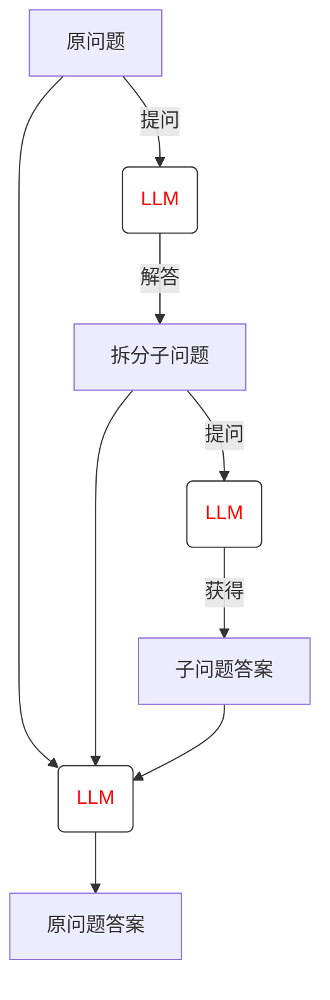
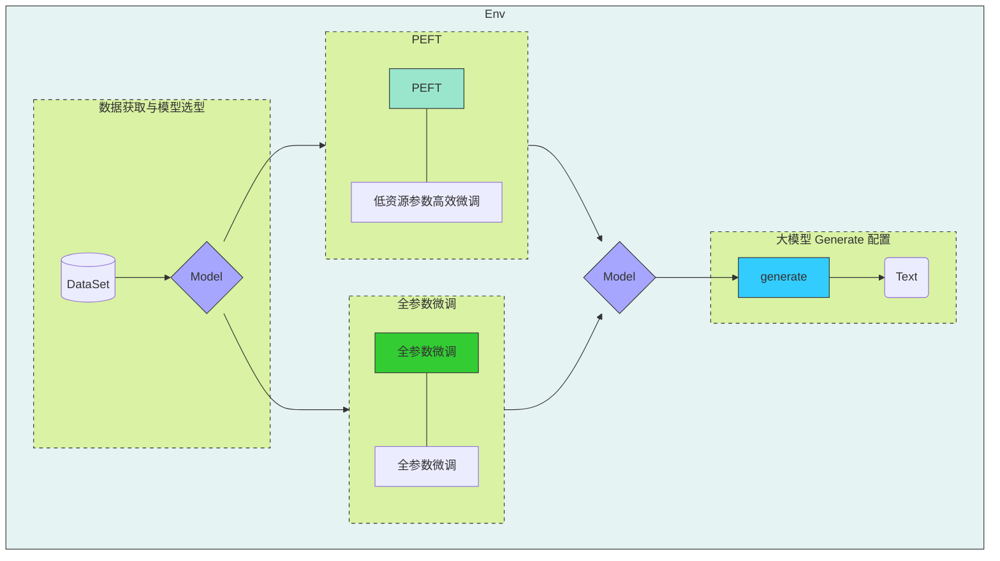

# swanlab

## 快速开始

1. `pip install swanlab`
2. 控制台命令行输入  `swanlab login`  注意密码不会显示出来
3. 粘贴API Key完成

## 使用教程

[欢迎使用SwanLab | SwanLab官方文档](https://docs.swanlab.cn/guide_cloud/general/what-is-swanlab.html)

- 开启一个实验并跟踪超参数

```python
import swanlab

swanlab.init(
    project: str = None,
    workspace: str = None,
    experiment_name: str = None,
    description: str = None,
    job_type: str = None,
    group: str = None,
    tags: List[str] = None,
    config: Union[dict, str] = None,
    logdir: str = None,
    mode: MODES = None,
    load: str = None,
    public: bool = None,
    callbacks: List[SwanKitCallback] = None,
    settings: Settings = None,
    id: str = None,
    resume: Union[Literal['must', 'allow', 'never'], bool] = None,
    reinit: bool = None,
    **kwargs,
)
```

| 参数                                    | 描述                                                         |
| :-------------------------------------- | :----------------------------------------------------------- |
| project         | (str)项目名，如果不指定则取运行目录的名称。                  |
| workspace                               | (str)工作空间，默认将实验同步到你的个人空间下，如果要上传到组织，则填写组织的username。 |
| experiment_name | (str) 实验名称, 如果不指定则取"swan-1"这样的`动物名+序号`作为实验名。 |
| job_type                                | (str) 任务类型，默认为空。                                   |
| group                                   | (str) 实验分组，默认为空。                                   |
| tags                                    | (list) 实验标签。可以传入多个字符串组成的列表，标签会显示在实验顶部的标签栏。 |
| description     | (str) 实验描述, 如果不指定默认为None。                       |
| config          | (dict, str) 实验配置，在此处可以记录一些实验的超参数等信息。支持传入配置文件路径，支持yaml和json文件。 |
| logdir                                  | (str) 离线看板日志文件存储路径，默认为`swanlog `。           |
| mode                                    | (str) 设置swanlab实验创建的模式，可选"cloud"、"local"、"offline"、"disabled"，默认设置为"cloud"。 `cloud`：将实验上传到云端。（公有云和私有化部署） `offline`：仅将实验数据保存到本地。 `local`：不上传到云端，但会记录实验数据和一些可被`swanlab watch`打开的数据到本地。 `disabled`：不上传也不记录。 |
| load                                    | (str) 加载的配置文件路径，支持yaml和json文件。               |
| public                                  | (bool) 设置使用代码直接创建SwanLab项目的可见性，默认为False即私有。 |
| callbacks                               | (list) 设置实验回调函数，支持`swanlab.toolkit.callback.SwanKitCallback`的子类。 |
| name                                    | (str) 与experiment_name效果一致，优先级低于experiment_name。 |
| notes                                   | (str) 与description效果一致，优先级低于description。         |
| settings                                | (dict) 实验配置。支持传入1个`swanlab.Settings`对象。         |
| id                                      | (str) 上次实验的运行ID，用于恢复上次实验。ID必须为21位字符串。 |
| resume                                  | (str) 断点续训模式，可选True、False、"must"、"allow"、"never"，默认取None。 `True`： 效果同`resume="allow"`。 `False`：效果同`resume="never"`。 `must`：你必须传递 `id` 参数，并且实验必须存在。 `allow`：如果存在实验，则会resume该实验，否则将创建新的实验。 `never`：你不能传递 `id` 参数，将会创建一个新的实验。(即不开启resume的效果) |
| reinit                                  | (bool) 是否重新创建实验，如果为True，则每次调用`swanlab.init()`时，会把上一次实验`finish`掉；默认取None。 |

- 记录

```python
swanlab.log(
    data: Dict[str, DataType],
    step: int = None,
    print_to_console: bool = False,
)
# 例
swanlab.log({'train-loss': avg_loss, 'test-loss': test_loss, 'test-accuracy': accuracy}, print_to_console=True)
```

| 参数             | 描述                                                         |
| :--------------- | :----------------------------------------------------------- |
| data             | (Dict[str, DataType]) 必须。传入一个键值对字典，key为指标名，value为指标值。value支持int、float、可被float()转换的类型、或任何`BaseType`类型。 |
| step             | (int) 可选，该参数设置了data的步数。如不设置step，则将以0开始，后续每1次step累加1。 |
| print_to_console | (bool) 可选，默认值为False。当设置为True时，会将data的key和value以字典的形式打印到终端。 |

- [记录媒体数据 | SwanLab官方文档](https://docs.swanlab.cn/guide_cloud/experiment_track/log-media.html)

- [邮件通知 | SwanLab官方文档](https://docs.swanlab.cn/plugin/notification-email.html)

```python
from swanlab.plugin.notification import EmailCallback

email_callback = EmailCallback(
    sender_email="2303479606@qq.com",
    receiver_email="xiaomaolin37@gmail.com",
    password="tpioydrbdwhgdibc",
    smtp_server="smtp.qq.com",
    port=587,
    language="zh",
)

swanlab.init(callbacks=[email_callback],)
    
```

## 微调中的使用

> `transformers>=4.50.0` 的版本，已官方集成了SwanLab
> 如果你的版本低于4.50.0或者你希望更灵活地控制SwanLab的行为，请使用[SwanLabCallback集成](https://docs.swanlab.cn/guide_cloud/integration/integration-huggingface-trl.html#_5-使用swanlabcallback)。

```python
import os
os.environ["SWANLAB_PROJECT"]="qwen2-sft"
...
training_args = SFTConfig(
    output_dir="Qwen/Qwen2.5-0.5B-SFT",
    per_device_train_batch_size=1,
    per_device_eval_batch_size=1,
    num_train_epochs=1,
    logging_steps=20,
    learning_rate=2e-5,
    report_to="swanlab", 
    )
trainer.train()
```

**SwanLabCallback**是适配于Transformers的日志记录类。

**SwanLabCallback**可以定义的参数有：

- project、experiment_name、description 等与 swanlab.init 效果一致的参数, 用于SwanLab项目的初始化。
- 你也可以在外部通过`swanlab.init`创建项目，集成会将实验记录到你在外部创建的项目中。

```python
from swanlab.integration.transformers import SwanLabCallback
from trl import SFTConfig, SFTTrainer

...

# 实例化SwanLabCallback
swanlab_callback = SwanLabCallback(project="trl-visualization")

trainer = SFTTrainer(
    ...
    # 传入callbacks参数
    callbacks=[swanlab_callback],
)

trainer.train()
```

# Embedding

## Embedding模型选择

1. 通用文本嵌入模型：

   - BGE-M3

     - 特点：支持100+语言，输入长度达8192 tokens，融合密集、稀疏、多向量混合检索

     - 适用场景：跨语言长文档检索、高精度RAG应用

   - text-embedding-3-large(open AI)

     - 特点：向量维度3072，长文本语义捕捉能力强，英文表现优秀
     - 适用场景：英文内容优先的全球化应用

2. 中文嵌入模型：

   - xiaobu-embedding-v2
     - 特点：针对中文语义优化，语义理解能力强。
     - 适用场景：中文文本分类、语义检索。
   - M3E-Base
     - 特点：针对中文优化的轻量模型，适合本地私有化部署。 
     - 适用场景：中文法律、医疗领域检索任务。

3. 指令驱动与复杂任务模型：

   - gte-Qwen2-7B-instruct（阿里巴巴）
     -  特点：基于Qwen大模型微调，支持代码与文本跨模态检索。
     - 适用场景：复杂指令驱动任务、智能问答系统。
   - E5-mistral-7B（Microsoft）
     - 特点：基于Mistral架构，Zero-shot任务表现优异。
     - 适用场景：动态调整语义密度的复杂系统。

4. 企业级与复杂系统：

   - BGE-M3（智源研究院）
     - 特点：适合企业级部署，支持混合检索。 
     - 适用场景：企业级语义检索、复杂RAG应用。
   - E5-mistral-7B（Microsoft）
     - 特点：适合企业级部署，支持指令微调。 
     - 适用场景：需要动态调整语义密度的复杂系统。

# RAG

> 使用notebookLM更佳(Gemini-embedding，闭源第一)

## 核心流程

**step1 数据预处理**

- 知识库构建：收集并整理文档、网页、数据库等多源数据，构建外部知识库
- 文档分块：将文档切分为适当大小的片段(chunks)，以便后续检索。分块策略需要在语义完整性与检索效率之间取得平衡。
- 向量化处理：使用嵌入模型（如BGE、M3E等）将文本块转换为向量，并存储在向量数据库中。

**step2 检索阶段**

- 查询处理：将用户输入的问题转换为向量，并在向量数据库中进行相似度检索，找到最相关的文本片段。
- 重排序：对检索结果进行相关性排序，选择最相关的片段作为生成阶段的输入

**step3 生成阶段**

- 上下文组装：将检索到的文本片段与用户问题结合，形成增强的上下文输入
- 生成回答：大语言模型基于增强的上下文生成最终回答

## Thinking

如果LLM可以处理无限上下文，RAG还有意义吗？

> 效率与成本：LMM处理时计算资源消耗大，响应时间增加
>
> 知识更新：LLM知识无法实时更新
>
> 可解释性：RAG的检索过程透明
>
> 定制化：RAG可以针对特定领域定制检索系统
>
> 数据隐私：RAG允许咋本地检索

## RAG高效召回方法

- 改进检索算法

  - 知识图谱：利用知识图谱中的语义信息和实体关系，增强对查询和文档的理解，提升召回的相关性

- 引入重排序（Reranking）

  - 重排序模型：对召回结果进行重排，提升问题和文档的相关性。常见的重排序模型有BGE-Rerank和Cohere Rerank。

  > 提问 —— 初步召回10篇文章 —— 重排序

  - 混合检索：结合向量检索和关键词检索的优势，通过重排序模型对结果进行归一化处理

- Query改写/Query+联网搜索

- 双向改写：将查询改写成文档(Query2Doc)或为文档生成查询，缓解短文本向量化效果差的问题

- 索引扩展

  - 离散索引扩展：使用关键词抽取、实体识别等技术生成离散索引，与向量检索互补，提升召回准确性。
  - 连续索引扩展：结合多种向量模型进行多路召回，取长补短。
  - 混合索引召回：将BM25等离散索引与向量索引结合，通过Ensenble Retriever实现混合召回
  - small-to-big索引策略：适用于处理长文档或多文档场景

## 检索算法

### 全文检索

全文检索通常基于倒排索引技术。在创建索引时，系统会对文本进行分词处理，将文本分解为单词或词项，并记录每个词项在哪些文档中出现以及出现的位置和频率等信息。

文本分词

- 定义：将一段连续的文档或查询文本分解成单词、词语或有意义的单元的过程，以便于索引和搜索处理。
- 特点：分词方法有规则、词典、统计和深度学习等多种方式，适用于不同语言和应用场景。

**TFIDF算法（相关性计算）**
$$
TF(t,d)=\frac{词t在文档d中出现的次数}{文档d的总词数}, \quad\quad\quad IDF(t,D)=log(\frac{语料库文档总数N}{包含词t的文档数n_t+1})\\\\
TF-IDF(t,d,D)=TF(t,d) \times IDF(t,D)
$$
总结：一个词语在一篇文章中的出现次数越多，同时在所有文档中出现次数越少，越能代表该文章

**BM25算法（相关性计算）**

定义：基于词频、逆文档频率和文档长度的加权排序算法，用于评估文档与查询的相关性。——BM25核心就是TF-IDF算法
$$
BM25(t,d)=log \frac{N-df_t+0.5}{df_t + 0.5} \cdot \frac{f_{t,d}\cdot (k_1+1)}{f_{t,d}+k_1\cdot (1-b+b\cdot \frac{\abs{d}}{avgdl})}
$$

| 改进之处             | **TF-IDF**                                                   | **BM25**                                                     | **总结**                                                     |
| -------------------- | ------------------------------------------------------------ | ------------------------------------------------------------ | ------------------------------------------------------------ |
| 非线性词频（TF）函数 | 线性  TF，词频无限增加，分数无限涨                           | 非线性  TF，引入饱和函数 → 词频的贡献逐渐减少，高频词贡献逐渐减弱（参数 k1 控制），更贴近实际语义  例如：  当  ft,d很小 → 公式近似线性（词频增加会明显提升分数）  当  ft,d很大 → 分母也变大，分数逐渐趋近于一个上限  ——词频增加到一定程度后，贡献会“饱和”。 | BM25 不是简单数次数，而是“数到一定程度就够了”，再多出现贡献也有限。 |
| 文档长度归一化       | 长文档容易得高分  例如： 文档  A(短)：50 个词，提到  1 次“人工智能”  文档  B(长)： 500 个词，提到 3 次“人工智能” | 用参数  b 平衡长文档和短文档，避免偏差  例如： 文档A（短）：tf=0.685  文档B（长）：tf=0.615 | 在  TF-IDF  中，长文档因为 词更多、词频更高、命中概率更大，往往得分偏高；BM25通过  长度归一化 抑制了这种偏差。 |
| 改进的IDF            | 稀有词权重过大，常见词惩罚不足例如：常见词  ≈ 权重接近 0（弱化，但还可能残留影响） | 平滑处理，强化对常见词的惩罚，更稳定  例如：常见词  ≈ 权重可能为负（惩罚更强，确保它们不会被误判为有区分度的关键词） | BM25 的改进  IDF  会在常见词出现过多时给它们 负权重惩罚，确保检索结果更聚焦在有区分度的关键词上。 |
| 灵活的参数调节       | 固定公式，不可调                                             | 提供  k1（TF饱和）和  b（长度归一化），可适应不同应用场景——K一般取1.2；b一般取0.75 | TFIDF的参数不可调； BM25的参数灵活且可调；                   |


# Prompt

## LtM提示法

(LEAST-TO-MOST PROMPTING)

LtM提示方法提出的初衷是为了解决CoT提示方法泛化能力不足的问题——即通过人工编写的思维链提示样本可能并不能够很好的迁移到别的问题当中去，即泛化能力不够。而这种泛化能力不足则会导致“新的问题”无法使用“老的模板”进行解决。

谷歌大脑基于这个思路开发了一种全新的提示流程，即先通过提示过程让模型找到解决该问题必须要分步解决哪几个问题，然后再通过依次解决这些问题来解决最原始的问题。



> 艾米需要4分钟才能爬到滑梯顶部，她花了1分钟才滑下来，水滑梯将在15分钟后关闭，请问在关闭之前她能滑多少次？为了解决‘在关闭之前能滑多少次？’这个问题，我们首先要解决的问题是?

## SCAN数据集

数据集本身是一系列的指令和对应的行为序列组成的数据集，指令在数据集中以IN的形式进行申明，是一串描述动作序列的英文句子，例如"walk twice and jump twice"；而行为序列则是以OUT的形式进行申明，是指令所指代的一系列精准步骤，例如“"WALK", "WALK", "JUMP", "JUMP"”，数据集基本结构如下：

```python
IN: walk opposite right thrice after run opposite right OUT: I_TURN_RIGHT I_TURN_RIGHT I_RUN I_TURN_RIGHT I_TURN_RIGHT I_WALK I_TURN_RIGHT I_TURN_RIGHT I_WALK I_TURN_RIGHT I_TURN_RIGHT I_WALK

IN: turn around right thrice after run opposite right twice OUT: I_TURN_RIGHT I_TURN_RIGHT I_RUN I_TURN_RIGHT I_TURN_RIGHT I_RUN I_TURN_RIGHT I_TURN_RIGHT I_TURN_RIGHT I_TURN_RIGHT I_TURN_RIGHT I_TURN_RIGHT I_TURN_RIGHT I_TURN_RIGHT I_TURN_RIGHT I_TURN_RIGHT I_TURN_RIGHT I_TURN_RIGHT

IN: look opposite left twice after walk around right twice OUT: I_TURN_RIGHT I_WALK I_TURN_RIGHT I_WALK I_TURN_RIGHT I_WALK I_TURN_RIGHT I_WALK I_TURN_RIGHT I_WALK I_TURN_RIGHT I_WALK I_TURN_RIGHT I_WALK I_TURN_RIGHT I_WALK I_TURN_LEFT I_TURN_LEFT I_LOOK I_TURN_LEFT I_TURN_LEFT I_LOOK
```

**Few-shot-LtM**

针对SCAN数据集，论文中将Few-shot-LtM提示的两个阶段进行重新命名，此前的Decompose Questions into Subquestions被重新命名为Command decomposition，即命令分解，其实也就是问题拆解，而第二个阶段Sequentially Solve Subquestion则重新命名为Command mapping，即指令翻译，当然其实本质也就是依次翻译拆解的指令以及原始指令。而这两个阶段的新名称，也非常清晰的指明了对于SCAN数据集来说，LtM提示工程的具体应用形式就是——先拆分命令、再逐个进行翻译。

```python
"""
Q: “look opposite right thrice after walk” \
A: “look opposite right thrice” can be solved by: “look opposite right”, “look opposite right thrice”. “walk” can be solved by “walk”. So, “look opposite right thrice after walk” can be solved by: “walk”, “look opposite right”, “look opposite right thrice”. \
Q: “look around right thrice and walk” \
A: “look around right thrice” can be solved by: “look right”, “look around right”, “look around right thrice”. “walk” can be solved by “walk”. So, “look around right thrice and walk” can be solved by: “look right”, “look around right”, “look around right thrice”, “walk”. \
"""
```

```python
import os
import json
import re
import datasets
import numpy as np
from datasets import load_dataset, Dataset, DatasetDict
from openai import OpenAI

api_key = os.getenv('API_KEY')


def get_response(message):
    client = OpenAI(
        api_key=api_key,
        base_url="https://dashscope.aliyuncs.com/compatible-mode/v1",
    )
    messages = [
        {"role": "system", "content": "你是一个语言模型，用于生成自然语言的指令。"},
        {"role": "user", "content": message},
    ]
    response = client.chat.completions.create(
        model="qwen-turbo",
        messages=messages,
    )
    return response.choices[0].message.content.strip()


current_dir = os.path.dirname(os.path.abspath(__file__))


def save_scan_dataset():
    data_folder = os.path.join(current_dir, "SCAN", "simple_split")
    train_path = os.path.join(data_folder, "tasks_train_simple.txt")
    test_path = os.path.join(data_folder, "tasks_test_simple.txt")

    def load_scan_data(file_path):
        """读取 SCAN 数据集的通用函数"""
        commands = []
        actions = []

        if not os.path.exists(file_path):
            print(f"错误: 找不到文件 {file_path}")
            return commands, actions

        with open(file_path, 'r', encoding='utf-8') as f:
            for line in f:
                # SCAN 数据格式通常是: IN: command OUT: actions
                line = line.strip()
                if line:
                    # 分割命令和动作
                    parts = line.split(' OUT: ')
                    if len(parts) == 2:
                        command = parts[0].replace('IN: ', '').strip()
                        action = parts[1].strip()
                        commands.append(command)
                        actions.append(action)

        return commands, actions

    def create_scan_dataset(train_commands, train_actions, test_commands, test_actions):
        """创建 SCAN 数据集的 DatasetDict 格式"""

        # 创建训练集
        train_dataset = Dataset.from_dict({
            'command': train_commands,
            'action': train_actions
        })

        # 创建测试集
        test_dataset = Dataset.from_dict({
            'command': test_commands,
            'action': test_actions
        })

        # 创建 DatasetDict
        scan_dataset = DatasetDict({
            'train': train_dataset,
            'test': test_dataset
        })

        return scan_dataset

    # 加载数据
    train_commands, train_actions = load_scan_data(train_path)
    test_commands, test_actions = load_scan_data(test_path)

    # 创建 Dataset 格式的数据集
    scan_dataset = create_scan_dataset(train_commands, train_actions, test_commands, test_actions)

    # 打印数据集信息
    print("SCAN 数据集信息:")
    print(scan_dataset)
    print(f"训练集大小: {len(scan_dataset['train'])}")
    print(f"测试集大小: {len(scan_dataset['test'])}")

    # 查看前几个样本
    print("训练集前3个样本:")
    for i in range(min(3, len(scan_dataset['train']))):
        print(scan_dataset['train'][i])
        print("-" * 50)

    # 保存数据集到本地（可选）
    scan_dataset.save_to_disk(os.path.join(current_dir, "SCAN_dataset"))
    print("数据集已保存到 SCAN_dataset 文件夹")


# 加载本地数据集
scan_dataset = datasets.load_from_disk(os.path.join(current_dir, "SCAN_dataset"))


# 也可以转换为 pandas DataFrame（可选）
# train_df = scan_dataset['train'].to_pandas()
# test_df = scan_dataset['test'].to_pandas()
#
# print(train_df)
# print(f"训练集 DataFrame 形状: {train_df.shape}")
# print(f"测试集 DataFrame 形状: {test_df.shape}")
def transform_expression(s):
    # Regular expression pattern
    pattern = r'is “.*'

    # Find the match
    match = re.search(pattern, s)

    s = match.group()[3: -1].replace('“', '"').replace('”', '"')
    # Step 1: Handle multiplications
    pattern = r'"([^"]+)" \* (\d+)'
    matches = re.findall(pattern, s)
    for match in matches:
        replacement = ' '.join([f'"{match[0]}"'] * int(match[1]))
        s = s.replace(f'"{match[0]}" * {match[1]}', replacement)

    # Step 2: Replace spaces within quotes with underscores
    pattern = r'"([^"]+)"'
    matches = re.findall(pattern, s)
    for match in matches:
        replacement = match.replace(' ', '_')
        s = s.replace(f'"{match}"', f'"{replacement}"')

    # Step 3: Add 'I_' prefix within quotes
    pattern = r'"([^"]+)"'
    matches = re.findall(pattern, s)
    for match in matches:
        replacement = 'I_' + match
        s = s.replace(f'"{match}"', f'"{replacement}"')

    # Step 4: Remove quotes
    s = s.replace('"', '')
    s = s.replace(' +', '')

    return s


few_shot = """
Command1 = 'look thrice after jump'
Action1 = 'JUMP LOOK LOOK LOOK';
Command2 = 'run left and walk'
Action2 = 'TURN LEFT RUN WALK';
Command3 = 'look opposite right'
Action3 = ?
"""

few_shot_LtM_1 = """
Q: “look opposite right thrice after walk” \
A: “look opposite right thrice” can be solved by: “look opposite right”, “look opposite right \
thrice”. “walk” can be solved by “walk”. So, “look opposite right thrice after walk” can be \
solved by: “walk”, “look opposite right”, “look opposite right thrice”. \
Q: “look around right thrice and walk” \
A: “look around right thrice” can be solved by: “look right”, “look around right”, “look around \
right thrice”. “walk” can be solved by “walk”. So, “look around right thrice and walk” can be \
solved by: “look right”, “look around right”, “look around right thrice”, “walk”. \
"""

few_shot_LtM = """
Q: “jump left” \
A: The output of “jump left” concatenates: the output of “turn left”, the output of “jump”. “turn \
left” outputs “TURN LEFT”. “jump” outputs “JUMP”. So concatenating the output of “turn \
left” and the output of “jump” leads to “TURN LEFT” + “JUMP”. So the output of “jump left” \
is “TURN LEFT” + “JUMP”. \
Q: “run and look twice” \
A: The output of “run and look twice” concatenates: the output of “run”, the output of “look \
twice”. “run” outputs “RUN”. “look twice” outputs “LOOK” * 2. So concatenating the output of \
“run” and the output of “look twice” leads to “RUN” + “LOOK” * 2. So the output of “run and \
look twice” is “RUN” + “LOOK” * 2. \
Q: “walk opposite left” \
A: The output of “walk opposite left” concatenates: the output of “turn opposite left”, the output of \
“walk”. “turn opposite left” outputs “TURN LEFT” * 2. “walk” outputs “WALK”. So concatenating the \
output of “turn opposite left” and the output of “walk” leads to “TURN LEFT” * 2 + “WALK”. So the \
output of “walk opposite left” is “TURN LEFT” * 2 + “WALK” \
"""
prompt_1 = few_shot_LtM + 'Q:“walk right” A：?'
response1 = get_response(prompt_1)
# print(response1)
prompt_2 = prompt_1 + response1 + 'Q:“run left” A：?'
response2 = get_response(prompt_2)
# print(response2)
prompt_3 = prompt_2 + response2 + 'Q:“run opposite left” A：?'
response3 = get_response(prompt_3)
print(response3)
print(transform_expression(response3))

```

# 微调

**使用时机**

提示工程——RAG——微调

**常用微调方法**

| 方法           | 可训练参数比例 | 核心思想                                                     | 常用场景                                                     |
| -------------- | -------------- | ------------------------------------------------------------ | ------------------------------------------------------------ |
| Prompt Tuning  | 极低(<0.01%)   | [软提示]冻结整个预训练模型，只在输入层添加一串可训练的软提示向量(即不是人能读的自然语言词)，让模型自适应的理解任务。 | 模型规模非常大(>10B)时效果才好，资源极度受限的场景           |
| P-Tuning v1/v2 | 极低(<0.1%~1%) | [可深度的软提示]是Prompt Tuning的升级版，将可训练的软提示向量插入到每一层的输入中，而不仅仅是输入层，使提示更深入、效果更强 | 自然语言理解任务，如分类、阅读理解。在中小型模型(~10B)上效果比Prompt Tuning好 |
| Prefix Tuning  | 低(~0.1%~3%)   | [隐式前缀]与P-Tuning类似，也是在每一层头部添加可训练向量。但它讲这些向量视为虚拟的“前缀token”，通过一个更复杂的网络(MLP)生成，之后被冻结 | 自然语言生成任务，如对话、摘要、翻译                         |
| LoRA           | 中低(~1%~10%)  | [低秩更新]冻结预训练模型权重，假设模型微调时的权重变化是低秩的，用两个小矩阵的乘积来近似这个更新量 | 几乎全能，是目前最流行、最通用的方法，有趣适合微调LLM和扩散模型 |
| QLoRA          | 中低(~1%~10%)  | [量化LoRA]LoRA的内存高效版。先将预训练模型量化为4-bit以极大减少内存占用，然后再使用LoRA进行微调。保证了性能几乎无损。 | 资源受限的场景，想要微调极其巨大的模型。                     |

**基本流程**



- 准备阶段：提前从原始数据中划分出验证集和测试集
- 训练中：使用验证集监控训练过程，防止过拟合
- 训练后：
  1. 在测试集上运行基座模型和微调后的模型，记录所有主指标
  2. 进行通用能力测试和泛化能力测试
  3. 人工抽查测试集和通用能力测试中的一些样本输出，进行质量分析
  4. 综合所有维度做出判断。主指标大幅提升，同事通用能力没有显著退化，才是一次成功的微调


**微调后的模型评估**

测试维度

- 任务主指标
  - 直接反映了模型在目标任务上的能力的提升幅度
- 通用能力保持
  - 常识推理，基础代码能力，通用对话
  - 防止模型出现灾难性遗忘
- 泛化能力
  - 构造更复杂或包含干扰信息的输入
  - 检验模型是死记硬背了数据还是真正学会了任务
- 人工评估
  - 发现自动化指标无法捕捉的细微问题，最终的质量关口
- 输出质量分析
  - 直接对比和分析模型在具体案例上的输入输出
  - 为下一步迭代优化提供最直接的线索和方向

## 精度

**半精度浮点数溢出和舍入误差**

- 溢出

  - FP16（半精度浮点数）可以表示的范围（正数）：$6.10 \times 10^{-5} \sim65504$
  - FP32（单精度浮点数）可以表示的范围（正数）：$1.4 \times 10^{-45}\sim 10^{38}$
  - BF16的指数位与FP32相同（8位），数据范围和FP32接近，几乎不会溢出，但代价是精度的大幅降低，舍入误差更大。

- 舍入误差

  假设权重为$2^{-3}$，梯度为$2^{-14}$，那么新的权重为$2^{-3}-2^{-14}$

  如果用FP16执行这样的计算就会出现舍入误差，FP16在区间$[2^{-3},2^{-2})$内，最小间隔为$2^{-13}$，所以$2^{-3}-2^{-14}$是无效操作。

**混合精度训练**

包含三种技术：

- 保留FP32权重主副本（解决舍入误差）


- 通过损失缩放避免梯度值变为0

  为了解决梯度过小数据下溢的问题，对前向计算出来的Loss值进行放大操作，也就是把FP32的参数乘以某一个因子系数后，把可能溢出的小数位数据往前移，平移到FP16能表示的数据范围内。根据链式求导法则，放大Loss后会作用在反向传播的每一层梯度，这样比在每一层梯度上进行放大更加高效。其主要的主要思路是：

  - Scale up阶段：网络模型前向计算后在反响传播前，将得到的损失变化值DLoss增大$2^K$倍。
  - Scale down阶段：反向传播后，将权重梯度缩$2^K$倍，恢复FP32值进行存储。

  $$
  \begin{flalign}
  &\quad\text{pred}=1e-4, \quad \text{loss}=1e-8. \quad \text{scale初始一般为}2^{16}, \text{即}65536\\
  &\text{step 1. 执行scaler.scale(loss)}\quad loss_{scaled}=65536 \times loss  = 65536\times pred^{2}\\
  &\text{step 2. 执行.backward()反向传播，计算梯度}\\
  &\quad grad_{scaled}=\frac{\partial L_{scaled}}{\partial \theta}=\frac{\partial L_{scaled}}{\partial pred} \cdot \frac{\partial pred}{\partial \theta}=65536\times2\times1e^{-4}\times\frac{\partial pred}{\partial \theta}\\
  &\quad\text{这里避免了原本}\frac{\partial L}{\partial pred}\text{趋近于0造成的下溢}\\
  &\text{step 3. 执行scaler.step()  \quad\quad还原梯度大小，以float32保存 和 更新参数}\\
  &\quad grad=\frac{grad_{scaled}}{scale}=2e^{-4}\times\frac{\partial pred}{\partial \theta}\\
  &\quad \theta \leftarrow \theta - lr * grad
  \end{flalign}
  $$

  ​	上面只是一个简单的实例，没有涉及scale的自动调整与溢出检测，跳过step的逻辑

- 将FP16算数累加值FP32格式，即上面两种技术的操作

**大小估算**

- 存储空间大小

| **规模** | **FP16 类型大小**                                            | **FP32 类型大小**                                            |
| -------- | ------------------------------------------------------------ | ------------------------------------------------------------ |
| **6B**   | $6,000,000,000 \times 2\text{Byte} \approx 11.18\text{GB}$   | $6,000,000,000 \times 4\text{Byte} \approx 22.35\text{GB}$   |
| **7B**   | $7,000,000,000 \times 2\text{Byte} \approx 13.04\text{GB}$   | $7,000,000,000 \times 4\text{Byte} \approx 26.08\text{GB}$   |
| **13B**  | $13,000,000,000 \times 2\text{Byte} \approx 24.21\text{GB}$  | $13,000,000,000 \times 4\text{Byte} \approx 48.43\text{GB}$  |
| **175B** | $175,000,000,000 \times 2\text{Byte} \approx 325.96\text{GB}$ | $175,000,000,000 \times 4\text{Byte} \approx 651.93\text{GB}$ |

- 显存大小（一个单位1B）

  - FP32权重主副本——4个单位
  - FP16权重副本——2个单位
  - FP16梯度——2个单位
  - FP32优化器——（AdamW）4+4=8个单位

  综上，除隐藏层外占用的总显存为16个单位字节。加上隐藏层：

  $24 × 𝑏𝑎𝑡𝑐ℎ\_𝑠𝑖𝑧𝑒 × 𝑠𝑒𝑞\_𝑙𝑒𝑛 × 𝑑_{𝑚𝑜𝑑𝑒𝑙} + 𝑏𝑎𝑡𝑐ℎ\_𝑠𝑖𝑧𝑒 × 𝑠𝑒𝑞\_𝑙𝑒𝑛 × 𝑠𝑒𝑞\_𝑙𝑒𝑛$

  Qwen3-0.6B 的解码器共有 28 层，因此，计算过程中总的隐藏层元素数量为

  $2 × 𝑏𝑎𝑡𝑐ℎ\_𝑠𝑖𝑧𝑒 × 𝑠𝑒𝑞\_𝑙𝑒𝑛 × 𝑑_{𝑚𝑜𝑑𝑒𝑙} + 𝑏𝑎𝑡𝑐ℎ\_𝑠𝑖𝑧𝑒 × 𝑠𝑒𝑞\_𝑙𝑒𝑛 × 𝑑_{𝑣𝑜𝑐𝑎𝑏} + 28
  × (24 × 𝑏𝑎𝑡𝑐ℎ\_𝑠𝑖𝑧𝑒 × 𝑠𝑒𝑞\_𝑙𝑒𝑛 × 𝑑_{𝑚𝑜𝑑𝑒𝑙} + 𝑏𝑎𝑡𝑐ℎ\_𝑠𝑖𝑧𝑒 × 𝑠𝑒𝑞\_𝑙𝑒𝑛 × 𝑠𝑒𝑞
  \_𝑙𝑒𝑛)$

显然，隐藏层元素数量远远大于权重数量，影响隐藏层显存占用的因素主要是𝑏𝑎𝑡𝑐ℎ\_𝑠𝑖𝑧𝑒和𝑠𝑒𝑞\_𝑙𝑒𝑛。

不考虑其他优化手段，训练所需总显存=16φ+激活值+显存碎片+预留

## 并行

- 数据并行：（Data Parallelism，DP）是最常见的并行形式，因其实现相对简单。在数据并
  行训练中，数据集被划分为多个分片，每个分片分配给一个设备（通常是 GPU）。这相当
  于沿批次（Batch）维度对训练过程进行并行化。每个设备持有完整的模型副本，并在其分
  配的数据分片上独立进行训练。在反向传播之后，所有设备的模型梯度会被聚合（通常通过
  AllReduce 操作），以确保不同设备上的模型参数保持同步。PyTorch DDP（Distributed Data Parallel）是典型实现。最佳

- 模型并行：另一种并行模式是模型并行（Model Parallelism, MP），它将模型本身分割并分布在多个设备上。模型并行通常分为两种类型：
  张量并行（Tensor Parallelism, TP）：在一个操作内部进行并行计算（例如矩阵乘法）。
  流水线并行（Pipeline Parallelism, PP）：在模型的不同层之间进行并行计算。
  因此，张量并行可视为层内并行，而流水线并行可视为层间并行。

- 多维度混合并行

  

### DDP加速

Python GIL的存在使得，一个python进程只能利用一个CPU核心，不适合用于计算密集型的任务。使用多进程，才能有效率利用多核的计算资源。

Ring-Reduce梯度合并，是一种分布式程序的通讯方法。

- scatter-reduce


- all gather


### Deepspeed

基于 pytorch 构建，只需要简单修改即可迁移

ZeRO：Zero Redundancy Optimizer，零冗余优化器。消除了数据和模型并行训练中的内存冗余，同时保留了低通信量和高计算粒度，使我们能够根据设备数量按比例缩放模型大小，并保持持续的高效率

（1）ZeRO-1：只对优化器存储进行切分，也就是 12φ的 fp32 数据，有多少 GPU 就切分多少份，即 12φ / NumGPU。
（2）ZeRO-2除了对优化器存储进行切分，还对梯度存储数据进行切分，即 2φ / NumGPU。
（3）ZeRO-3除了对优化器存储进行切分，还对梯度和参数 w 存储数据进行切分，又多了一个 2φ /NumGPU。
ZeRO1 和 2 没有带来额外通讯，而 3 是有额外的通讯的，增加了 zero3 之后，整个通讯录增加1.5倍，只要通讯时间小于计算时间就能够接受。

从左到右，越来越慢：
Stage 0 (DDP) > Stage 1 > Stage 2 > Stage 2 + offload > Stage 3 > Stage 3 + offloads
从左到右，所需 GPU 显存越来越少：
Stage 0 (DDP) < Stage 1 < Stage 2 < Stage 2 + offload < Stage 3 < Stage 3 + offloads

在实际训练阶段，应采用从左到右的方式逐一尝试，找到在当前硬件配置下，能够运行
的最优方案

## LORA

- 在原始 PLM (Pre-trained Language Model) 旁边增加一个旁路，做一个降维再升维的操作，来模拟所谓的`intrinsic rank`。
- 训练的时候固定 PLM 的参数，只训练降维矩阵 A 与升维矩阵 B 。而模型的输入输出维度不变，输出时将 BA 与 PLM 的参数叠加。
- 用随机高斯分布初始化 A ，用 0 矩阵初始化 B ，保证训练的开始此旁路矩阵依然是 0 矩阵。

假设要在下游任务微调一个预训练语言模型（如 GPT-3），则需要更新预训练模型参数，公式表示如下：$W_0+ \Delta W$

- $W_0$是预训练模型初始化的参数，$\Delta W$就是需要更新的参数。如果是全参数微调，则它的参数量$=W_0$（如果是GPT-3，则$\Delta W \approx 175B$） 。从这可以看出要全参数微调大语言模型代价是非常高的。

  而对于LORA来说，只需要微调$\Delta W$。具体来看，假设预训练的矩阵为$W_0 \in \R^{d \times k}$，它的更新可以表示为：
  $$
  W_0+\Delta W=W_0+BA,\quad B \in \R^{d \times r},A \in \R^{r \times k}
  $$
  其中秩$r << min(d,k)$。

- 在LORA的训练过程中，$W_0$是固定不变的，只有A和B是训练参数。在前向的过程中，$W_0$和$\Delta W$都会乘以相同的输入x，最有相加：
  $$
  h = W_0x + \Delta Wx = W_0x +BAx
  $$
  LORA 的这种思想有点类似于残差连接，同时使用这个旁路的更新来模拟 Full Fine-Tuning的过程。并且，Full Fine-Tuning可以被看做是 LoRA 的特例（当r等于k时）。

## Unsloth

Unsloth是一个开源的大模型训练加速项目，使用OpenAI的Triton对模型的计算过程进行重写，大幅提升模型的训练速度，降低训练中的显存占用。

**参数说明**

- FastLanguageModel.from_pretrained  → model, tokenizer

| 参数名                 | 类型        | 必填 | 说明                                                         | 推荐值                                                       |
| ---------------------- | ----------- | ---- | ------------------------------------------------------------ | ------------------------------------------------------------ |
| model_name             | str         | 是   | 预训练模型名称或本地路径。   <br />• 使用官方 4-bit 量化模型时需包含 unsloth/前缀。   <br />• 本地路径需指向已下载的模型目录。 | "unsloth/Qwen3-8B-unsloth-bnb-4bit"   （根据模型尺寸调整名称） |
| local_files_only       | bool        | 否   | 强制使用本地文件，否则回去huggingface下载                    | True                                                         |
| load_in_4bit           | bool        | 否   | 启用 4-bit 量化加载，显存降低70%。   <br />• Qwen3 官方已提供预量化版本，优先启用 | True（默认）   （显存 ≤24GB 必选）                           |
| bnb_4bit_quant_type    | str         | 否   | 量化算法类型。   <br />• 需搭配 load_in_4bit=True生效        | "nf4"（精度与效率最佳平衡）                                  |
| bnb_4bit_compute_dtype | torch.dtype | 否   | 量化后计算使用的数据类型。   <br />• 根据 GPU 架构自动选择最优类型 | torch.bfloat16（A100/H100）   <br />torch.float16（T4/V100） |
| max_seq_length         | int         | 否   | 模型支持的最大输入长度。  <br />• Qwen3 原生支持 128K 上下文，但需显存充足。<br />• 低显存场景建议设为 2048或 4096 | 2048（通用场景）   8192（长文本场景）                        |
| dtype                  | torch.dtype | 否   | 模型权重加载的数据类型。  <br />• 设为 None可自动根据硬件选择 | None（自动选择）                                             |
| device_map             | Str or dict | 否   | 指定模型加载的设备分布。   <br />• 多卡环境用 "auto"自动并行；单卡用 "cuda:0" | "auto"（多卡）   "cuda:0"（单卡）                            |
| token                  | str         | 否   | Hugging Face Hub 访问令牌，用于加载需认证的模型（如 gated 模型） | "hf_YourToken"（按需提供）                                   |
| full_finetuning        | bool        | 否   | 是否启用全参数微调。   <br />• Qwen3推荐设为False（即使用 LoRA 轻量化微调） | False（默认）                                                |

- FastLanguageModel.get_peft_model

| 参数名                        | 类型      | 作用                                                         | 推荐值（Qwen3）                                              | 特殊说明                                                   |
| ----------------------------- | --------- | ------------------------------------------------------------ | ------------------------------------------------------------ | ---------------------------------------------------------- |
| r                             | int       | LoRA 秩：控制低秩矩阵的维度，决定可训练参数量。   ↑秩 = ↑表达能力但↑显存占用；↓秩 = ↓过拟合风险但可能欠拟合。 | 简单任务：8   复杂任务：32-64                                | 数据量少时建议 r=8；长文本生成任务可提升至 r=64  。        |
| target_modules                | List[str] | 适配层选择：指定添加 LoRA 适配器的模型层。   影响模型对任务特征的捕捉能力。 | ["q_proj",  "k_proj", "v_proj", "o_proj",  "gate_proj", "up_proj", "down_proj"] | Qwen3 需包含 FFN 层（gate/up/down_proj）以适配门控结构  。 |
| lora_alpha                    | int       | 缩放因子：控制 LoRA 输出对原始权重的调整幅度。   ↑α = ↑学习速度但需配合↓学习率。 | r或者2*r（如 r=32→ alpha=64）                                | 避免过高（如 alpha > 128），否则易导致训练不稳定  。       |
| lora_dropout                  | float     | Dropout率：防止过拟合的正则化手段。   0 表示禁用，>0 时在适配器前向传播中随机丢弃神经元。 | 小数据集：0.1-0.3   大数据集：0                              | Unsloth 优化下可设 0，依赖早停等防过拟合  。               |
| bias                          | str       | 偏置项训练：控制是否微调模型偏置参数。   选项："none"、"all"、"lora_only"。 | "none"                                                       | 训练偏置对效果提升有限，且增加显存占用，通常关闭  。       |
| use_gradient_   checkpointing | str/bool  | 梯度检查点：用计算时间换显存优化，支持更大批次训练。         | "unsloth"（优先）或 True                                     | Unsloth 专用优化比常规检查点节省 30% 显存  。              |
| random_state                  | int       | 随机种子：固定训练随机性，确保实验可复现。                   | 任意整数（如 3407）                                          | 生产环境必设，调试时需测试不同种子  。                     |

- SFTTrainer

| 参数名             | 类型                | 作用                                       | 推荐值（Qwen3）                   | 特殊说明                                       |
| ------------------ | ------------------- | ------------------------------------------ | --------------------------------- | ---------------------------------------------- |
| model              | PreTrainedModel     | 待微调的模型，需已添加 LoRA 适配器         | 必填                              | 需 FastLanguageModel.get_peft_model预加载 LoRA |
| tokenizer          | PreTrainedTokenizer | 分词器，需与模型匹配                       | 必填                              | 从 FastLanguageModel.from_pretrained获取       |
| train_dataset      | Dataset             | 训练数据集，需已格式化                     | 必填                              | 需包含 text字段（见 dataset_text_field）       |
| dataset_text_field | str                 | 数据集中文本字段名，存储格式化后的训练样本 | "text"                            | 必须与数据集的键名一致                         |
| max_seq_length     | int                 | 输入序列最大长度，与模型初始化时一致       | 2048（默认）或 8192               | 不要超过原生长度                               |
| data_collator      | DataCollator        | 数据整理器，处理批次数据                   | DataCollatorForSeq2Seq(tokenizer) | 序列生成任务必选                               |
| dataset_num_proc   | int                 | 数据集预处理并行进程数                     | 2（平衡效率与内存）               | Windows 需设为 1防崩溃                         |
| packing            | bool                | 是否启用样本打包，将短文本拼接成长序列     | False（默认）                     | 可加速训练但可能降低精度                       |

- SFTConfig

| 参数名                      | 类型  | 作用                                  | 推荐值（Qwen3）                  | 注意事项                                        |
| --------------------------- | ----- | ------------------------------------- | -------------------------------- | ----------------------------------------------- |
| per_device_train_batch_size | int   | 单设备批次大小（影响显存占用）        | 2（24GB 显存）或 4（40GB+ 显存） | 需结合梯度累积调整有效批次大小                  |
| gradient_accumulation_steps | int   | 梯度累积步数（模拟更大批次训练）      | 4（默认）                        | 有效批次大小 = batch_size ×  accumulation_steps |
| warmup_steps                | int   | 学习率预热步数（避免初期震荡）        | 10（小数据集）或 50（大数据集）  | 占总步数 5%-10%                                 |
| max_steps                   | int   | 最大训练步数（替代 num_train_epochs） | 100-500（根据数据量调整）        | 小数据集可设 60-100                             |
| learning_rate               | float | 初始学习率（LoRA 微调需较低学习率）   | 2e-4（默认）或 5e-5（敏感任务）  | 过高易导致训练发散                              |

## trl

 TRL - Transformer Reinforcement Learning使用强化学习的全栈Transformer语言模型。trl 是一个全栈库，其中我们提供一组工具，用于通过强化学习训练Transformer语言模型和稳定扩散模型，从监督微调步骤（SFT）到奖励建模步骤（RM）再到近端策略优化（PPO）步骤。该库建立在Hugging Face 的 transformers 库之上。因此，可以通过 transformers 直接加载预训练语言模型。


## AutoDL租用

> 数据盘位置 `/root/autodl-tmp`，其余都是系统盘

- 服务器初始化

```shell
conda init  # 初始化
source ~/.bachrc  # 进入base环境
watch -n -1 nvidia-smi  # 实时监控显卡
conda create -n env_name python=3.12  # 创建虚拟环境
```

- 注册jupyterkernel（可选）

  `python -m ipykernel install --user --name sft312 --display-name "给kernel取的名字"`

- pycharm连接

  1. 创建一个本地项目，Python环境任选

  2. 添加SSH解释器  

     选择新建，复制登录指令，填入对应端口 ，Host为“@”符号后的部分

     复制密码输入

     选择conda env，会自动检测到`/root/miniconda3/bin/conda`，选择之前服务器上建好的环境

     修改sync folders路径：`<Project root>→/root/autodl-tmp/新建的项目文件夹`

  > 注意运行代码前先 [`ctrl+s`] 保存上传代码到服务器 ！！！
  >
  > 注意pip时不要用pycharm的终端，需要在服务器上pip ！！！

- 模型下载

  ```python
  from modelscope.hub.snapshot_download import snapshot_download
  
  model_dir = snapshot_download('unsloth/Qwen3-8B-Base-unsloth-bnb-4bit', cache_dir='/root/autodl-tmp/pretrained')  # 注意预训练模型路径不要放在项目路径中
  print('下载完成')
  ```

  > 自带梯子  `source /etc/network_turbo`； 取消：`unset http_proxy && unset https_proxy`

  服务器中新建conda env去下载
  
  ```shell
  conda create -n modelscope python=3.12
  conda activate modelscope
  pip install modelscope -i https://pypi.tuna.tsinghua.edu.cn/simple
  # 去到项目路径
  python model_download.py  # 注意是用modelscope环境中的python
  ```

- 清理系统盘

  ```bash
  du -sh /root/miniconda3/pkgs/ && rm -rf /root/miniconda3/pkgs/*   # conda的历史包
  du -sh /root/.local/share/Trash && rm -rf /root/.local/share/Trash   # jupyterlab的回收站
  sudo rm -rf /root/.cache/pip/*					#删除 pip 缓存
  sudo rm -rf /root/.cache/torch/hub/*	 			#删除 torch hub 缓存
  
  ```

  

## 代码

### unsloth

train

```python
from unsloth import FastLanguageModel  # 注意放第一个
from trl import SFTConfig, SFTTrainer
from datasets import load_dataset
import torch
from swanlab.integration.transformers import SwanLabCallback

"""
服务器后台运行
nohup python -u train_unsloth.py >20251227_1.log 2>&1 &
"""

# 初始化swanlab
swanlab_callback = SwanLabCallback(
    project="SFT",
    experiment_name="Qwen3-8B-unsloth-bnb-4bit-test",
    description="测试使用trl框架sft训练"
)


# ==================== 1.加载模型，tokenizer ====================
local_model_path = '/root/autodl-tmp/pretrained/unsloth/Qwen3-8B-unsloth-bnb-4bit'
dataset_path = '../data/keywords_data_train.jsonl'
model, tokenizer = FastLanguageModel.from_pretrained(
    model_name=local_model_path,
    max_seq_length=2048,
    device_map='auto',
    dtype=None,
    load_in_4bit=True,  # 注意加载的模型为4bit，此处必须设置为True
    load_in_8bit=False,
    full_finetuning=False,
    local_files_only=True,  # 强制使用本地文件，避免网络连接问题
)

model = FastLanguageModel.get_peft_model(  # 使用peft库的get_peft_model函数来添加LoRA层
    model,
    r=32,  # 秩 Choose any number > 0! Suggested 8, 16, 32, 64, 128
    target_modules=["q_proj", "k_proj", "v_proj", "o_proj",
                    "gate_proj", "up_proj", "down_proj", ],
    lora_alpha=32,  # Best to choose alpha = rank or rank*2
    lora_dropout=0,  # Supports any, but = 0 is optimized
    bias="none",  # Supports any, but = "none" is optimized
    # [NEW] "unsloth" uses 30% less VRAM, fits 2x larger batch sizes!
    use_gradient_checkpointing="unsloth",  # True or "unsloth" for very long context
    random_state=1024,
    use_rslora=False,  # rank stabilized LoRA
    loftq_config=None,  # LoftQ
)
# print(model)


# ==================== 2.数据加载与格式转换 ====================
def convert_to_qwen_format(example):
    """
    {"conversation_id": 501, "category": "dialogue", "conversation": [{"human": "", "assistant": ""}], "dataset": "psychology"}
    """
    conversations = []
    for conv_list in example['conversation']:
        for conv in conv_list:  # 因为是batch，所以需要遍历batch，然后再遍历conv_list
            conversations.append([
                {"role": "human", "content": conv['human'].strip()},
                {"role": "assistant", "content": conv['assistant'].strip()}
            ])
    return {"conversations": conversations}


def format_func(example):
    formatted_texts = []
    for conv in example['conversations']:
        formatted_texts.append(
            tokenizer.apply_chat_template(  # 将对话列表转换为模型训练/推理所需的格式化文本，自动添加特殊token和格式
                conv,
                tokenize=False,  # true返回张量
                add_generation_prompt=False,  # 训练期间关闭，推理设为True
            )
        )
    return {"text": formatted_texts}


dataset = load_dataset('json', data_files=dataset_path, split="train")
train_dataset = dataset.shuffle(seed=1024).select(range(100))
train_dataset = train_dataset.map(
    convert_to_qwen_format,
    batched=True,  # 开batch才需要遍历两次，否则进一条数据，出来一条数据
    remove_columns=train_dataset.column_names
)
formatted_train_dataset = train_dataset.map(
    format_func,
    batched=True,
    remove_columns=train_dataset.column_names
)
# print(formatted_train_dataset[0])  # {'text': '<|im_start|>assistant\n农业工程;圆盘式施肥机;试验;抛撒模型;圆盘转速<|im_end|>\n'}


# ==================== 3.使用trl库的训练器 ====================
trainer = SFTTrainer(
    model=model,
    # processing_class = tokenizer,
    tokenizer=tokenizer,
    train_dataset=formatted_train_dataset,
    eval_dataset=None,  # Can set up evaluation!
    callbacks=[swanlab_callback],
    args=SFTConfig(
        dataset_text_field="text",
        per_device_train_batch_size=2,
        gradient_accumulation_steps=4,  # Use GA to mimic batch size!
        warmup_steps=5,  # 一般总批次的1/10
        num_train_epochs=1,  # Set this for 1 full training run.
        # max_steps = 30,  # 和num_train_epochs二选一
        learning_rate=2e-4,  # Reduce to 2e-5 for long training runs
        logging_steps=1,
        optim="adamw_8bit",
        weight_decay=0.01,
        lr_scheduler_type="linear",
        seed=1024,
        # report_to="none",  # Use this for WandB etc
    ),
)

# 显示当前内存统计信息
gpu_stats = torch.cuda.get_device_properties(0)
start_gpu_memory = round(torch.cuda.max_memory_reserved() / 1024 / 1024 / 1024, 3)
max_memory = round(gpu_stats.total_memory / 1024 / 1024 / 1024, 3)
print(f"GPU = {gpu_stats.name}. Max memory = {max_memory} GB.")
print(f"{start_gpu_memory} GB of memory reserved.")

trainer_stats = trainer.train()

# 显示最终内存和时间统计信息
used_memory = round(torch.cuda.max_memory_reserved() / 1024 / 1024 / 1024, 3)
used_memory_for_lora = round(used_memory - start_gpu_memory, 3)
used_percentage = round(used_memory / max_memory * 100, 3)
lora_percentage = round(used_memory_for_lora / max_memory * 100, 3)
print(f"{trainer_stats.metrics['train_runtime']} seconds used for training.")
print(
    f"{round(trainer_stats.metrics['train_runtime']/60, 2)} minutes used for training."
)
print(f"Peak reserved memory = {used_memory} GB.")
print(f"Peak reserved memory for training = {used_memory_for_lora} GB.")
print(f"Peak reserved memory % of max memory = {used_percentage} %.")
print(f"Peak reserved memory for training % of max memory = {lora_percentage} %.")


# ==================== 4.保存模型 ====================
save_path = '/root/autodl-tmp/outputs/Qwen3-8B-sft-lora-adapter-unsloth'
model.save_pretrained(save_path)  # 只保存lora适配器参数
tokenizer.save_pretrained(save_path)

# 保存整个模型
# model.save_pretrained_merged("/root/autodl-tmp/outputs/Qwen3-8B-sft-fp16", tokenizer, save_method = "merged_16bit",)
# model.save_pretrained_merged("/root/autodl-tmp/outputs/Qwen3-8B-sft-int4", tokenizer, save_method = "merged_4bit",)


```

interence

```python
from unsloth import FastLanguageModel

"""
1. 加载基座模型，tokenizer
2. 注入LoRA适配器
3. 构造数据 {text:<im_start>\nsystem...<im_end>} ==> tokenizer.apply_chat_template
4. 调用tokenizer得到input
5. 调用model.generate()
"""

local_model_path = '/root/autodl-tmp/pretrained/unsloth/Qwen3-8B-unsloth-bnb-4bit'
lora_adapter_path = '/root/autodl-tmp/outputs/Qwen3-8B-sft-lora-adapter-unsloth'
dataset_path = '../data/keywords_data_train.jsonl'

# 1. 加载基座模型，tokenizer
model, tokenizer = FastLanguageModel.from_pretrained(
    model_name=local_model_path,
    max_seq_length=2048,
    device_map='auto',
    dtype=None,
    load_in_4bit=True,  # 注意加载的模型为4bit，此处必须设置为True
    local_files_only=True,  # 强制使用本地文件，避免网络连接问题
)


# 2. 注入LoRA适配器
model.load_adapter(lora_adapter_path)
# 启用unsloth推理加速
FastLanguageModel.for_inference(model)
model.eval()


# 3. 构造数据
messages = [
    {"role": "user",
     "content": "关键词识别：\n梯度功能材料是基于一种全新的材料设计概念而开发的新型功能材料.陶瓷-金属FGM的主要结构特点是各梯度层由不同体积浓度的陶瓷和金属组成,材料在升温和降温过程中宏观梯度层间产生热应力,每一梯度层中细观增强相和基体的热物性失配将产生单层热应力,从而导致材料整体的破坏.采用云纹干涉法,对具有四个梯度层的SiC/A1梯度功能材料分别在机载、热载及两者共同作用下进行了应变测试,分别得到了这三种情况下每梯度层同一位置的纵向应变,横向应变和剪应变值."}
]
format_messages = tokenizer.apply_chat_template(
    messages,
    tokenize=False,  # 训练时部分词，true返回的是张量
    add_generation_prompt=True,  # 训练期间要关闭，如果是推理则设为True
)


# 4. 调用tokenizer得到input
inputs = tokenizer(format_messages, return_tensors='pt').to(model.device)


# 5. 调用model.generate()
outputs = model.generate(**inputs, max_new_tokens=1024)
response = tokenizer.decode(outputs[0], skip_special_tokens=True)
# 只输出回答部分
print(response)

```

evaluation

```python
from transformers import TextStreamer
from unsloth import FastLanguageModel
import json

local_model_path = '/root/autodl-tmp/pretrained/unsloth/Qwen3-8B-unsloth-bnb-4bit'
lora_adapter_path = '/root/autodl-tmp/outputs/Qwen3-8B-sft-lora-adapter-unsloth'

# 1. 加载基座模型，tokenizer
model, tokenizer = FastLanguageModel.from_pretrained(
    model_name=local_model_path,
    max_seq_length=2048,
    device_map='auto',
    dtype=None,
    load_in_4bit=True,  # 注意加载的模型为4bit，此处必须设置为True
    local_files_only=True,  # 强制使用本地文件，避免网络连接问题
)


# 2. 注入LoRA适配器
model.load_adapter(lora_adapter_path)
# 启用unsloth推理加速
FastLanguageModel.for_inference(model)
model.eval()


# 3. 构造数据
with open('../data/keywords_data_test.jsonl', 'r', encoding='utf-8') as f_read, open('../data/keywords_data_test_result.jsonl', 'w+', encoding='utf-8') as f_write:
    for line in f_read.readlines():
        # {"conversation_id": 1, "category": "dialogue", "conversation": [{"human": "", "assistant": ""}], "dataset": "psychology"}
        data = json.loads(line.strip())
        # 取出内容
        user_context = data['conversation'][0]['human']
        assistant_context = data['conversation'][0]['assistant']
        # 调用微调后的模型，生成对应的回复结果
        message = [
            {"role": "user", "content": user_context}
        ]
        format_messages = tokenizer.apply_chat_template(
            message,
            tokenize=False,  # 训练时部分词，true返回的是张量
            add_generation_prompt=True,  # 训练期间要关闭，如果是推理则设为True
            enable_thinking=False,  # 禁用思考
        )
        inputs = tokenizer(format_messages, return_tensors='pt').to(model.device)
        outputs = model.generate(**inputs, max_new_tokens=1024)
        response = tokenizer.decode(outputs[0][inputs.input_ids.shape[-1]:], skip_special_tokens=True)
        print(response)
        f_write.write(json.dumps({"input":user_context,"predict":response,"target":assistant_context}, ensure_ascii=False)+'\n')

```

### no_unsloth

```python
from transformers import AutoTokenizer, AutoModelForCausalLM, BitsAndBytesConfig
from trl import SFTConfig, SFTTrainer
from peft import LoraConfig
from datasets import load_dataset
import torch
from swanlab.integration.transformers import SwanLabCallback

"""
服务器后台运行
nohup python -u train_unsloth.py >20251227_1.log 2>&1 &
"""

# 初始化swanlab
swanlab_callback = SwanLabCallback(
    project="SFT",
    experiment_name="Qwen3-8B-unsloth-bnb-4bit-no-unsloth",
    description="使用trl框架sft训练所有样本，不使用unsloth"
)

# ==================== 1.加载模型，tokenizer ====================
local_model_path = '/root/autodl-tmp/pretrained/unsloth/Qwen3-8B-unsloth-bnb-4bit'
dataset_path = '../data/keywords_data_train.jsonl'

bnb_config = BitsAndBytesConfig(
    load_in_4bit=True,
    bnb_4bit_quant_type='nf4',
    bnb_4bit_compute_dtype=torch.float16,
    bnb_4bit_use_double_quant=True,
)

model = AutoModelForCausalLM.from_pretrained(
    local_model_path,
    quantization_config=bnb_config,
    device_map='auto',
    trust_remote_code=True,
    local_files_only=True,
)

tokenizer = AutoTokenizer.from_pretrained(
    local_model_path,
    trust_remote_code=True,
    local_files_only=True,
)

# 注入lora适配器
peft_config = LoraConfig(
    r=32,
    lora_alpha=32,
    target_modules=["q_proj", "k_proj", "v_proj", "o_proj",
                    "gate_proj", "up_proj", "down_proj", ],
    lora_dropout=0.0,
    bias="none",
    task_type="CAUSAL_LM"
)


# print(model)


# ==================== 2.数据加载与格式转换 ====================
def convert_to_qwen_format(example):
    """
    {"conversation_id": 501, "category": "dialogue", "conversation": [{"human": "", "assistant": ""}], "dataset": "psychology"}
    """
    conversations = []
    for conv_list in example['conversation']:
        for conv in conv_list:  # 因为是batch，所以需要遍历batch，然后再遍历conv_list
            conversations.append([
                {"role": "user", "content": conv['human'].strip()},
                {"role": "assistant", "content": conv['assistant'].strip()}
            ])
    return {"conversations": conversations}


def format_func(example):
    formatted_texts = []
    for conv in example['conversations']:
        formatted_texts.append(
            tokenizer.apply_chat_template(  # 将对话列表转换为模型训练/推理所需的格式化文本，自动添加特殊token和格式
                conv,
                tokenize=False,  # true返回张量
                add_generation_prompt=False,  # 训练期间关闭，推理设为True
            )
        )
    return {"text": formatted_texts}


dataset = load_dataset('json', data_files=dataset_path, split="train")
# dataset = dataset.shuffle(seed=1024).select(range(100))
train_dataset = dataset.map(
    convert_to_qwen_format,
    batched=True,  # 开batch才需要遍历两次，否则进一条数据，出来一条数据
    remove_columns=dataset.column_names
)

formatted_train_dataset = train_dataset.map(
    format_func,
    batched=True,
    remove_columns=train_dataset.column_names
)
# print(formatted_train_dataset[0])  # {'text': '<|im_start|>user\n通过圆盘式施肥机抛撒模型,在施肥过程中对不同圆盘转速进行了试验,并通过试验在横向和纵向施肥距离上,从不同的角度绘制了曲线图,进行比较得出了施肥的均匀性随着圆盘转速的减低而减低,其有效施肥幅宽也随其减小.同时,找到了达到试验所用的3种肥料的极限速度的圆盘转速,得出圆盘转速在高于极限速度时变化,施肥曲线图变化不明显;而低于极限速度时,施肥曲线变化明显.\n找出上文中的关键词<|im_end|>\n<|im_start|>assistant\n<think>\n\n</think>\n\n农业工程;圆盘式施肥机;试验;抛撒模型;圆盘转速<|im_end|>\n'}


# ==================== 3.使用trl库的训练器 ====================
trainer = SFTTrainer(
    model=model,
    processing_class=tokenizer,
    train_dataset=formatted_train_dataset,
    eval_dataset=None,  # Can set up evaluation!
    callbacks=[swanlab_callback],
    args=SFTConfig(
        dataset_text_field="text",
        per_device_train_batch_size=8,
        gradient_accumulation_steps=4,  # Use GA to mimic batch size!
        warmup_steps=40,  # 一般总批次的1/10
        num_train_epochs=1,  # Set this for 1 full training run.
        # max_steps = 30,  # 和num_train_epochs二选一
        learning_rate=3e-4,  # Reduce to 2e-5 for long training runs
        logging_steps=1,
        optim="adamw_8bit",
        weight_decay=0.01,
        lr_scheduler_type="cosine",
        seed=1024,
        # report_to="none",  # Use this for WandB etc
    ),
)

# 显示当前内存统计信息
gpu_stats = torch.cuda.get_device_properties(0)
start_gpu_memory = round(torch.cuda.max_memory_reserved() / 1024 / 1024 / 1024, 3)
max_memory = round(gpu_stats.total_memory / 1024 / 1024 / 1024, 3)
print(f"GPU = {gpu_stats.name}. Max memory = {max_memory} GB.")
print(f"{start_gpu_memory} GB of memory reserved.")

trainer_stats = trainer.train()


# ==================== 4.保存模型 ====================
save_path = '/root/autodl-tmp/outputs/Qwen3-8B-sft-lora-adapter'
trainer.model.save_pretrained(save_path)  # 只保存lora适配器参数
tokenizer.save_pretrained(save_path)

# 保存整个模型
# model.save_pretrained_merged("/root/autodl-tmp/outputs/Qwen3-8B-sft-fp16", tokenizer, save_method = "merged_16bit",)
# model.save_pretrained_merged("/root/autodl-tmp/outputs/Qwen3-8B-sft-int4", tokenizer, save_method = "merged_4bit",)

```

## DeepSpeed

使用 DeepSpeed 进行多机多卡训练的核心是通过指定主节点（master）的地址和端口，让所有机器在同一分布式环境中通信。

一、前提条件
1、机器网络互通：所有机器需在同一局域网内，能相互 ping 通（关闭防火墙或开放通信端口）。
2、环境一致：所有机器的 Python 环境、依赖库（DeepSpeed、PyTorch 等）版本完全一致。
3、代码和数据同步：train_all.py 脚本及训练数据在所有机器上的路径完全相同。
4、已知主节点信息：确定其中一台机器作为主节点（master），记录其局域网 IP（如 192.168.1.100），并指定一个空闲端口（如 29500，用于节点间通信）。

二、多机多卡训练步骤
假设我们有 2 台机器，每台机器有 4 张 GPU（总计 8 卡），主节点 IP 为 192.168.1.100，通信端口为 29500。
1、步骤 1：在主节点（第一台机器）上启动训练
主节点需要指定自身地址（--master_addr）和端口（--master_port），以及当前节点的 GPU 数量（--num_gpus）。
命令如下：

主节点（192.168.1.100）执行

deepspeed --num_gpus=4 \
          --master_addr=192.168.1.100 \
          --master_port=29500 \
          --node_rank=0 \
          train_all.py

--node_rank=0：标记当前节点为主节点（rank 0 是默认主节点）。
--master_addr 和 --master_port：指定主节点的 IP 和通信端口，其他节点需要通过这个地址连接。

2、步骤 2：在从节点（第二台机器）上启动训练
从节点需要连接到主节点的地址和端口，同时指定自身的节点编号（--node_rank，从 1 开始递增）。
命令如下：

从节点（假设 IP 为 192.168.1.101）执行

deepspeed --num_gpus=4 \
          --master_addr=192.168.1.100 \  # 必须与主节点的 IP 一致
          --master_port=29500 \          # 必须与主节点的端口一致
          --node_rank=1 \                # 从节点编号，依次为 1,2,...
          train_all.py

若有更多机器（如第 3 台），则 --node_rank=2，以此类推。

三、注意事项
1、端口冲突：--master_port 需确保在主节点上未被占用（可先用 netstat -tunlp | grep 29500 检查）。
2、网络性能：多机通信依赖网络带宽，建议用千兆以上以太网或 InfiniBand，避免训练速度瓶颈。
3、节点同步：所有节点的启动命令需在短时间内执行（建议先在从节点准备好命令，再启动主节点，最后快速启动从节点）。
4、DeepSpeed 配置：若训练脚本中使用了 deepspeed_config.json，需确保所有节点的配置文件一致，且路径正确。

> 避免显存碎片，当前目录输入：`export PYTHON_CUDA_ALLOC_CONF=expandable_segments:True`

## LLaMA-Factory

### 安装

```bash
git clone https://github.com/hiyouga/LLaMA-Factory.git

conda create -n llama_factory python=3.10
conda activate llama_factory

cd LLaMA-Factory
pip install -e ".[torch,metrics]" --no-build-isolation

llamafactory-cli version  # 验证成功
```

### 启动

```bash
llamafactory-cli webui

# 正式启动
nohup llamafactory-cli webui >llama_factory.log 2>&1 &
```

隧道

```bash
ssh -CNg -L 7860:127.0.0.1:7860 root@connect.nmb2.seetacloud.com -p 16900
```


### 两种数据格式

- Alpaca格式

是基于 Meta 开源的 LLaMA 模型构建的一种微调数据集格式，特别用于 instruction-tuning，即指令微调。其数据格式的特点是提供了一个明确的任务描述（instruction）、输入（input）和输出（output）三部分。

```python
{
    "instruction": "Summarize the following text.",  # 告诉模型任务
    "input": "Artificial intelligence (AI) is a rapidly growing field...",
    "output": "AI is an evolving technology that is growing quickly in various fields..."
}
```

- ShareGPT格式

它更侧重于多轮对话数据的收集和组织，模拟用户与 AI 之间的交互。

```python
{
    "conversations": [
        {
            "role": "user",
            "content": "What is the capital of France?"
        },
        {
            "role": "assistant",
            "content": "The capital of France is Paris."
        },
        {
            "role": "user",
            "content": "Can you tell me more about Paris?"
        },
        {
            "role": "assistant",
            "content": "Paris is the largest city and the capital of France. It is known for its art, culture, and history..."
        }
    ]
}

```

### 处理数据格式

```python
from datasets import load_dataset

def convert_to_qwen_format(examples):
    conversations = []
    # 遍历每个对话样本,注意开启batch时，会自动套一层list
    for conv_list in examples["conversation"]:
        # 重建符合Qwen3标准的消息结构
        for conv in conv_list:
            conversations.append([
                {"role": "user", "content": conv['human'].strip()},
                {"role": "assistant", "content": conv['assistant'].strip()}
            ])

    return {"conversations": conversations}

if __name__ == '__main__':

    dataset = load_dataset("json", data_files="data/keywords_data_train.jsonl", split="train")
    # 格式化数据为 Chatgpt 格式
    dataset = dataset.map(
        convert_to_qwen_format,
        batched=True,
        remove_columns=dataset.column_names
    )
    dataset.to_json("data/keywords_data_sharegpt.json",force_ascii=False)
```

拷贝数据文件到data目录中

```bash
Cp keywords_data_sharegpt.json /root/autodl-tmp/LLaMA-Factory/data/
```

**修改dataset_info.json文件，添加数据集信息**

```bash
"psychology_dialogue": {
  "file_name": "keywords_data_sharegpt.json",
  "formatting": "sharegpt",
  "columns": {
    "messages": "conversations"
  },
  "tags": {
    "role_tag": "role",
    "content_tag": "content",
    "user_tag": "user",
    "assistant_tag": "assistant"
  }
},

```

在web ui的数据集下拉框中能够索引到

## vLLM框架

相比ollama，vLLM更加适合企业级高并发应用场景，但对应的，显存占用也会更高，底层是基于Pytorch 构建。

vLLM项目主页：https://docs.vllm.ai/en/latest/index.html

Github开源地址：https://github.com/vllm-project/vllm

从各种基准测试数据来看，同等配置下，使用 vLLM 框架与 Transformer 等传统推理库相比，其吞吐量可以提高一个数量级，这归功于以下几个特性：

- 高级 GPU 优化：利用 CUDA 和 PyTorch 最大限度地提高 GPU 利用率，从而实现更快的推理速度。Ollama其实是对CPU-GPU的混合应用，但vllm是针对纯GPU的优化。
-  高级内存管理：通过PagedAttention算法实现对 KV cache的高效管理，减少内存浪费，从而优化大模型的运行效率。
-  批处理功能：支持连续批处理和异步处理，从而提高多个并发请求的吞吐量。
-  安全特性：内置 API 密钥支持和适当的请求验证，不像其他完全跳过身份验证的框架。
-  易用性：vLLM 与 HuggingFace 模型无缝集成，支持多种流行的大型语言模型，并兼容 OpenAI 的 API 服务器。

### 安装启动

```bash
conda create -n vllm_env python=3.11 
conda activate vllm_env

pip install vllm

# 启动
vllm serve /root/autodl-tmp/models/Qwen3-8B-sft-all --served-model-name Qwen3-8B-sft-all --max-model-len 32K
```

> 小写的k，单位是1000；大写的K，单位是1024
>
> 如果是基础模型+lora适配器，可加上--enable-lora --lora-modules adapter_v1=&lt;lora&gt;
>
> 更多选项：[https://docs.vllm.ai/en/stable/cli/index.html#modelconfig](https://docs.vllm.ai/en/stable/cli/index.html%23modelconfig)

正式运行

```bash
nohup vllm serve /root/autodl-tmp/models/Qwen3-8B-sft-all --served-model-name Qwen3-8B-sft-all --max-model-len 32K >vllm.log 2>&1 &
```

### 快速测试

```bash
curl http://localhost:8000/v1/chat/completions \
-H "Content-Type: application/json" \
-d '{
	"model": "Qwen3-8B-sft-all",
	"messages": [
		{"role": "system", "content": "你是个乐于助人的助理。"},
		{"role": "user", "content": "我的猫死了，我很难过。"}
	]
}'
```

## EvalScope模型评估

EvalScope 是魔搭社区倾力打造的模型评测与性能基准测试框架，为模型评估需求提供一站式解决方案。

项目官网：https://evalscope.readthedocs.io/zh-cn/latest/index.html

Github地址：https://github.com/modelscope/evalscope

### 安装

```bash
conda create -n evalscope python=3.11
conda activate evalscope

pip install evalscope

pip install 'evalscope[opencompass]'   # 安装 OpenCompass backend
pip install 'evalscope[vlmeval]'       # 安装 VLMEvalKit backend
pip install 'evalscope[rag]'           # 安装 RAGEval backend
pip install 'evalscope[perf]'          # 安装 模型压测模块 依赖
pip install 'evalscope[app]'           # 安装 可视化 相关依赖

# 或可以直接输入all，安装全部模块
pip install 'evalscope[all]' 
```

### 压测

```bash
evalscope perf \
--url "http://127.0.0.1:8000/v1/chat/completions" \
--parallel 5 \
--model Qwen3-8B-sft-all \
--number 20 \
--api openai \
--dataset openqa \
--stream
```

参数说明：

- --url 指定被测试的模型服务接口地址。这里是本地（127.0.0.1）8000 端口的 OpenAI 兼容格式聊天接口（vLLM接口）。
-  --parallel并发请求数，即同时向模型服务发送请求，用于模拟多用户同时访问的场景。数值越大，压测强度越高。
-  --model测试的模型名称（标识用），用于在压测报告中区分不同模型。
-  --number总请求数量，本次压测共向模型发送 20 个请求（配合 --parallel 5 时，会分 4 轮发送，每轮 5 个）。
-  --api openai  指定接口协议类型为 OpenAI 格式。Evalscope 会按照 OpenAI 的 API 规范（如请求体格式、参数名）构造请求，确保与模型服务兼容。
-  --dataset openqa   指定压测使用的数据集。openqa 是开放问答类数据集（如常见的问答对），Evalscope 会从该数据集抽取样本作为输入，向模型发送实际请求（如用问题作为用户输入，测试模型生成回答的性能）。
-  --stream 启用流式响应模式。模型会以流的形式逐段返回生成结果（类似 ChatGPT 的打字效果），而非一次性返回完整结果。该参数用于测试模型在流式输出场景下的性能。

压测指标说明：

| **指标项**                              | **含义**     |
| --------------------------------------- | ------------ |
| **Time taken for tests (s)**            | 总测试耗时   |
| **Number of concurrency**               | 并发数       |
| **Total requests**                      | 总请求数     |
| **Succeed requests / Failed  requests** | 成功与失败数 |

吞吐性能：

| **指标项**                           | **含义**                |
| ------------------------------------ | ----------------------- |
| **Output token  throughput (tok/s)** | 每秒生成 token 数       |
| **Total token  throughput (tok/s)**  | 总吞吐（包括输入+输出） |
| **Request  throughput (req/s)**      | 每秒处理请求数          |

延迟分析：

| 指标项                                 | 含义                      |
| -------------------------------------- | ------------------------- |
| **Average latency  (s)**               | 单次请求平均耗时          |
| **Average time to  first token (s)**   | 首 token 延迟             |
| **Average time per  output token (s)** | 每个生成 token 的平均耗时 |

Token分布与批处理

| 指标项                                 | 含义                    |
| -------------------------------------- | ----------------------- |
| **Average input  tokens per request**  | 每次输入平均 token 数   |
| **Average output  tokens per request** | 每次输出平均 token 数   |
| **Average package  latency (s)**       | 批处理延迟              |
| **Average package  per request**       | 每次请求中 token 包含数 |

- web 查看结果

```bash
pip install 'evalscope[app]'

evalscope app
```

```bash
ssh -CNg -L 7860:127.0.0.1:7860 root@connect.bjc1.seetacloud.com -p 30119
```

# 项目

## 企业知识库（RAG）

参考项目：RAG-Challenge-2

系统特点：

- 定制PDF解析：使用Docling进行PDF文档解析
- 向量搜索与父文档检索：通过向量搜索实现文档检索
- LLM重排序：利用LLM对检索结果进行重排序，提高山下文相关性
- 结构化输出提示：采用链式推理进行结构化输出
- 查询路由：支持多公司比较的查询路由功能


## 旅行AI助手

**背景**

本项目基于 LangChain + LangGraph 框架开发多个Agent + WorkFlow实现了一套智能 服务助手，聚焦于多轮对话管理、多任务链路执行和工具调用等能力。

**描述**

围绕旅游/出行业务场景，结合携程式服务流程，数据涵盖航班信息、酒店信息、景点推荐等核心领域， 替代客服和销售人员，通过交互的方式，完成携程旅游系统中各个业务。由AI大模型自主完成：机票预 订，改签，酒店查询和订单管理，旅游产品销售和预定等

**实现**

- 工具函数模块：将携程已有的业务，提取整合成为LangChain工具;依据功能风险将工具划分为“只读 工具”与“敏感操作工具”，将所有工具安装业务分类（机票业务，酒店业务，旅游业务，租车业务， 公共业务），并与大模型完成交互绑定
- 身份信息和权限控制模块：主助手智能体（Agent）一开始就能通过节点fetch_user_info从请求参数中获取旅客ID，并调用Tools查询完整的旅客信息，并保存在State中，当整个工作流执行到任何敏感工具节点之前都会进行interrupt_before（中断），并且通过MemorySaver()保存上下文信息，即使中断的情况下Agent也能通过Config中的thread_id和旅客ID来保证上下文统一。
- 多Agent调度块： 整个模块主要是把业务流程细分为四个子工作流，由一个主Agent进行居中调度，每个子工作流作为一个单独的Agent负责完成各自的业务，分为：机票业务Agent、酒店业务 Agent、旅游业务Agent，租车业务Agent。每个（Agent）子工作流包含五个节点，分别是入口节点(create_entry_node)、决策节点（带有大模型的节点）、只读工具、敏感操作工具和离开当前任务节点（所有子助理共用一个），从主工作流到子工作流的调度是通过动态路由条件 (add_conditional_edges)来实现，从子工作流到主工作流是通过控制State中的 update_dialog_stack来管理记录
- 状态管理模块:整个模块是State模块，就是保存工作流中的messages（历史消息列表）、用户信息 (user_info)、以及工作流状态栈(dialog_stack)


## python知识点补充

### SQLite

```python
from sqlite3 import connect, Cursor

db = 'xxx.sqlite'
conn = connect(db)  # 建立与SQLite数据库的连接
# 数据库文件不存在，SQLite 会自动创建一个新的数据库文件；若已存在，则打开现有的
"""
连接对象（conn）的主要功能：
- 管理数据库连接
- 提交事务（commit）
- 回滚事务（rollback）
- 关闭连接（close）
- 创建游标对象（cursor）
"""

cursor = conn.cursor()
"""
游标对象（cursor）的主要功能：
- 执行 SQL 语句： execute() , executemany() , executescript()
- 获取查询结果： fetchone() , fetchall() , fetchmany()
- 获取结果集信息： description 属性（包含列名等信息）
- 关闭游标： close()
"""
```

- 连接对象（conn） 就像是一个电话通话，建立了与数据库的通信通道
- 游标对象（cursor） 就像是通话中的对话，每次具体的交流都通过游标进行

`query = "SELECT * FROM flights WHERE 1 = 1"`：常用SQL编程技巧，目的是简化动态SQL的构建

```python
conn = connect(db)
cursor = conn.cursor()

query = "SELECT * FROM flights WHERE 1 = 1"  # 常见的 SQL 编程技巧，目的是简化动态 SQL 的构建。
params = []

if departure_airport:
    query += " AND departure_airport = ?"
    params.append(departure_airport)

if arrival_airport:
    query += " AND arrival_airport = ?"
    params.append(arrival_airport)

query += " LIMIT ?"
params.append(limit)
cursor.execute(query, params)  # 参数化查询
rows = cursor.fetchall()
```

代码中使用 `?` 作为占位符，参数通过 `params` 列表传递，这是**参数化查询**

1. 防止 SQL 注入攻击 - 参数会被自动转义
2. 性能优化 - 数据库可以缓存执行计划
3. 类型安全 - 数据类型会被正确处理

`rows = cursor.fetchall()`  获取查询结果中的所有行，返回一个元组列表。

例：

flight_id | flight_no | departure_airport | arrival_airport
---------|-----------|-------------------|-----------------
   1     |   CA123   |       PEK         |      SHA
   2     |   MU456   |       SHA         |      PEK

```python
rows = cursor.fetchall()
print(rows)
# 输出：
# [(1, 'CA123', 'PEK', 'SHA'), 
#  (2, 'MU456', 'SHA', 'PEK')]
```

**事务**

```python
conn = connect(db)
cursor = conn.cursor()

# 开始事务（隐式）
cursor.execute("UPDATE ...")  # 操作 1
cursor.execute("INSERT ...")  # 操作 2
cursor.execute("DELETE ...")  # 操作 3

conn.commit()  # 提交事务 - 所有修改永久生效

```

`cursor.rowcount` 只读属性，表示上一次 execute() 操作影响的行数。

```python
conn = connect(db)
cursor = conn.cursor()

# 更新航班信息
cursor.execute(
    "UPDATE flights SET flight_no = ? WHERE flight_id = ?",
    ("CA999", 1)
)

print(f"受影响的行数: {cursor.rowcount}")  # 输出：1 或 0

if cursor.rowcount > 0:
    print("更新成功")
    conn.commit()
else:
    print("没有找到匹配的记录，更新失败")

cursor.close()
conn.close()

```

### langchain_tavily

> Langchain的官方集成包，用于将 Tavily 的搜索和内容提取功能与 LangChain 的生态系统无缝连接。

- TavilySearch：用于执行实时网络搜索，返回结构化搜索结果。
- TavilyExtract：用于从指定网页提取和分析内容。
- 代理集成：支持将 Tavily 工具绑定到 LangChain 代理，实现动态搜索和内容处理。

> Tavily 需要 API 密钥进行身份验证，获取 API 密钥：https://tavily.com。

`TavilySearchResults` 是 LangChain 库中的一个工具类，用于集成 Tavily 搜索功能到 LangChain 工作流中。

```python
TavilySearchResults(
    max_results=10,              # 最大结果数（默认：10）
    search_depth="basic",       # 搜索深度："basic" 或 "advanced"
    include_domains=None,       # 只搜索这些域名（列表）
    exclude_domains=None,       # 排除这些域名（列表）
    include_answer=True,        # 是否包含AI生成的答案
    include_raw_content=False,   # 是否包含原始网页内容
    include_images=False,       # 是否包含图片
    use_cache=True,             # 是否使用缓存
    days=3,                     # 搜索最近多少天的内容
    topic=" "                   # 搜索主题："general", "news"等
)
```

### ToolNode

`ToolNode` 是 LangGraph 中的预构建组件，用于执行工具调用。

```python
from langgraph.prebuilt import ToolNode

# 创建工具节点
tool_node = ToolNode([search_flights, book_hotel, cancel_ticket])

# 工具节点可以：
# - 接收工具调用请求
# - 执行对应的工具函数
# - 返回工具执行结果
```

```python
工具调用请求
    ↓
ToolNode
    ↓
识别要调用的工具
    ↓
执行工具函数
    ↓
返回工具结果
```

**`ToolNode(tools).with_fallbacks(...)`**

LangChain 中的回退机制，用于在主要操作失败时提供备选方案。

```python
RunnableObject.with_fallbacks(
    fallbacks=[...],       # 回退函数列表
    exception_key="error"   # 异常信息的存储键
)
```

```python
尝试执行主要操作
    ↓
  成功？
    ↓ 是
返回结果
    ↓ 否
触发回退机制
    ↓
执行 fallback 函数
    ↓
返回回退结果
```

### `RunnableLambda(...)`

将一个普通函数包装成 LangChain 可执行的 Runnable 对象。

```python
from langchain_core.runnables import RunnableLambda

# 普通函数
def my_function(x):
    return x * 2

# 包装为 Runnable
runnable = RunnableLambda(my_function)

# 现在可以作为 LangChain 组件使用
result = runnable.invoke(5)  # 返回 10
```

### Tools_condition

LangGraph 提供的预定义路由函数,它的内部逻辑大致如下（简化版）：

```python
def tools_condition(state: State) -> str:
    """
    路由函数：检查最后一条消息是否包含工具调用
    
    返回:
        "tools"      - 如果助手调用了工具
        END          - 如果助手直接回复（无工具调用）
    """
    last_message = state["messages"][-1]
    
    # 检查消息中是否有工具调用（tool_calls）
    if hasattr(last_message, "tool_calls") and last_message.tool_calls:
        return "tools"
    else:
        return END  # 结束，等待下一个用户输入

```

```tex
           assistant 节点
                   │
          运行 create_assistant_node()
                   │
                   ▼
        ┌──────────────────────┐
        │  检查最后一条消息      │
        │  是否有 tool_calls?   │
        └──────────────────────┘
                   │
        ┌──────────┴──────────┐
        │                     │
       YES                   NO
        │                     │
        ▼                     ▼
   [跳转到 tools]         [跳转到 END]
        │                     │
        ▼                     ▼
  执行工具调用          等待用户输入
        │
        ▼
   [返回 assistant] ←──┘
```

### 提示词模板

```python
primary_assistant_prompt = ChatPromptTemplate.from_messages(
    [
        (
            "system",
            "您是携程瑞士航空公司的客户服务助理。"
            "您的主要职责是搜索航班信息和公司政策以回答客户的查询。"
            "如果客户请求更新或取消航班、预订租车、预订酒店或获取旅行推荐，请通过调用相应的工具将任务委派给合适的专门助理。您自己无法进行这些类型的更改。"
            "只有专门助理才有权限为用户执行这些操作。"
            "用户并不知道有不同的专门助理存在，因此请不要提及他们；只需通过函数调用来安静地委派任务。"
            "向客户提供详细的信息，并且在确定信息不可用之前总是复查数据库。"
            "在搜索时，请坚持不懈。如果第一次搜索没有结果，请扩大查询范围。"
            "如果搜索无果，请扩大搜索范围后再放弃。"
            "\n\n当前用户的航班信息:\n<Flights>\n{user_info}\n</Fllights>"
            "\n当前时间: {time}.",
        ),
        ("placeholder", "{messages}"),
    ]
).partial(time=datetime.now())
```

- 动态变量注入
  - `{user_info}`：用户的航班信息（在运行时动态填入）
  - `{time}`：当前时间（通过 `.partial(time=datetime.now())` 预填充
- Placeholder 消息：这是一个特殊的占位符，用于：
  - 在运行时动态插入对话历史
  - `{messages}` 会被替换为实际的对话消息列表
  - 保持对话的上下文连续性

```python
# eg
messages = [
    ("user", "帮我查询从北京到上海的航班"),
    ("assistant", "我找到了几个航班选项...")
]
# 则最终提示会变成
System: 您是携程瑞士航空公司的客户服务助理...
User: 帮我查询从北京到上海的航班
Assistant: 我找到了几个航班选项...
User: [当前用户的新问题]

```

- `.partial(time-datatime.now())`：用于预填充变量

  - 创建一个新的模板，其中 `time` 已经被填充

  - 运行时不需要再提供 `time` 参数

  - 对比

    ```python
    # 不使用 partial
    prompt = ChatPromptTemplate.from_messages([...])
    prompt.invoke({"time": datetime.now(), "user_info": "..."})
    
    # 使用 partial
    prompt = ChatPromptTemplate.from_messages([...]).partial(time=datetime.now())
    prompt.invoke({"user_info": "..."})  # time 已预填充，不需要提供
    
    ```


